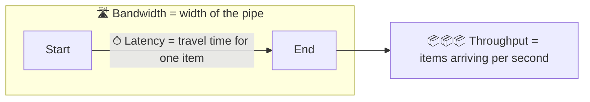

# 004 · Latency vs Throughput vs Bandwidth

> ⏱ 8 min · 📈 4% · 🅰️ Part A (core) · Phase 01: Foundations
>
> `░░░░░░░░░░░░░░░░░░░░` 4% of the whole guide

---

## 📖 Story

It's the Friday dinner rush. Orders flood in, and even though each one takes only a moment, a line forms and everything slows down. Leo is baffled: "Each order takes 50 milliseconds. Why is everyone waiting two seconds?" Maya realizes that "fast" can mean three completely different things.

## 🎯 One-sentence idea

**Latency is how long one thing takes, throughput is how many things finish per second, and bandwidth is the maximum the pipe can carry. Improving one doesn't automatically improve the others.**

## 🧸 Analogy

A **highway**:

- 🚗 **Latency** = how long it takes **one car** to drive from A to B (1 hour).
- 🚗🚗🚗 **Throughput** = how many cars **actually arrive per hour** (2,000 cars/hour).
- 🛣️ **Bandwidth** = the **maximum** cars per hour the lanes *could* carry (4 lanes × 1,000 = 4,000 cars/hour).

Adding lanes (bandwidth) doesn't make any single car faster (latency). A traffic jam lowers throughput below bandwidth.

## 🖼️ Visual



**Little's Law** connects them:

```
Items in the system (concurrency) = Throughput × Latency
          L                       =     λ      ×    W
```

## 🔬 How it works

- **Latency** (ms): time for one request, from start to finish. Users *feel* this.
- **Throughput** (requests/s, MB/s): completed work per unit of time. The business *needs* enough of it.
- **Bandwidth** (Mbps/Gbps): the **capacity** of a link. Throughput ≤ bandwidth.
- **They trade off:** batching raises throughput but raises latency (you wait to fill the batch). Handling each request immediately lowers latency but may lower throughput.
- **Queueing:** as utilization approaches 100%, **latency explodes** because requests wait in line. Keep headroom (run at about 50–70%).
- **Little's Law** sizes things: how many threads, connections, or workers you need in flight.

## 🧩 Worked example

**1. Little's Law: how many DB connections do I need?**

```
Throughput = 2,000 queries/s
Latency    = 5 ms = 0.005 s
In flight  = 2,000 × 0.005 = 10 connections busy at any moment
→ a pool of ~20 (2× headroom) is plenty
```

**2. Bandwidth vs latency: sending a 1 GB file across the world**

```
Latency (RTT)  ~ 100 ms           → the first byte arrives quickly
Bandwidth 100 Mbps ≈ 12.5 MB/s    → 1,000 MB / 12.5 ≈ 80 s to finish
```

Here **bandwidth dominates**. For a tiny 1 KB API call, **latency dominates**.

**3. Why utilization matters (the queueing intuition)**

| Server busy | Typical wait multiplier |
|---|---|
| 50% | ~1× service time |
| 80% | ~4× |
| 90% | ~9× |
| 99% | ~99× |

(For a simple queue, wait ≈ service time × ρ/(1−ρ), where ρ = how busy the server is.)

## ⚖️ Trade-offs

| You gain | You pay | Use it when |
|---|---|---|
| Batching → high throughput | Higher per-item latency | Analytics, bulk inserts, log shipping |
| Process each item immediately → low latency | Lower max throughput, more overhead | Interactive APIs |
| High utilization → lower cost | Latency spikes, no room for failures | Batch clusters that can wait |
| Headroom (50–70%) | Paying for idle capacity | User-facing services |

## 🌍 Real world

- **Kafka** batches messages to reach millions of messages/s, at the cost of a few ms of latency (lesson 059).
- **Video streaming** needs bandwidth. **Online gaming** needs low latency. Different problems need different fixes.
- "**Never underestimate the bandwidth of a station wagon full of tapes**." AWS Snowball physically ships drives because, for petabytes, trucks beat networks.

## 📌 Cheat card

> - **Latency** = time for one. **Throughput** = done per second. **Bandwidth** = max capacity.
> - **Little's Law: L = λ × W** (in-flight = rate × time).
> - **Busy servers are slow servers.** Above ~80% utilization, latency climbs fast.
> - **Batching trades latency for throughput.**
> - 1 Gbps ≈ **125 MB/s**. Divide bits by 8 to get bytes.

## 🧪 Feynman check

Using the highway, explain why adding more lanes doesn't make your commute shorter when the road is empty, but does help at rush hour.

⚠️ **Common confusion:** "Our network is 10 Gbps, so our API is fast." Bandwidth ≠ latency. A 1 KB request across the world still takes about 100 ms, whatever the bandwidth.

## ⚡ Quick recall

1. A service handles 500 req/s with 200 ms latency. How many requests are in flight?
<details><summary>Answer</summary>

L = 500 × 0.2 = **100 concurrent requests**.
</details>

2. Does batching improve latency or throughput?
<details><summary>Answer</summary>

Throughput. It usually *worsens* per-item latency.
</details>

3. Why keep servers below ~70% busy?
<details><summary>Answer</summary>

Queueing delay grows sharply as utilization approaches 100%, and you need spare capacity for traffic spikes and failed nodes.
</details>

## 🎤 Interview practice

**Q1. "How many application servers do we need for 30,000 requests/s if each request takes 50 ms of CPU and each server has 8 cores?"**
<details><summary>Model answer</summary>

- One core handles 1 / 0.05 = 20 req/s. 8 cores → **160 req/s per server**.
- 30,000 / 160 ≈ **188 servers** at 100% utilization.
- Target ~60% utilization → 188 / 0.6 ≈ **~315 servers**, plus N+1/N+2 redundancy.
- The honest caveat: real requests also wait on I/O, so benchmark instead of trusting the math blindly.
- **Likely follow-up:** "How would you reduce that?" → cache results, optimize hot code paths, move work async.
</details>

**Q2. "Latency got worse after we increased throughput. Why?"**
<details><summary>Model answer</summary>

- Higher utilization → **queueing delay**. Requests wait for threads, connections, CPU, or locks.
- Possibly **batching** was introduced or increased, or a downstream dependency (DB) is saturated.
- Check saturation metrics (CPU, pool usage, queue depth) and use Little's Law to size pools.
- Fix: add capacity, shed load, reduce per-request work, or separate latency-sensitive traffic from bulk traffic.
- **Likely follow-up:** "How would you protect latency-sensitive requests?" → separate pools (bulkheads, lesson 064), priority queues, rate limits.
</details>

> 📖 *Next time: Leo has big plans, and Maya needs numbers before anyone buys a single server.*

---

⬅️ [003 · Latency Numbers & Percentiles](003-latency-numbers-and-percentiles.md) · 🗺️ [Phase map](README.md) · ➡️ [005 · Back-of-Envelope Estimation](005-back-of-envelope-estimation.md)

✅ **Safe stopping point.** Tick lesson 004 in [PROGRESS.md](../../PROGRESS.md).
