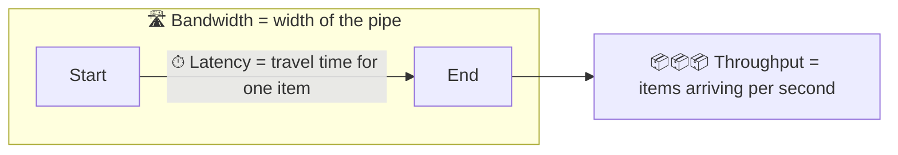

# 004 · Latency vs Throughput vs Bandwidth

> ⏱ 8 min · 📈 4% · 🅰️ Part A (core) · Phase 01: Foundations
>
> `░░░░░░░░░░░░░░░░░░░░` 4% of the whole guide

---

## 📖 Story

Friday, 6:45 p.m. The dinner rush hits Pantry like a wave hitting a seawall.

Maya has profiled the order endpoint. It takes **50 ms**. That's crisp. So why do customers see a spinner for **two full seconds**?

She watches the server's request queue. It's like a turnstile at a train station during rush hour: each person gets through in half a second, but there are four hundred people behind them, shuffling forward, elbow to elbow. The CPU gauge sits at **96%**, glowing red.

Nothing is broken, and every single request is fast. The line in front of it is what's slow.

I asked the same question years ago, and the answer made me rethink what "fast" means. It can mean three completely different things.

## 🎯 One-sentence idea

**Latency is how long one thing takes, throughput is how many things finish per second, and bandwidth is the most the pipe can carry, and improving one does not automatically improve the others.**

## 🧸 Analogy

A **highway**:

- 🚗 **Latency** = how long **one car** takes from A to B (1 hour).
- 🚗🚗🚗 **Throughput** = how many cars **actually arrive per hour** (2,000).
- 🛣️ **Bandwidth** = the **maximum** the lanes *could* carry (4 lanes × 1,000 = 4,000/hour).

Adding lanes doesn't make one car drive faster. A traffic jam pushes throughput far below bandwidth.

## 🖼️ Visual

*Diagram brief:* a pipe whose width is labelled **bandwidth**. A single ball travels the pipe's length, labelled **latency**. A counter at the exit counts balls per second, labelled **throughput**. Below it, the Little's Law equation.



```
Little's Law:   in-flight items  =  throughput  ×  latency
                      L          =      λ       ×     W
```

## 🔬 How it works

- **Latency** (ms) is what users *feel*: one request, start to finish. **Throughput** (req/s, MB/s) is the completed work the business *needs*. **Bandwidth** (Gbps) is a link's ceiling. Throughput ≤ bandwidth, always.
- **Little's Law, L = λ × W**, sizes everything that holds work in flight: thread pools, DB connections, worker counts.
- **Queueing is the hidden killer:** for a simple queue, wait ≈ service time × ρ/(1 − ρ). At **90%** utilization that's **9×** the service time, and at 99% it's 99×.
- **Batching trades latency for throughput:** you wait to fill a batch (higher per-item latency) and then amortize the overhead (higher throughput).
- **Keep headroom:** user-facing services run at **50–70%** utilization so that spikes and failed nodes don't push them up the steep part of the curve.

## 🧩 Worked example

**1. Little's Law: how many DB connections does Maya need?**

```
Throughput = 2,000 queries/s
Latency    = 5 ms = 0.005 s
In flight  = 2,000 × 0.005 = 10 connections busy at any instant
→ a pool of ~20 (2× headroom) is plenty
```

**2. Maya's Friday rush:** each order takes 50 ms of CPU on a 4-core box, so max throughput is 4 ÷ 0.05 = **80 req/s**. At 77 req/s, ρ ≈ 0.96 → wait ≈ 50 ms × 24 ≈ **1.2 s** of queueing, plus spikes → the **2 s** she saw. Adding one more server drops ρ to ~0.48, and the wait falls to **~46 ms**.

**3. Bandwidth vs latency: a 1 GB file across the world**

```
RTT ≈ 100 ms            → the first byte arrives fast
100 Mbps ≈ 12.5 MB/s    → 1,000 MB ÷ 12.5 ≈ 80 s to finish  (bandwidth dominates)
A 1 KB API call         → ~100 ms                            (latency dominates)
```

## ⚖️ Trade-offs

| Maya's choice | What she gains | What she pays |
|---|---|---|
| Batching | High throughput, less per-item overhead | Higher per-item latency |
| Process each item immediately | Low latency | Lower max throughput |
| Run hot (85–95% busy) | Lower cost | Latency spikes, no room for a failed node |
| Keep 30–50% headroom | Flat p99 under spikes | Paying for idle capacity |

## 🌍 Real world

- **Kafka** batches producer writes (`linger.ms`, `batch.size`) to reach millions of messages/s, at the cost of a few ms of latency (lesson 059).
- **Video streaming** is limited by bandwidth, and **online gaming** by latency. Each needs a different fix.
- **AWS Snowball** ships physical drives, because for petabytes a truck has more bandwidth than the network.

## 📌 Cheat card

> - **Latency** = time for one. **Throughput** = done per second. **Bandwidth** = the ceiling.
> - **L = λ × W.** Use it to size pools.
> - **Busy servers are slow servers:** above ~80% utilization, latency climbs steeply.
> - **Batching trades latency for throughput.**
> - 1 Gbps ≈ **125 MB/s** (divide bits by 8).

## 🧪 Feynman check

Using the highway, explain why adding lanes does nothing for your commute on an empty road but saves you at rush hour.

⚠️ **Common confusion:** "We have a 10 Gbps network, so our API is fast." Bandwidth is not latency. A 1 KB request across the world still takes ~100 ms, because the speed of light doesn't care how wide the pipe is.

## ⚡ Quick recall

1. A service handles 500 req/s at 200 ms latency. How many requests are in flight?
<details><summary>Reveal Answer</summary>

L = 500 × 0.2 = **100 concurrent requests**.
</details>

2. Does batching improve latency or throughput?
<details><summary>Reveal Answer</summary>

Throughput. It usually *worsens* per-item latency.
</details>

3. Why keep user-facing servers below ~70% busy?
<details><summary>Reveal Answer</summary>

Queueing delay grows as ρ/(1 − ρ), exploding near 100%, and you need spare capacity for spikes and failed nodes.
</details>

## 🎤 Interview practice

**Q. "We need to serve 30,000 req/s. Each request uses 50 ms of CPU, and servers have 8 cores. How many servers do you need? And after we scale up, why might latency still get worse?"**
<details><summary>Model answer</summary>

- **Raw capacity:** one core does 1 ÷ 0.05 = **20 req/s**, so 8 cores = **160 req/s per server**. Then 30,000 ÷ 160 ≈ **188 servers** at 100% busy.
- **Add headroom:** target ~60% utilization → 188 ÷ 0.6 ≈ **315 servers**, plus N+2 for failures and deploys. Validate with a load test, because real requests also wait on I/O.
- **Why latency can still rise:**
  - **Downstream saturation.** Now 315 servers push work into one database. Its connection pool or CPU becomes the queue.
  - **Little's Law on pools:** 30,000 req/s × 10 ms DB time = **300 connections** in flight. If the pool is 200, requests queue for connections.
  - **Batching** introduced for throughput adds wait time.
- **Fixes:**
  - Size pools with L = λW.
  - Add read replicas or a cache.
  - Use **bulkheads** so bulk traffic can't starve interactive traffic (lesson 064).
  - Shed load before queues grow unbounded.
- **Likely follow-up:** "How would you cut the server count?" → cache results, optimize the hot path, and move non-critical work to async queues.
</details>

## 📖 Teaser

> 📖 *A food festival wants to feature Pantry, and Maya has two minutes and a napkin to work out whether her laptop will survive a million visitors.*

---

⬅️ [003 · Latency Numbers & Percentiles](003-latency-numbers-and-percentiles.md) · 🗺️ [Phase map](README.md) · ➡️ [005 · Back-of-Envelope Estimation](005-back-of-envelope-estimation.md)

✅ **Safe stopping point.** Tick lesson 004 in [PROGRESS.md](../../PROGRESS.md).
