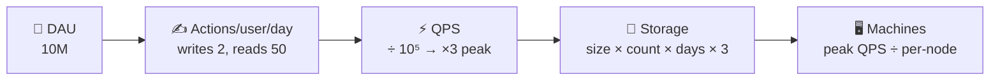

# 005 · Back-of-Envelope Estimation

> ⏱ 10 min · 📈 5% · 🅰️ Part A (core) · Phase 01: Foundations
>
> `█░░░░░░░░░░░░░░░░░░░` 5% of the whole guide

---

## 📖 Story

The email arrives at 4:12 p.m. A city food festival wants to feature Pantry on its homepage. Estimated reach: **two million people** over one weekend.

Maya's stomach drops. Her entire company runs on one laptop. Does she need a data centre? A hundred servers? A miracle?

The festival needs an answer by five.

She doesn't open a spreadsheet. She grabs a paper napkin from the takeout bag and a pen that's almost out of ink. Two minutes of rounded numbers, scribbled in the margins.

This is the moment I most want you to master. She didn't need exact answers. She needed the right **order of magnitude**, fast. Watch her do it.

## 🎯 One-sentence idea

**Two minutes of rough math with rounded numbers tells you whether you need 1 server or 1,000, and 1 GB or 1 PB, and that decides the shape of the whole design.**

## 🧸 Analogy

Planning a party. You don't count every chip. You think: *"30 people × ~3 slices ≈ 90 slices ≈ 11 pizzas. Buy 12."* It's close enough to be right and fast enough to be useful. Systems work the same way: **order of magnitude beats precision**.

## 🖼️ Visual

*Diagram brief:* a napkin-style pipeline of five boxes, each turning the previous number into the next: daily users → actions → QPS → storage → machine count.



## 🔬 How it works

- **Round without mercy:** 86,400 s/day → **10⁵**, and a year → **3 × 10⁷ s**. Work in powers of ten and add the exponents.
- **QPS** = (users × actions/day) ÷ 10⁵. **Peak ≈ 2–3× average**, and launches and festivals can be 10×.
- **Storage** = bytes per item × items/day × retention days × **3 replicas**. **Bandwidth** = QPS × payload size.
- **Machines** = peak QPS ÷ per-node capacity (≈ **10k simple req/s** for an app server, **100k+ ops/s** for Redis, **thousands of writes/s** for one SQL primary).
- **Always end with "so this means…"**: the number exists only to drive a design decision. State your assumptions out loud.

## 🧩 Worked example

**Maya's napkin for the festival weekend:**

```
Visitors         = 2M over 2 days      → 1M/day
Page views       = 1M × 10 pages       = 10⁷/day
Avg QPS          = 10⁷ ÷ 10⁵           = 100/s
Peak QPS         = ×10 (festival spike) = 1,000/s
Orders           = 1M × 2% conversion  = 20,000/day ≈ 0.2 writes/s avg, ~5/s peak
Page size        = 200 KB (with images)
Egress at peak   = 1,000 × 200 KB      = 200 MB/s ≈ 1.6 Gbps
```

**So this means:**

1. 1,000 req/s at peak → **a few app servers behind a load balancer**, not a data centre.
2. Writes are tiny → **one Postgres primary** handles them easily.
3. **1.6 Gbps** of images would choke a home connection → **put images on a CDN**, today.

Her reply to the festival: *"Yes."*

## ⚖️ Trade-offs

| Maya's choice | What she gains | What she pays |
|---|---|---|
| A 2-minute estimate | A fast, defensible direction | Could be off by 2–3× |
| A detailed capacity model + load test | Real confidence | Days of work |
| Over-provisioning for the event | Survives surprises | Money spent on idle machines |

## 🌍 Real world

- **Capacity planning** at Google, Meta, and AWS starts exactly like this, and is then refined with load tests and production telemetry.
- **Interviewers** use estimation to check whether you can link numbers to design choices. The *conclusion* matters far more than the arithmetic.

## 📌 Cheat card

> - **1 day ≈ 10⁵ s** · **1M/day ≈ 12/s** · **1 year ≈ 3 × 10⁷ s**
> - **Peak = 2–3× average** (10× for events) · **× 3 replicas** · **cache the hot 20%**
> - **KB 10³ · MB 10⁶ · GB 10⁹ · TB 10¹² · PB 10¹⁵**
> - App server ≈ **10k req/s** · Redis ≈ **100k+ ops/s** · SQL primary ≈ **thousands of writes/s**
> - More tricks: [ESTIMATION-TRICKS.md](../../cheatsheets/ESTIMATION-TRICKS.md)

## 🧪 Feynman check

Out loud, estimate the QPS for **50M daily users making 20 requests each**, then say what that number means for the design.

<details><summary>Check your math</summary>

50M × 20 = 10⁹/day ÷ 10⁵ = **10,000 QPS average**, ~30,000 at peak. So you need multiple stateless app servers behind a load balancer, and almost certainly a cache.
</details>

⚠️ **Common confusion:** Spending ten minutes on precise arithmetic. Interviewers want **2–3 minutes**, rounded numbers, and then the **design implication**. A precise answer with no "so this means" scores lower than a rough one with a clear decision.

## ⚡ Quick recall

1. 100M requests/day ≈ how many per second?
<details><summary>Reveal Answer</summary>

≈ **1,000 QPS** (10⁸ ÷ 10⁵). The precise figure is ~1,157.
</details>

2. 1 billion items × 1 KB each = ?
<details><summary>Reveal Answer</summary>

10⁹ × 10³ = 10¹² bytes = **1 TB**.
</details>

3. Why multiply storage by 3?
<details><summary>Reveal Answer</summary>

Most storage systems keep 3 replicas for durability and availability.
</details>

## 🎤 Interview practice

**Q. "Estimate the storage and write throughput for a chat app with 100M DAU, each sending 40 messages a day of about 100 bytes, kept for 2 years. What does that tell you about the database?"**
<details><summary>Model answer</summary>

- **Messages/day** = 100M × 40 = **4 × 10⁹**.
- **Bytes/day** = 4 × 10⁹ × 100 B = **400 GB**. Roughly double it for metadata and indexes → **~800 GB/day**.
- **Two years** ≈ 800 GB × 730 ≈ **~580 TB**, × 3 replicas ≈ **~1.7 PB**.
- **Write QPS** = 4 × 10⁹ ÷ 10⁵ = **40,000/s average**, so **~100k+/s at peak**.
- **So this means:**
  - That is far beyond a single SQL primary. You need a **horizontally scalable, write-optimized store** (e.g. Cassandra or another LSM-based system), partitioned by `conversation_id`.
  - Recent messages are hot, so add **tiered storage**: SSD for the last ~30 days, cheap object storage for the rest.
  - **Compression** (~3–5× on text) and **retention TTLs** cut cost.
- **Likely follow-up:** "What read QPS would you expect?" → reads are often 5–10× writes for chat (scrollback, multiple devices), so 200k–400k/s. That calls for a cache of recent conversations in front of the store.
</details>

## 📖 Teaser

> 📖 *The numbers say one laptop can almost cope, until Maya asks herself what happens the second that laptop's power cable gets kicked out of the wall.*

---

⬅️ [004 · Latency vs Throughput vs Bandwidth](004-latency-throughput-bandwidth.md) · 🗺️ [Phase map](README.md) · ➡️ [✅ Checkpoint 5%](checkpoint-05.md)

✅ **Safe stopping point.** Tick lesson 005 in [PROGRESS.md](../../PROGRESS.md), then do the checkpoint!
