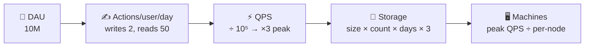

# 005 · Back-of-Envelope Estimation

> ⏱ 10 min · 📈 5% · 🅰️ Part A (core) · Phase 01: Foundations
>
> `█░░░░░░░░░░░░░░░░░░░` 5% of the whole guide

---

## 🎯 One-sentence idea

**Rough math, done in 2 minutes with rounded numbers, tells you whether you need 1 server or 1,000, and 1 GB or 1 PB. That decides the shape of the design.**

## 🧸 Analogy

Planning a party. You don't count every chip. You think: *"30 people × ~3 slices each ≈ 90 slices ≈ 11 pizzas. Buy 12."* Close enough to be right, fast enough to be useful. Same with systems: **order of magnitude beats precision**.

## 🖼️ Visual



## 🔬 How it works

- **Round aggressively.** 86,400 s/day → **10⁵**. 365 days → **400** if you like.
- **Use powers of 10** and add exponents: 3 × 10⁸ × 2 × 10³ = 6 × 10¹¹.
- **QPS** = (users × actions per day) ÷ 10⁵. **Peak ≈ 2–3× average.**
- **Storage** = size per item × items per day × retention days × **3 replicas**.
- **Bandwidth** = QPS × payload size.
- **Machines** = peak QPS ÷ what one machine handles (about 10k simple req/s for an app server, 100k+ for Redis).
- **State your assumptions out loud.** Being wrong with clear assumptions is fine. Being vague isn't.

## 🧩 Worked example

**Design estimate: a photo-sharing app.**

Assumptions: **10M DAU**, each uploads **0.2 photos/day** and views **50 photos/day**. Photo = **500 KB** (compressed), metadata = **1 KB**. Keep for **5 years**.

```
Uploads/day    = 10M × 0.2       = 2M/day
Write QPS      = 2M ÷ 10⁵        = 20/s      (peak ~60/s)       → tiny!
Views/day      = 10M × 50        = 500M/day
Read QPS       = 500M ÷ 10⁵      = 5,000/s   (peak ~15,000/s)   → read-heavy (250:1)

Photo storage/day = 2M × 500 KB  = 1 TB/day
5 years           = 1 TB × 365 × 5 ≈ 1.8 PB   (×3 replicas ≈ 5.5 PB, or let S3 handle durability)
Metadata          = 2M × 1 KB × 365 × 5 ≈ 3.65 TB  → fits a sharded SQL/NoSQL DB

Bandwidth out  = 5,000 × 500 KB  = 2.5 GB/s average   → must use a CDN
Cache (20% of daily views' unique metadata) → small, easily fits in Redis
```

**What the numbers tell us:**

1. Writes are trivial, and **reads dominate** → cache + CDN.
2. **Photos go in object storage**, not the database.
3. 2.5 GB/s egress → a **CDN is mandatory**, both for cost and speed.

## ⚖️ Trade-offs

| You gain | You pay | Use it when |
|---|---|---|
| Fast, rough estimate | Could be off by 2–3× | Always, as a first step |
| Detailed capacity model | Time | Real production planning |
| Over-provisioning | Money | Unknown growth, launch events |

## 🌍 Real world

- **Capacity planning** at real companies starts exactly like this, then gets refined with load tests.
- **Interviewers** use estimation to see if you can connect numbers to design choices. The *conclusion* matters more than the arithmetic.

## 📌 Cheat card

> - **1 day ≈ 10⁵ s** · **1M/day ≈ 12/s** · **1 year ≈ 3 × 10⁷ s**
> - **Peak = 2–3× avg** · **Replicas × 3** · **Cache the hot 20%**
> - **KB 10³ · MB 10⁶ · GB 10⁹ · TB 10¹² · PB 10¹⁵**
> - One app server ≈ **10k req/s** · Redis ≈ **100k+ ops/s** · a DB ≈ **thousands of writes/s**
> - **Always end with "so this means…"** and the design implication.
> - More tricks: [ESTIMATION-TRICKS.md](../../cheatsheets/ESTIMATION-TRICKS.md)

## 🧪 Feynman check

Estimate out loud: *"How many requests per second does a service with 50 million daily users, each making 20 requests, receive?"* Then explain what that number means for the design.

<details><summary>Check your math</summary>

50M × 20 = 10⁹/day → ÷ 10⁵ = **10,000 QPS average**, ~30,000 peak. That means multiple app servers behind a load balancer, and almost certainly a cache.
</details>

⚠️ **Common confusion:** Spending 10 minutes on precise math. Interviewers want **2–3 minutes** and rounded numbers, and then the **design implication**.

## ⚡ Quick recall

1. 100M requests/day ≈ how many per second?
<details><summary>Answer</summary>

~1,200 QPS (10⁸ ÷ 10⁵ = 1,000, and the precise figure is ~1,157).
</details>

2. 1 billion items × 1 KB each = ?
<details><summary>Answer</summary>

10⁹ × 10³ = 10¹² bytes = **1 TB**.
</details>

3. Why multiply storage by 3?
<details><summary>Answer</summary>

Most storage systems keep 3 replicas for durability and availability.
</details>

## 🎤 Interview practice

**Q1. "Estimate the storage needed for a chat app with 100M DAU, each sending 40 messages/day of about 100 bytes, kept for 2 years."**
<details><summary>Model answer</summary>

- Messages/day = 100M × 40 = **4 × 10⁹**.
- Bytes/day = 4 × 10⁹ × 100 B = **400 GB/day** (add ~2× for metadata/indexes → ~800 GB).
- 2 years ≈ 800 GB × 730 ≈ **~580 TB**, × 3 replicas ≈ **~1.7 PB**.
- Write QPS = 4 × 10⁹ ÷ 10⁵ = **40,000/s avg**, ~100k+ peak → a write-optimized, horizontally scalable store (e.g., Cassandra).
- **Likely follow-up:** "How would you reduce storage cost?" → compression, tiering old messages to cheaper storage, TTL/retention policies.
</details>

**Q2. "Does this service need a cache? Use numbers."**
<details><summary>Model answer</summary>

- Compute **read QPS at peak** and compare it with what the DB handles (a few thousand to tens of thousands of simple reads/s per node).
- If peak reads ≫ DB capacity, or latency targets are tighter than DB latency, then **yes**.
- Size the cache: hot set ≈ 20% of daily accessed data × object size. Check that it fits in RAM (tens to hundreds of GB is fine across a cluster).
- **Likely follow-up:** "What hit rate do you need?" → if the DB can take 5k QPS and the load is 50k, you need ≥ 90% hits.
</details>

---

⬅️ [004 · Latency vs Throughput vs Bandwidth](004-latency-throughput-bandwidth.md) · 🗺️ [Phase map](README.md) · ➡️ [✅ Checkpoint 5%](checkpoint-05.md)

✅ **Safe stopping point.** Tick lesson 005 in [PROGRESS.md](../../PROGRESS.md), then do the checkpoint!
