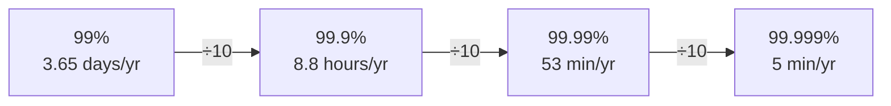
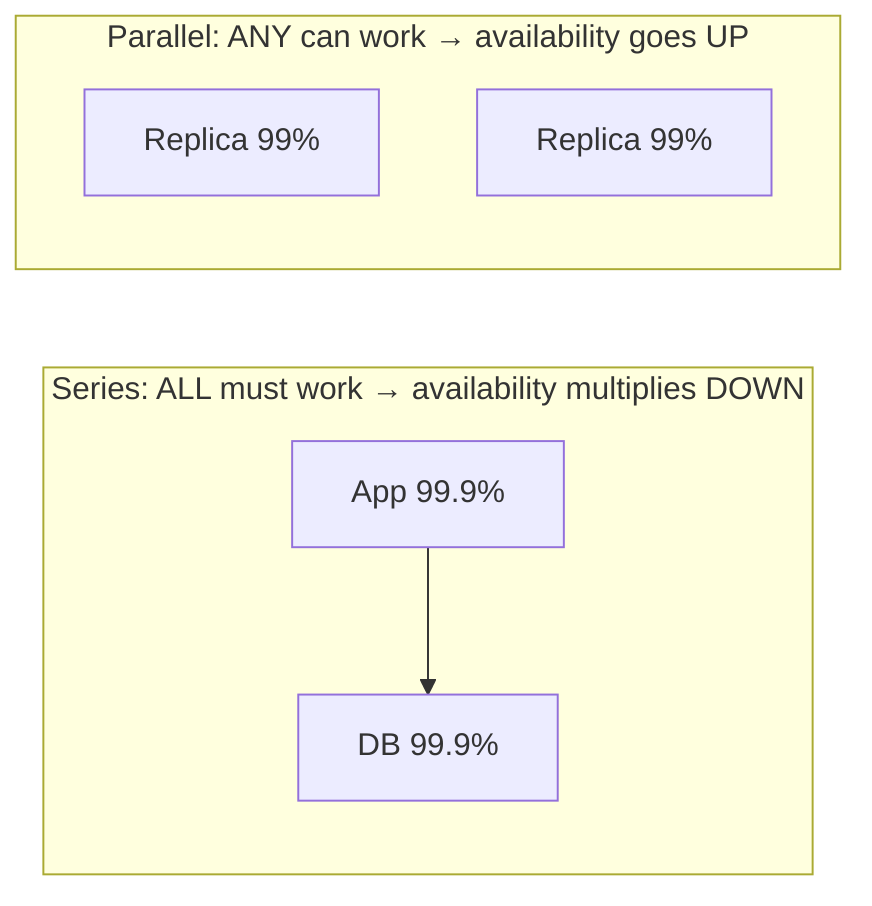

# 006 · Availability & the Nines

> ⏱ 8 min · 📈 6% · 🅰️ Part A (core) · Phase 01: Foundations
>
> `█░░░░░░░░░░░░░░░░░░░` 6% of the whole guide

---

## 📖 Story

Saturday, 7:02 p.m. Peak dinner. Maya's phone buzzes, then buzzes again, then won't stop.

*"Site's down??"* *"Can't order."* *"My kids are starving, fix it!!"*

She sprints to the closet where the server lives. The fan is silent. The status light is dark. A power supply has died, quietly, like a heart skipping its last beat.

For **40 minutes**, while she hunts for a spare cable and waits for Postgres to replay its log, Pantry doesn't exist. Hundreds of dinners go unordered.

Later, staring at the ceiling, she asks herself: *Can I promise this never happens again?*

I've had that exact conversation with myself. The honest answer is that "never" is impossible. "Almost never" can be measured, budgeted, and paid for. Let me show you how.

## 🎯 One-sentence idea

**Availability is the percentage of time a system works, and each extra "nine" (99% → 99.9% → 99.99%) means 10× less downtime and costs a lot more to achieve.**

## 🧸 Analogy

A **corner shop**:

- 99% open = closed about **3.5 days a year**. Annoying, but survivable.
- 99.9% = closed about **9 hours a year**.
- 99.99% = closed about **1 hour a year**. That takes a backup generator, two staff on every shift, and a spare key with a neighbour. **Every nine costs more backup.**

## 🖼️ Visual

*Diagram brief:* a staircase where each step divides downtime by 10. Below it, two circuits: components in **series** (all must work, so availability multiplies down), and components in **parallel** (any one can work, so availability goes up).





## 🔬 How it works

- **Availability = good time ÷ total time**, usually measured as **successful requests ÷ total requests**. At 99.9%, the monthly downtime budget is ≈ **43 minutes**.
- **Series multiplies down:** if a request needs every component, A = a₁ × a₂ × … Three 99.9% hops = **99.7%**. Every hard dependency costs you.
- **Parallel multiplies up:** if any one replica can serve, A = 1 − (1 − a)ⁿ. Two 99% replicas = **99.99%**, *if* their failures are independent (different racks, zones, power).
- **A ≈ MTBF ÷ (MTBF + MTTR):** you can fail less often (raise MTBF) or **recover faster** (cut MTTR). Faster recovery through automated failover and fast rollback is usually the cheaper nine.
- **Your ceiling is your weakest single point of failure (SPOF).** Redundancy anywhere else can't fix one box that everything depends on.

## 🧩 Worked example

**Checkout path:** load balancer → app → payment service → DB, each 99.9%.

```
All in series:   0.999⁴ ≈ 0.996 → 99.6%  → ~35 hours of downtime/year 😬
```

Make the app and the DB redundant (2 independent copies each):

```
App pair:  1 − (0.001)² = 0.999999
DB pair:   1 − (0.001)² = 0.999999
Total ≈ 0.999 (LB) × 0.999999 × 0.999 (payment) × 0.999999 ≈ 99.8%
```

The **single load balancer and single payment service** are now the ceiling. Make those redundant too, and you approach 99.99%. Maya's 40-minute outage came from one power supply, a classic SPOF.

## ⚖️ Trade-offs

| Maya's choice | What she gains | What she pays |
|---|---|---|
| More nines | Fewer angry Saturday nights | Redundant hardware, multi-AZ, on-call, complexity |
| Fewer nines | Cheap and simple | Occasional real outages |
| Lower MTTR (automation, fast rollback) | Short outages, often for little cost | Up-front investment in monitoring and tooling |

## 🌍 Real world

- **AWS S3** is designed for 99.99% availability and **99.999999999% (11 nines) durability**. Data can be safe yet briefly unreachable.
- Most cloud SLAs sit at **99.9–99.99%**. **Five nines** is the territory of telecom and core payment networks, and it's very expensive.

## 📌 Cheat card

> - **3 nines ≈ 9 h/yr · 4 nines ≈ 53 min/yr · 5 nines ≈ 5 min/yr.**
> - **Series multiplies down. Parallel = 1 − (1 − a)ⁿ.**
> - **A ≈ MTBF / (MTBF + MTTR).** Recovering faster is a superpower.
> - **Availability ≠ durability.** Being up is not the same as not losing data.
> - Full table: [NUMBERS.md](../../cheatsheets/NUMBERS.md)

## 🧪 Feynman check

Explain why adding *more services* to a request path makes a system *less* available, while adding *copies* of one service makes it *more* available.

⚠️ **Common confusion:** The parallel formula assumes **independent** failures. Two replicas on the same rack, power strip, or bad config share their fate, so the real availability is far below 1 − (1 − a)². Redundancy only counts across separate **failure domains**.

## ⚡ Quick recall

1. How much downtime per year does 99.9% allow?
<details><summary>Reveal Answer</summary>

About **8.76 hours**.
</details>

2. Two components in series, each 99%. What's the overall availability?
<details><summary>Reveal Answer</summary>

0.99 × 0.99 = **98.01%**.
</details>

3. Two independent replicas in parallel, each 99%. What's the overall availability?
<details><summary>Reveal Answer</summary>

1 − 0.01² = **99.99%**.
</details>

## 🎤 Interview practice

**Q. "Your service is at 99.9% and depends on 5 other services, each 99.9%. Leadership wants 99.99%. What do you do?"**
<details><summary>Model answer</summary>

- **Do the math first.** With 5 hard dependencies in series, the ceiling is 0.999⁵ ≈ **99.5%** (~44 h/yr). You can't reach 99.99% while those stay hard dependencies.
- **Make dependencies soft:**
  - **Cache** their responses with serve-stale.
  - Use **fallbacks and defaults** (no recommendations rather than an error page).
  - Move non-critical calls **async** through queues.
  - Wrap every call in **timeouts and circuit breakers** so one slow dependency can't cascade (lesson 064).
- **Remove your own SPOFs:** at least two instances across **availability zones**, health-checked behind a redundant load balancer, and a DB with **automated failover**.
- **Cut MTTR:** most outages come from **bad deploys and config changes**. Use canaries, automatic rollback, and feature flags (lesson 068), plus alerting on SLO burn rate.
- **Name the cost:** roughly 2× infrastructure, plus operational maturity. Do this only for the paths that earn it (checkout, yes; the "about us" page, no).
- **Likely follow-up:** "Which dependencies can't be soft?" → payments and inventory reservation. For those, invest in their redundancy directly, or design an async "accept now, confirm later" flow.
</details>

## 📖 Teaser

> 📖 *A big office wants Pantry for staff lunches, and their contract asks Maya to put a number on reliability that she'll be legally held to.*

---

⬅️ [✅ Checkpoint 5%](checkpoint-05.md) · 🗺️ [Phase map](README.md) · ➡️ [007 · SLA, SLO, SLI](007-sla-slo-sli.md)

✅ **Safe stopping point.** Tick lesson 006 in [PROGRESS.md](../../PROGRESS.md).
