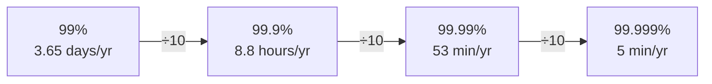
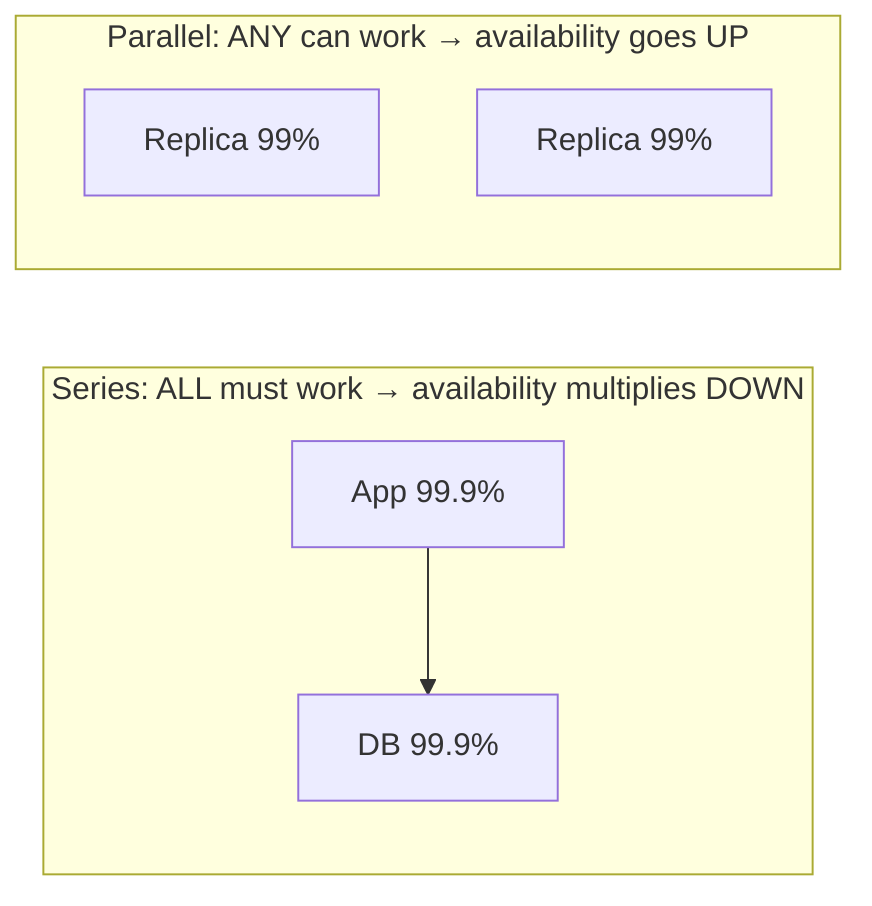

# 006 · Availability & the Nines

> ⏱ 8 min · 📈 6% · 🅰️ Part A (core) · Phase 01: Foundations
>
> `█░░░░░░░░░░░░░░░░░░░` 6% of the whole guide

---

## 🎯 One-sentence idea

**Availability is the percentage of time a system works. Each extra "nine" (99% → 99.9% → 99.99%) means 10× less downtime, and costs a lot more to achieve.**

## 🧸 Analogy

A **corner shop**:

- 99% open = closed about **3.5 days a year**. Annoying, but you'd survive.
- 99.9% = closed about **9 hours a year**.
- 99.99% = closed about **1 hour a year**. To manage that, the shop needs a backup generator, two staff on every shift, and a spare key with a neighbour. **Each nine costs more backup.**

## 🖼️ Visual



**Series vs parallel:**



## 🔬 How it works

- **Availability = uptime ÷ total time.** Often measured as **successful requests ÷ total requests**.
- **Downtime budget:** 99.9% per month ≈ **43 minutes** you're "allowed" to be down.
- **Components in series** (a request needs all of them): **multiply**. 99.9% × 99.9% × 99.9% ≈ **99.7%**. More dependencies → *lower* availability.
- **Components in parallel** (any one works): **1 − (1 − a)ⁿ**. Two 99% replicas → 1 − 0.01² = **99.99%**.
- **How to get more nines:** remove single points of failure (SPOFs), add redundancy, detect failures fast, fail over automatically, deploy carefully (lessons 063–068).
- **MTBF / MTTR:** availability ≈ MTBF ÷ (MTBF + MTTR). You can fail less often (↑ MTBF) *or* **recover faster (↓ MTTR)**. Faster recovery is often cheaper.

## 🧩 Worked example

**A checkout request goes: Load balancer → App → Payment service → DB.** Each is 99.9%.

```
Series: 0.999⁴ ≈ 0.996 → 99.6%  → ~35 hours of downtime/year 😬
```

Now make the app and DB redundant (2 copies each, in parallel):

```
App pair: 1 − (0.001)² = 0.999999
DB pair:  1 − (0.001)² = 0.999999
Total ≈ 0.999 (LB) × 0.999999 × 0.999 (payment) × 0.999999 ≈ 99.8%
```

The **single LB and single payment service** now limit you. Make them redundant too, and you head toward 99.99%.

**Lesson: your availability is capped by your weakest single point of failure.**

## ⚖️ Trade-offs

| You gain | You pay | Use it when |
|---|---|---|
| More nines | Redundant hardware, multi-zone/region, on-call, complexity | Revenue- or safety-critical paths |
| Fewer nines | Occasional downtime | Internal tools, batch jobs |
| Fast recovery (low MTTR) | Automation, monitoring investment | Almost always worth it |

## 🌍 Real world

- **AWS S3** targets 99.99% availability and **99.999999999% ("11 nines") durability**. Durability ≠ availability: data can be safe but temporarily unreachable.
- Many cloud SLAs are **99.9–99.99%**. **Five nines** is typical of telecom and core payment networks, and very expensive.

## 📌 Cheat card

> - **3 nines ≈ 9 h/yr · 4 nines ≈ 1 h/yr · 5 nines ≈ 5 min/yr.**
> - **Series multiplies (worse). Parallel = 1 − (1 − a)ⁿ (better).**
> - **Availability ≈ MTBF / (MTBF + MTTR).** Recovering faster is a superpower.
> - **Availability ≠ durability.** Up vs. not losing data.
> - Full table: [NUMBERS.md](../../cheatsheets/NUMBERS.md)

## 🧪 Feynman check

Explain to a friend why adding *more* services to a request path can make a system *less* available, and why adding *copies* of a service makes it *more* available.

⚠️ **Common confusion:** "Our servers are 99.99% available, so our product is 99.99% available." Not if a request passes through 5 such components in series: 0.9999⁵ ≈ 99.95%.

## ⚡ Quick recall

1. How much downtime per year does 99.9% allow?
<details><summary>Answer</summary>

About **8.76 hours**.
</details>

2. Two components in series, each 99%: overall?
<details><summary>Answer</summary>

0.99 × 0.99 = **98.01%**.
</details>

3. Two replicas in parallel, each 99%: overall?
<details><summary>Answer</summary>

1 − 0.01² = **99.99%**.
</details>

## 🎤 Interview practice

**Q1. "How would you take a service from 99.9% to 99.99% availability?"**
<details><summary>Model answer</summary>

- **Find the SPOFs:** a single DB, a single LB, a single region, a single deploy pipeline.
- Add **redundancy** across **availability zones**, use **health checks + automatic failover**, and replicate the DB with automated promotion.
- **Reduce MTTR:** good alerting, runbooks, fast rollback, canary deploys (most outages come from changes!).
- **Graceful degradation:** serve cached or partial results if a non-critical dependency is down.
- Cost: roughly 2× infrastructure, plus operational maturity.
- **Likely follow-up:** "What's the most common cause of outages?" → bad deploys and config changes. So invest in safe rollout (lesson 068).
</details>

**Q2. "Your service depends on 5 other services, each 99.9%. What's your best possible availability, and how do you improve it?"**
<details><summary>Model answer</summary>

- 0.999⁵ ≈ **99.5%** (~44 h/year) if all are hard dependencies.
- Improve it by making dependencies **soft**: cache their responses, use fallbacks/defaults, make calls **async** via queues, and add **circuit breakers** so one failure doesn't cascade.
- **Likely follow-up:** "Which dependencies can be soft?" → e.g., recommendations or reviews on a product page. Payments and inventory usually can't.
</details>

---

⬅️ [✅ Checkpoint 5%](checkpoint-05.md) · 🗺️ [Phase map](README.md) · ➡️ [007 · SLA, SLO, SLI](007-sla-slo-sli.md)

✅ **Safe stopping point.** Tick lesson 006 in [PROGRESS.md](../../PROGRESS.md).
