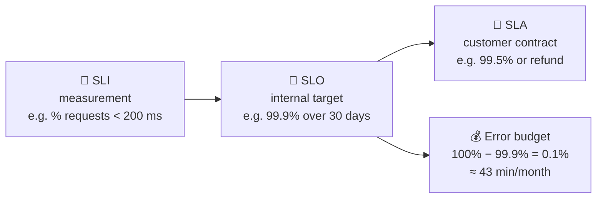

# 007 · SLA, SLO, SLI

> ⏱ 7 min · 📈 7% · 🅰️ Part A (core) · Phase 01: Foundations
>
> `█░░░░░░░░░░░░░░░░░░░` 7% of the whole guide

---

## 📖 Story

A big office wants Pantry for staff lunches, and their lawyer sends a contract: "What uptime do you guarantee?" Leo is ready to write 100%. Maya gently takes the pen away. She's learning the difference between what you *measure*, what you *aim for*, and what you *promise*.

## 🎯 One-sentence idea

**SLI is what you measure, SLO is the target you aim for, and SLA is the promise (with penalties) you make to customers. The gap between 100% and your SLO is an "error budget" you're allowed to spend.**

## 🧸 Analogy

A **pizza delivery** shop:

- 📏 **SLI (Indicator):** "How long did each delivery actually take?" You measure it.
- 🎯 **SLO (Objective):** "99% of deliveries under 30 minutes." Your internal goal.
- 📜 **SLA (Agreement):** "If it takes over 45 minutes, the pizza's free." A promise to customers, with a penalty.

The SLA is **looser** than the SLO, so you have a safety margin before paying out.

## 🖼️ Visual



## 🔬 How it works

- **SLI (Service Level Indicator):** a measured ratio of **good events ÷ total events**. Common SLIs:
  - **Availability:** successful requests ÷ all requests
  - **Latency:** requests faster than X ms ÷ all requests
  - **Freshness, correctness, durability** for data systems
- **SLO (Objective):** SLI target over a window, e.g. "**99.9%** of requests succeed over **30 days**".
- **SLA (Agreement):** a *business contract*, with credits or refunds if it's broken. Always **looser than the SLO**.
- **Error budget = 1 − SLO.** At 99.9%, you may "fail" 0.1% of requests. If the budget is left, **ship features**. If it's used up, **freeze risky changes and fix reliability**.
- **Pick SLOs from the user's view:** "Can users check out?" matters more than "Is CPU below 80%?"

## 🧩 Worked example

**Service:** a checkout API, **10M requests/month**.

```
SLI (availability) = non-5xx responses ÷ total responses
SLO               = 99.9% over 30 days
Error budget      = 0.1% × 10M = 10,000 failed requests/month
                  ≈ 43 minutes of full outage

SLI (latency)     = requests < 300 ms ÷ total
SLO               = 99% under 300 ms

SLA (to customers) = 99.5% monthly, else 10% credit
```

Mid-month, a bad deploy causes 6,000 errors → **60% of the budget spent**. The team slows releases and adds a canary stage (lesson 068) before shipping more features.

## ⚖️ Trade-offs

| You gain | You pay | Use it when |
|---|---|---|
| Tight SLO (99.99%) | Slow releases, expensive redundancy | Payments, auth, core infra |
| Loose SLO (99%) | More user-visible failures | Internal/batch/experimental |
| Error budgets | Discipline, and agreement between product and engineering | Balancing speed of shipping vs stability |

## 🌍 Real world

- **Google SRE** popularized SLOs and error budgets. "100% is the wrong reliability target for basically everything."
- **Cloud providers publish SLAs** (e.g., 99.99% for multi-AZ databases) with service credits as the penalty.

## 📌 Cheat card

> - **I**ndicator = **I** measure. **O**bjective = **O**ur goal. **A**greement = **A** contract.
> - **SLI = good ÷ total.** Always a ratio.
> - **SLA < SLO < 100%.** Keep a margin.
> - **Error budget = 1 − SLO.** Budget left → ship. Budget gone → stabilize.
> - 99.9%/month ≈ **43 min**. 99.99%/month ≈ **4.3 min**.

## 🧪 Feynman check

Explain SLI, SLO, and SLA using pizza delivery, and say why the SLA should be looser than the SLO.

⚠️ **Common confusion:** Using SLA to mean "our target." Engineers mostly work with **SLOs**. SLAs are legal and business promises.

## ⚡ Quick recall

1. What's the error budget for a 99.95% SLO over 1M requests?
<details><summary>Answer</summary>

0.05% × 1M = **500 failed requests**.
</details>

2. Why should an SLA be looser than the SLO?
<details><summary>Answer</summary>

So you notice and fix problems (SLO breach) before you owe customers money (SLA breach).
</details>

3. Give an example of a latency SLI.
<details><summary>Answer</summary>

"Proportion of requests served in under 200 ms."
</details>

## 🎤 Interview practice

**Q1. "What SLOs would you define for a URL shortener?"**
<details><summary>Model answer</summary>

- **Redirect availability:** 99.99% of redirects return a 301/302 (redirects are the core user path).
- **Redirect latency:** 99% under 50 ms (it's in front of every click, so it must feel invisible).
- **Create-link availability:** 99.9% (less critical, since users can retry).
- **Durability:** created links are never lost.
- **Likely follow-up:** "How do you measure these?" → at the load balancer or edge, counting status codes and latency histograms.
</details>

**Q2. "Your team has burned the whole error budget in week one. What happens now?"**
<details><summary>Model answer</summary>

- Follow the **error budget policy**: pause risky launches, focus engineering on reliability work (postmortem action items, tests, rollbacks, canaries).
- Investigate the cause: deploys? a dependency? capacity?
- Resume normal velocity when the budget recovers over the rolling window.
- **Likely follow-up:** "What if the business insists on shipping?" → leadership accepts the risk explicitly, and the SLO may need renegotiation if it's unrealistic.
</details>

> 📖 *Next time: Before building anything bigger, Maya needs to pin down exactly what Pantry must do.*

---

⬅️ [006 · Availability & the Nines](006-availability-and-nines.md) · 🗺️ [Phase map](README.md) · ➡️ [008 · Requirements](008-requirements.md)

✅ **Safe stopping point.** Tick lesson 007 in [PROGRESS.md](../../PROGRESS.md).
