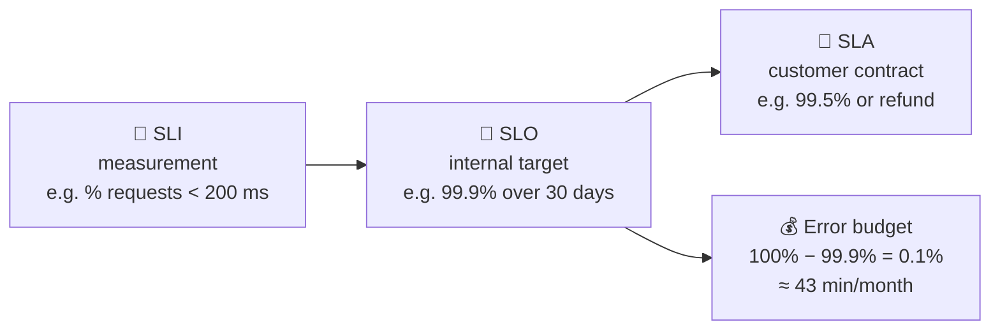

# 007 · SLA, SLO, SLI

> ⏱ 7 min · 📈 7% · 🅰️ Part A (core) · Phase 01: Foundations
>
> `█░░░░░░░░░░░░░░░░░░░` 7% of the whole guide

---

## 📖 Story

The contract is twelve pages long. On page nine, highlighted in yellow, is one line:

> *Vendor guarantees service availability of ______ %.*

A 600-person office wants Pantry for daily staff lunches. It's the biggest deal Maya has ever seen. Her pen hovers over the blank. Her hand wants to write **100**.

Then she remembers last Saturday: the dead power supply and the 40 dark minutes. If she writes 100, she is in breach of contract the first time a cable wiggles.

She puts the pen down. I was proud of her. I once signed something like that and spent a quarter paying refunds.

Here's the difference between what you *measure*, what you *aim for*, and what you *promise*.

## 🎯 One-sentence idea

**An SLI is what you measure, an SLO is the target you aim for, and an SLA is the promise you make to customers with penalties attached. The gap between 100% and your SLO is an error budget you're allowed to spend.**

## 🧸 Analogy

A **pizza delivery** shop:

- 📏 **SLI:** "How long did each delivery actually take?" You measure it.
- 🎯 **SLO:** "99% of deliveries under 30 minutes." The internal goal.
- 📜 **SLA:** "Over 45 minutes and the pizza's free." The customer promise, with a penalty.

The SLA is **looser** than the SLO, so you have a safety margin before you start paying out.

## 🖼️ Visual

*Diagram brief:* three nested rings. The innermost is the measured SLI, the middle is the SLO target, and the outermost (loosest) is the SLA. A fuel gauge to the side shows the remaining error budget.



## 🔬 How it works

- **SLI = good events ÷ total events**, always a ratio, measured at the edge closest to the user. Examples: non-5xx ÷ all requests (availability), requests < 300 ms ÷ all (latency), data younger than 1 min ÷ all reads (freshness).
- **SLO = an SLI target over a rolling window**, e.g. "99.9% of checkout requests succeed over 30 days." Choose it from the **user's view**: "can they check out?", not "is CPU < 80%?"
- **SLA = a business contract** with credits or refunds if broken. It is always **looser than the SLO**, so engineering sees the SLO breach first.
- **Error budget = 1 − SLO.** If budget remains, **ship features**. If it's exhausted, **freeze risky changes** and spend the time on reliability.
- **Alert on burn rate, not blips:** page when the budget is burning fast enough to empty early (e.g. 14× the normal rate over 1 h), not on single error spikes.

## 🧩 Worked example

**Pantry checkout API, 10M requests/month:**

```
SLI (availability) = non-5xx responses ÷ total responses
SLO                = 99.9% over 30 days
Error budget       = 0.1% × 10M = 10,000 failed requests/month ≈ 43 min of full outage

SLI (latency)      = requests < 300 ms ÷ total
SLO                = 99% under 300 ms

SLA (to the office) = 99.5% monthly, else a 10% credit
```

On day 12, a bad deploy throws 6,000 errors → **60% of the budget is gone**. Maya pauses feature launches and adds a canary stage (lesson 068) before she ships anything else.

## ⚖️ Trade-offs

| Maya's choice | What she gains | What she pays |
|---|---|---|
| Tight SLO (99.99%) | Users almost never see failure | Slow releases, expensive redundancy |
| Loose SLO (99%) | Fast iteration, low cost | More user-visible failures |
| Error-budget policy | An objective rule for "ship vs stabilize" | Discipline, plus product and engineering agreeing to follow it |

## 🌍 Real world

- **Google SRE** popularized SLOs and error budgets, with the line: "100% is the wrong reliability target for basically everything."
- **AWS, GCP, and Azure** publish SLAs (e.g. 99.99% for multi-AZ databases) with service credits as the penalty.

## 📌 Cheat card

> - **I**ndicator = **I** measure. **O**bjective = **O**ur goal. **A**greement = **A** contract.
> - **SLI = good ÷ total.** Always a ratio.
> - **SLA < SLO < 100%.** Keep a margin.
> - **Error budget = 1 − SLO.** Budget left → ship. Budget gone → stabilize.
> - 99.9%/month ≈ **43 min**. 99.99%/month ≈ **4.3 min**.

## 🧪 Feynman check

Explain SLI, SLO, and SLA with the pizza shop, and say why the SLA must be looser than the SLO.

⚠️ **Common confusion:** Using "SLA" to mean "our target." Engineers live by **SLOs**. SLAs are legal and financial promises. A related trap: an SLO with no **window** ("99.9%") is meaningless. "99.9% over 30 rolling days" is an SLO.

## ⚡ Quick recall

1. What's the error budget for a 99.95% SLO over 1M requests?
<details><summary>Reveal Answer</summary>

0.05% × 1M = **500 failed requests**.
</details>

2. Why should an SLA be looser than the SLO?
<details><summary>Reveal Answer</summary>

So you detect and fix problems (an SLO breach) before you owe customers money (an SLA breach).
</details>

3. Give an example of a latency SLI.
<details><summary>Reveal Answer</summary>

"The proportion of requests served in under 200 ms."
</details>

## 🎤 Interview practice

**Q. "Define SLOs for a URL shortener, then tell me what happens if your team burns the entire monthly error budget in week one."**
<details><summary>Model answer</summary>

- **SLOs by user journey:**
  - **Redirect availability:** 99.99% of redirects return 301/302. It sits in front of every click.
  - **Redirect latency:** 99% under **50 ms**. It must feel invisible.
  - **Create-link availability:** 99.9%. It's less critical, and users can retry.
  - **Durability:** a created link is never lost.
  - Measure all of these at the **edge/load balancer** with status-code counters and latency histograms.
- **Budget burned in week one:**
  - Invoke the **error-budget policy**: freeze risky launches, and redirect engineering to reliability work (postmortem actions, tests, canaries, rollback automation).
  - **Find the cause:** was it a deploy, a dependency, or a capacity shortfall?
  - Normal release speed **resumes when the rolling window recovers**.
  - If the business insists on shipping anyway, leadership **explicitly accepts the risk**. If the SLO is never achievable, **renegotiate it**. Don't quietly ignore it.
- **Likely follow-up:** "How do you alert on this?" → multi-window burn-rate alerts (e.g. 2% of budget gone in 1 h → page; 5% in 6 h → ticket).
</details>

## 📖 Teaser

> 📖 *The contract is signed. Now Maya has a whiteboard covered in feature ideas, and she must decide what Pantry actually has to do, and how well.*

---

⬅️ [006 · Availability & the Nines](006-availability-and-nines.md) · 🗺️ [Phase map](README.md) · ➡️ [008 · Requirements](008-requirements.md)

✅ **Safe stopping point.** Tick lesson 007 in [PROGRESS.md](../../PROGRESS.md).
