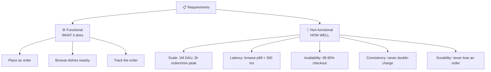

# 008 · Functional vs Non-Functional Requirements

> ⏱ 8 min · 📈 8% · 🅰️ Part A (core) · Phase 01: Foundations
>
> `█░░░░░░░░░░░░░░░░░░░` 8% of the whole guide

---

## 📖 Story

The whiteboard looks like a crime-scene wall. Sticky notes everywhere, connected by frantic marker lines: **chat with cooks**, **live courier map**, **recipe videos**, **cooking classes**, **loyalty points**, **AI meal planner**.

Maya's fingers twitch toward the marker. She wants to draw boxes. Servers. Databases. Arrows. The fun part.

She stops herself with the cap still on.

Last month she would have drawn for three hours and built the wrong thing. Now she knows the most expensive line of code is the one that solves a problem nobody had. So she turns her back on the wall, opens a blank page, and writes two headings: **WHAT** and **HOW WELL**.

You and she have already learned this from me: don't draw a system before you know what it's for.

## 🎯 One-sentence idea

**Functional requirements say *what* the system does, non-functional requirements say *how well* it must do it (scale, speed, uptime, consistency), and you pin down both before drawing a single box.**

## 🧸 Analogy

Building a **house**:

- 🏠 **Functional:** 3 bedrooms, a kitchen, a garage. *Which rooms exist.*
- 🧱 **Non-functional:** survives an earthquake, heats up in 10 minutes, costs < $300k, lasts 50 years. *How good it is.*

Two houses with identical rooms can be built completely differently. **Non-functionals shape the architecture.**

## 🖼️ Visual

*Diagram brief:* a tree that splits "Requirements" into two branches. The left branch (WHAT) holds feature verbs. The right branch (HOW WELL) holds measurable targets with numbers.

## 🔬 How it works

- **Functional = verbs** (*order, browse, pay, message, track*). In an interview, pick the **top 3** and state what's explicitly **out of scope**.
- **Non-functional = measurable adjectives:** scale (users, QPS, data size), latency (p99), availability (nines), consistency (strong vs eventual, lesson 053), durability, security, cost, compliance.
- **Non-functionals choose the architecture, and functionals choose the APIs.** "Never double-charge" → transactions + idempotency. "Global, < 100 ms" → CDN + multi-region. "Eventual is fine" → caches and async replication are allowed.
- **The two most useful early questions** are the **read/write ratio** and the **access pattern** (by key? by range? by location? full-text?).
- **Write assumptions down and get a nod.** They're your contract with the interviewer or stakeholder.

## 🧩 Worked example

**Maya's page for Pantry v2:**

| Type | Requirement |
|---|---|
| Functional (in) | Browse dishes near me · Place and pay for an order · Track order status |
| Functional (out) | Chat, video, classes, loyalty, AI planner. *Later.* |
| Scale | 1M DAU, browse:order ≈ 100:1, peak **2,000 orders/min** at 7 p.m. |
| Latency | Browse p99 < 300 ms. Checkout p99 < 1 s. |
| Availability | 99.95% for checkout. Browse may serve stale data during incidents. |
| Consistency | **Strong** for payment and dish stock. **Eventual** for ratings and "popular now". |
| Durability | A confirmed order must never be lost. |

**Design consequences that are already visible:** read-heavy browsing → cache + CDN. Strong payments → transactions + idempotency keys. Order tracking → a status store plus push updates.

## ⚖️ Trade-offs

| Maya's choice | What she gains | What she pays |
|---|---|---|
| Narrow scope | Ships fast, stays focused | Risk of missing what the stakeholder wanted, so confirm it |
| Strict non-functionals | Strong guarantees | Far more complex and expensive design |
| Relaxed consistency | Speed, availability, low cost | Users may briefly see stale data |

## 🌍 Real world

- Design docs at **Google, Amazon, and Meta** open with **Goals / Non-goals** and **Requirements** sections, exactly like this.
- Amazon's **"working backwards"** process starts from the customer press release and FAQ, which are requirements written before any code.

## 📌 Cheat card

> - **Functional = verbs. Non-functional = measurable adjectives.**
> - Must-ask: **Who uses it? How many? Read- or write-heavy? Consistency or availability? Latency target? Can data ever be lost?**
> - **Top 3 features + explicit out-of-scope.**
> - Spend **≤ 5 minutes** on requirements in an interview, then move on.

## 🧪 Feynman check

Pick an app you use daily. Say out loud 3 functional requirements, 3 *measurable* non-functional ones, and which non-functional would be hardest to meet.

⚠️ **Common confusion:** Writing "scalable" or "fast" with no number. A non-functional requirement only counts when it's **measurable**: "p99 < 200 ms at 50k QPS." "Highly available" is a wish, and "99.95% over 30 days" is a requirement.

## ⚡ Quick recall

1. Is "users can reset their password" functional or non-functional?

Reveal Answer

Functional. It's a feature (a verb).

2. Is "99.95% availability" functional or non-functional?

Reveal Answer

Non-functional. It's a quality.

3. Why state out-of-scope features?

Reveal Answer

To keep the design focused, show prioritization, and agree on exactly what problem you're solving.

## 🎤 Interview practice

**Q. "Design a ride-sharing app." What do you ask in the first five minutes, and which answer changes the architecture most?**

Model answer

- **Features:** request a ride, match with a driver, live tracking, pricing, payments. Confirm which 3 are in scope. Ratings, pooling, and scheduling are out.
- **Scale:** riders, drivers, concurrent trips, and cities. E.g. 20M riders, 2M drivers, 500k concurrent trips.
- **Update frequency:** drivers send GPS every **3–5 s**. 1M active drivers ÷ 4 s ≈ **250k location writes/s**.
- **Latency:** match within a few seconds. Map updates feel live (< 1 s).
- **Consistency:** a driver must **never be double-assigned** (strong, per driver). Location can be **eventual**.
- **Availability:** matching must be highly available. Payments can settle asynchronously.
- **The one that changes the architecture:** **250k location writes/s plus "drivers near me" queries**. That forces an in-memory **geo-index** (geohash/S2/H3 cells, lesson 095) rather than a SQL table, and pushes trip state onto a separate, strongly consistent path.
- **Likely follow-up:** "What if the interviewer says 'you decide'?" → propose explicit numbers, get a quick OK, and move on in under 5 minutes.

## 📖 Teaser

> 📖 *Chapter 2 is next. Pantry's first customers are about to arrive from far away, and Maya's packets are about to cross the internet without her.*

---

⬅️ [007 · SLA, SLO, SLI](007-sla-slo-sli.md) · 🗺️ [Phase map](README.md) · ➡️ [009 · IP, Ports & Packets](../02-networking/009-ip-ports-packets.md)

✅ **Safe stopping point.** Tick lesson 008 in [PROGRESS.md](../../PROGRESS.md). 🎉 **Phase 01 complete!** Skim the [Phase 01 cheatsheet](CHEATSHEET.md) and try the [interview bank](INTERVIEW-QUESTIONS.md).
