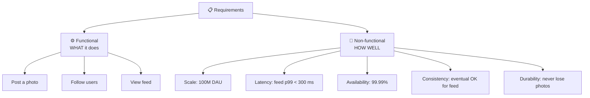

# 008 · Functional vs Non-Functional Requirements

> ⏱ 8 min · 📈 8% · 🅰️ Part A (core) · Phase 01: Foundations
>
> `█░░░░░░░░░░░░░░░░░░░` 8% of the whole guide

---

## 📖 Story

Leo's whiteboard is covered in dreams: chat with cooks, live courier maps, recipe videos, cooking classes. Maya itches to start drawing boxes and arrows. But you and she have learned something already: don't draw a system before you know what it's *for*. So she sits Leo down and asks questions first.

## 🎯 One-sentence idea

**Functional requirements say *what* the system does (features). Non-functional requirements say *how well* it does it (scale, speed, uptime, consistency). You must pin both down before drawing a single box.**

## 🧸 Analogy

Building a **house**:

- 🏠 **Functional:** 3 bedrooms, a kitchen, a garage. *What rooms exist.*
- 🧱 **Non-functional:** survives earthquakes, heats up in 10 minutes, costs < $300k, lasts 50 years. *How good it is.*

Two houses can have the same rooms but be built completely differently because of the non-functionals. **Non-functionals shape the architecture.**

## 🖼️ Visual

## 🔬 How it works

- **Functional** = verbs the user can do: *upload, search, pay, message, follow*. In interviews, **pick the top 3** and say what's **out of scope**.
- **Non-functional** = qualities. The usual list:
  - **Scale:** users, QPS, data size, growth
  - **Performance:** latency targets (p99)
  - **Availability:** how many nines
  - **Consistency:** strong vs eventual (lesson 053)
  - **Durability:** can we ever lose data?
  - **Security & privacy**, **cost**, **maintainability**, **compliance**
- **Non-functionals drive the design:** "must never double-charge" → transactions/idempotency. "Global users, < 100 ms" → CDN + multi-region. "Eventual is fine" → caches and async replication are allowed.
- **Read/write ratio** and **access patterns** are the most useful questions to ask early.
- **Write assumptions down.** They're your contract with the interviewer or stakeholder.

## 🧩 Worked example

**Prompt:** "Design Instagram."

✅ **Clarified requirements:**

| Type | Requirement |
|---|---|
| Functional (in) | Upload photo with caption · Follow users · Home feed of followed users' photos |
| Functional (out) | Stories, DMs, video, ads, search. *Out of scope for now.* |
| Scale | 500M DAU, 100M photo uploads/day, feed views ≈ 100× uploads |
| Latency | Feed loads p99 < 500 ms. Upload may take a few seconds. |
| Availability | 99.99% for viewing. Uploads can degrade briefly. |
| Consistency | **Eventual** for feeds (a few seconds' delay is fine). **Strong** for "my own upload shows in my profile" (read-your-writes). |
| Durability | Photos must never be lost. |

**Design consequences, already visible:** read-heavy → caching + precomputed feeds; media → object storage + CDN; eventual consistency → async fan-out via queues.

## ⚖️ Trade-offs

| You gain | You pay | Use it when |
|---|---|---|
| Narrow scope | Might miss what the interviewer wanted | Always. Confirm it with them. |
| Stricter non-functionals | Much more complex/expensive design | The business truly needs it |
| Relaxed consistency | Users may briefly see stale data | Social, analytics, counters |

## 🌍 Real world

- Real design docs at big tech companies start with **Goals / Non-goals** and **Requirements** sections, exactly like this.
- Most failed projects didn't fail on tech. They built the wrong thing or ignored a non-functional (e.g., compliance).

## 📌 Cheat card

> - **Functional = verbs. Non-functional = adjectives.**
> - Must-ask questions: **Who uses it? How many? Read- or write-heavy? Consistency or availability? Latency target? Can data be lost?**
> - **Top 3 features + explicit out-of-scope.**
> - **Non-functionals choose the architecture.** Functionals choose the APIs.

## 🧪 Feynman check

Pick an app you use daily (e.g., WhatsApp). Say out loud: 3 functional requirements, 3 non-functional ones, and which non-functional would be hardest to meet.

⚠️ **Common confusion:** Listing "scalable" or "fast" without numbers. A non-functional requirement is only useful when it's **measurable**: "p99 < 200 ms at 50k QPS".

## ⚡ Quick recall

1. Is "users can reset their password" functional or non-functional?

Answer

Functional (it's a feature/verb).

2. Is "99.95% availability" functional or non-functional?

Answer

Non-functional (a quality).

3. Why state out-of-scope features?

Answer

To keep the design focused, to show prioritization, and to agree with the interviewer or stakeholder on what you're solving.

## 🎤 Interview practice

**Q1. "Design a ride-sharing app." What questions do you ask before designing?**

Model answer

- **Features:** request a ride, match with a driver, live location tracking, pricing, payments? Which are in scope?
- **Scale:** how many riders and drivers, and how many concurrent trips? Which cities or countries?
- **Latency:** how fast must matching be (a few seconds)? How often do locations update (every 3–5 s)?
- **Consistency:** a driver must never be double-assigned (strong for matching). Location can be eventual.
- **Availability:** matching must be highly available. Payments can be async.
- **Likely follow-up:** "Which requirement drives the design most?" → high-frequency location updates plus nearby search → geo-indexing (lesson 095).

**Q2. "The interviewer says 'you decide the requirements.' What do you do?"**

Model answer

- Propose a **reasonable, explicit set**: top 3 features, realistic scale (e.g., 10M DAU), latency and availability targets, consistency needs.
- Say them out loud and **ask for a quick OK**. Then move on. Don't spend more than about 5 minutes.
- Choose requirements that let you show interesting trade-offs (e.g., read-heavy with a hot-key problem).
- **Likely follow-up:** "What if scale were 100× bigger?" → explain what would change (sharding, caching tiers, multi-region).

> 📖 *Next time: Chapter 2 begins. Pantry's first customers are about to arrive from far away, across the internet.*

---

⬅️ [007 · SLA, SLO, SLI](007-sla-slo-sli.md) · 🗺️ [Phase map](README.md) · ➡️ [009 · IP, Ports & Packets](../02-networking/009-ip-ports-packets.md)

✅ **Safe stopping point.** Tick lesson 008 in [PROGRESS.md](../../PROGRESS.md). 🎉 **Phase 01 complete!** Skim the [Phase 01 cheatsheet](CHEATSHEET.md) and try the [interview bank](INTERVIEW-QUESTIONS.md).
