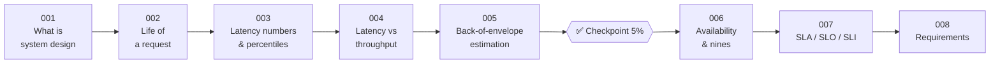

# 🧱 Phase 01: Foundations

> **Lessons 001–008 · 1% → 8% · 🅰️ Part A (core)**
> By the end of this phase you'll **think in trade-offs**, **estimate scale on a napkin**, and **speak the language** of latency and availability.

| # | Lesson | ⏱ | One-line idea |
|---|---|---|---|
| 001 | [What is system design?](001-what-is-system-design.md) | 7 min | Arranging building blocks so software stays fast, correct, and alive at scale, by picking trade-offs |
| 002 | [Client–server & the life of a request](002-life-of-a-request.md) | 8 min | Every click travels through DNS, a network, servers, and a database, and each hop costs time |
| 003 | [Latency numbers & percentiles](003-latency-numbers-and-percentiles.md) | 9 min | Know which operations are 1000× slower, and judge speed by p99 rather than averages |
| 004 | [Latency vs throughput vs bandwidth](004-latency-throughput-bandwidth.md) | 8 min | How long one takes, how many per second, and how wide the pipe is: three different things |
| 005 | [Back-of-envelope estimation](005-back-of-envelope-estimation.md) | 10 min | Rough math tells you if you need 1 server or 1,000 |
| ✅ | [Checkpoint 5%](checkpoint-05.md) | 15 min | |
| 006 | [Availability & the nines](006-availability-and-nines.md) | 8 min | 99.9% sounds great until you learn it means about 9 hours down per year |
| 007 | [SLA, SLO, SLI](007-sla-slo-sli.md) | 7 min | Measure it (SLI), aim for it (SLO), promise it (SLA) |
| 008 | [Functional vs non-functional requirements](008-requirements.md) | 8 min | *What* it does vs *how well* it does it. Decide both before you draw anything |

📌 [Phase cheatsheet](CHEATSHEET.md) · 🎤 [Phase interview questions](INTERVIEW-QUESTIONS.md)

➡️ Next phase: [02 Networking essentials](../02-networking/README.md)
