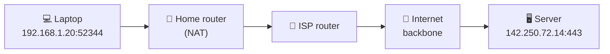

# 009 · IP, Ports & Packets

> ⏱ 8 min · 📈 9% · 🅰️ Part A (core) · Phase 02: Networking Essentials
>
> `█░░░░░░░░░░░░░░░░░░░` 9% of the whole guide

---

## 📖 Story

The order notification chimes at 9:14 p.m. The delivery address is **300 kilometres away**, in a city Maya has never visited.

She leans back and the hair on her arms stands up. That message, *one lasagna, extra basil*, was sliced into fragments, flung across fibre-optic cables under highways, bounced through a dozen anonymous machines in buildings she'll never see, and reassembled perfectly on her little server.

Nobody hand-carried it. Nobody gave it directions.

So how did it know where to go? And when it arrived, how did it find *Pantry* among all the programs on that machine, rather than Postgres or SSH?

I still find this part of the internet quietly beautiful. Let me show you its addressing system.

## 🎯 One-sentence idea

**Every network interface has an IP address, every program listens on a port, and data travels in small packets that routers forward hop by hop toward the destination.**

## 🧸 Analogy

Sending mail to an **apartment building**:

- 🏢 **IP address** = the building's street address (`142.250.72.14`)
- 🚪 **Port** = the apartment number (`443` = HTTPS, `5432` = Postgres)
- ✉️ **Packets** = your long letter split into numbered envelopes
- 📮 **Routers** = post offices, each forwarding the envelope one step closer

## 🖼️ Visual

*Diagram brief:* a laptop on the left, a server on the right, and a chain of post-office routers between them. Under it, a four-layer cake showing where IPs and ports live.



```
┌──────────────────────────────┐
│ Application  HTTP, DNS, gRPC │  ← what your code speaks
├──────────────────────────────┤
│ Transport    TCP, UDP        │  ← ports live here
├──────────────────────────────┤
│ Network      IP              │  ← addresses & routing
├──────────────────────────────┤
│ Link         Ethernet, Wi-Fi │  ← the physical hop
└──────────────────────────────┘
```

## 🔬 How it works

- **IPv4** is 32 bits (`10.0.0.5`, ~**4.3 billion** addresses, long exhausted). **IPv6** is 128 bits (`2001:db8::1`, effectively unlimited).
- **Private ranges** (`10/8`, `172.16/12`, `192.168/16`) are only routable inside a network. **NAT** rewrites addresses and ports so that many private devices share one public IP.
- **Ports (0–65535)** pick the *program*: **80 HTTP, 443 HTTPS, 22 SSH, 53 DNS, 5432 Postgres, 3306 MySQL, 6379 Redis**. A connection is uniquely identified by its **5-tuple**: src IP, src port, dst IP, dst port, protocol.
- **Packets** are capped by the **MTU (~1,500 bytes on Ethernet)**. Each one is routed independently, so they can arrive late, out of order, or not at all. TCP repairs that (lesson 010).
- **Routing** is hop by hop: each router matches the destination IP against its routing table (longest prefix wins) and forwards to the next hop. `traceroute` reveals the chain.

## 🧩 Worked example

```bash
$ dig +short example.com                # name → IP
93.184.215.14

$ traceroute example.com                # the hop chain
 1  192.168.1.1     1 ms   (home router)
 2  10.20.0.1       8 ms   (ISP)
 ...
 9  93.184.215.14  32 ms   (destination)

$ ss -ltnp                              # who listens on which port?
LISTEN 0.0.0.0:443     users:(("nginx"))
LISTEN 127.0.0.1:5432  users:(("postgres"))   ← localhost only: unreachable from the internet
```

A 1 MB image on a 1,500-byte MTU ≈ **~700 packets**. Lose one and TCP must notice it and resend it.

## ⚖️ Trade-offs

| Maya's choice | What she gains | What she pays |
|---|---|---|
| Private IPs + NAT | The DB and app servers are invisible to attackers | Harder to reach from outside; a NAT gateway to run |
| Public IPs | Directly reachable | Every open port is attack surface |
| IPv6 | A huge address space, no NAT | Some legacy tooling and firewall friction |

## 🌍 Real world

- **AWS VPCs:** app servers and databases live in **private subnets**. Only the load balancer has a public IP.
- **Kubernetes** gives every pod its own IP, and Services get stable virtual IPs.
- **Mobile carriers** run **CGNAT**, so thousands of phones share a handful of public IPv4 addresses.

## 📌 Cheat card

> - **IP = building, Port = apartment, Packet = envelope, Router = post office.**
> - Ports: **80 HTTP · 443 HTTPS · 22 SSH · 53 DNS · 5432 PG · 3306 MySQL · 6379 Redis**.
> - **MTU ≈ 1,500 B.** IPv4 ≈ **4.3B** addresses.
> - **Only expose what must be public.** Databases bind to **private IPs or localhost**.

## 🧪 Feynman check

Explain how a message from your laptop finds the right *program* on a server across the world, using the apartment building.

⚠️ **Common confusion:** "An IP identifies a computer." It identifies a **network interface**. One machine can have many IPs, and thousands of machines can hide behind one IP (NAT, load balancers).

## ⚡ Quick recall

1. What's the difference between an IP and a port?
<details><summary>Reveal Answer</summary>

The IP identifies the interface/machine on the network. The port identifies the specific program on that machine.
</details>

2. What does NAT do?
<details><summary>Reveal Answer</summary>

It lets many privately addressed devices share one public IP by rewriting addresses and ports as traffic passes through.
</details>

3. Why can packets arrive out of order?
<details><summary>Reveal Answer</summary>

Each packet is routed independently and may take a different path, be delayed, or be retransmitted.
</details>

## 🎤 Interview practice

**Q. "Lay out the network for a web app in the cloud. Then: can a single server hold more than 65,535 connections?"**
<details><summary>Model answer</summary>

- **Layout:**
  - A **VPC** with **public subnets** (only the load balancer and a NAT gateway) and **private subnets** (app servers, databases, caches), each spread across **≥ 2 availability zones**.
  - **Security groups:** the LB accepts 443 from `0.0.0.0/0`, app servers accept only from the LB's security group, and the DB accepts only from the app security group on 5432.
  - Private instances reach the internet outbound through the **NAT gateway**.
  - Engineers get in through a bastion host or zero-trust proxy. **SSH is never public.**
- **65,535 connections?** **Yes**, on the server side. A connection is the full 5-tuple, so one listening port (443) can accept connections from millions of distinct client IP:port pairs. The real limits are **memory per socket, file descriptors (`ulimit -n`), and TLS CPU**.
- **Where 65k does bite:** the **client** side. One source IP talking to one destination IP:port has only ~64k ephemeral ports. That's the classic problem for a proxy hammering one backend. Fix it with **connection pooling/keep-alive** or **more source IPs**.
- **Likely follow-up:** "How do you tune a box for 1M connections?" → raise fd limits, shrink per-connection buffers, use epoll/event-driven servers, and terminate TLS efficiently.
</details>

## 📖 Teaser

> 📖 *The packets arrive, but some of Pantry's data must arrive perfectly and some just needs to arrive fast, and Maya has to choose between a phone call and a postcard.*

---

⬅️ [008 · Requirements](../01-foundations/008-requirements.md) · 🗺️ [Phase map](README.md) · ➡️ [010 · TCP vs UDP](010-tcp-vs-udp.md)

✅ **Safe stopping point.** Tick lesson 009 in [PROGRESS.md](../../PROGRESS.md).
