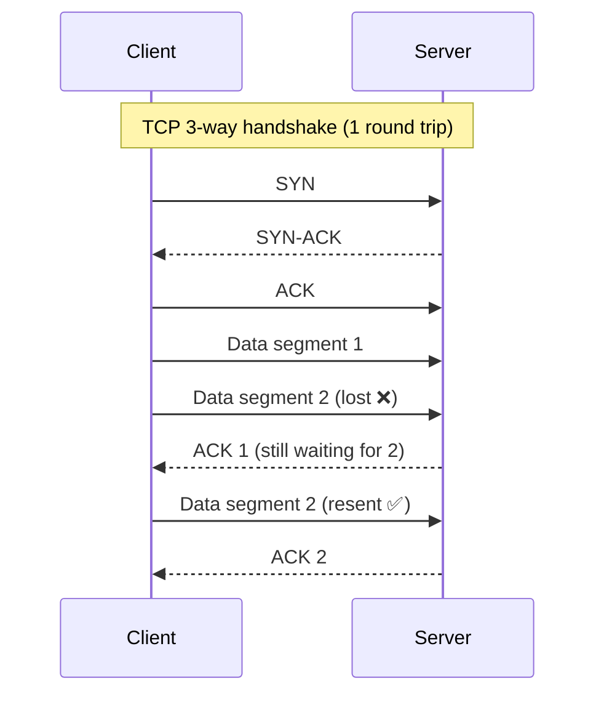
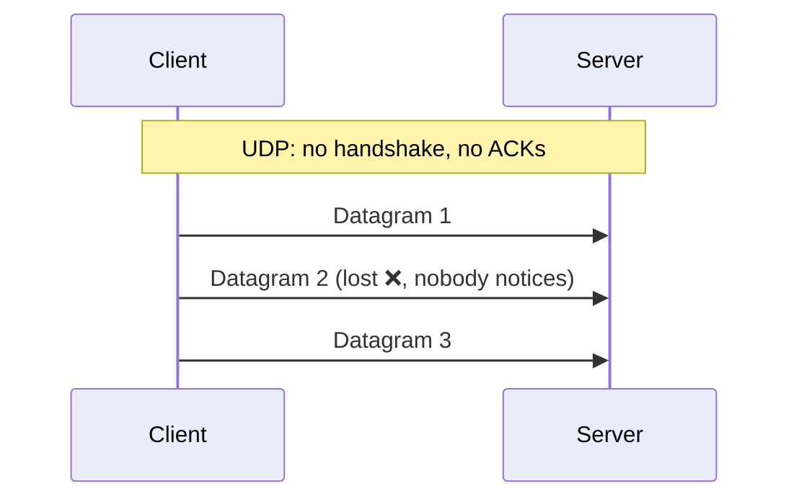

# 010 · TCP vs UDP

> ⏱ 9 min · 📈 10% · 🅰️ Part A (core) · Phase 02: Networking Essentials
>
> `██░░░░░░░░░░░░░░░░░░` 10% of the whole guide

---

## 🎯 One-sentence idea

**TCP is a reliable, ordered connection that resends anything lost (slower but safe). UDP just fires packets with no guarantees (fast but lossy). Pick based on whether a late packet is worse than a missing one.**

## 🧸 Analogy

- 📞 **TCP = a phone call.** You dial, the other person says "hello?", you both confirm. If they miss a word, they ask "sorry, say that again?" Everything arrives, in order.
- 📬 **UDP = throwing postcards.** You just send them. Some get lost, some arrive out of order, and nobody checks. But there's no setup, so it's very fast.

For a **live video call**, a lost frame from 1 second ago isn't worth re-sending, because it's already too late. Postcards win. For a **bank transfer**, every byte matters. The phone call wins.

## 🖼️ Visual





## 🔬 How it works

- **TCP (Transmission Control Protocol):**
  - **Connection setup:** 3-way handshake (SYN → SYN-ACK → ACK) costs **1 RTT** before any data.
  - **Reliable:** sequence numbers + ACKs + retransmission. Lost data is resent.
  - **Ordered:** the receiver reassembles bytes in order.
  - **Flow control** (don't overwhelm the receiver) and **congestion control** (don't overwhelm the network).
  - **Head-of-line blocking:** if packet 2 is lost, packets 3, 4, 5 wait, even if they already arrived.
- **UDP (User Datagram Protocol):**
  - **No handshake, no ACKs, no ordering, no retransmission.** Just "here's a datagram."
  - Tiny header (8 bytes vs TCP's 20+), and low latency.
  - Apps add *only* the reliability they need (e.g., QUIC adds it back, smartly).
- **QUIC / HTTP/3:** built on UDP, with its own reliability and encryption, and **no head-of-line blocking across streams**. Best of both.

## 🧩 Worked example

**Choosing protocols for a multiplayer game:**

| Data | Protocol | Why |
|---|---|---|
| Player position (60×/second) | **UDP** | The next update replaces the old one, so resending stale positions is pointless |
| Voice chat | **UDP** | A 50 ms glitch beats a 500 ms delay |
| Chat messages | **TCP** | Every message must arrive, in order |
| In-game purchases | **TCP** (HTTPS) | Money, so it must be correct |
| Login | **TCP** (HTTPS) | Security + reliability |

A tiny UDP sender in Python, to show how little setup it needs:

```python
import socket
s = socket.socket(socket.AF_INET, socket.SOCK_DGRAM)   # DGRAM = UDP
s.sendto(b"player:42 x=10 y=7", ("game.example.com", 9000))  # no connect, no handshake
```

## ⚖️ Trade-offs

| | TCP | UDP |
|---|---|---|
| Reliability | ✅ Guaranteed delivery | ❌ Best effort |
| Order | ✅ In order | ❌ Any order |
| Setup cost | 1 RTT handshake | None |
| Latency under loss | Higher (retransmits, HOL blocking) | Lower |
| Use it when | Web, APIs, DBs, file transfer, email | Video/voice calls, games, DNS, metrics, streaming |

## 🌍 Real world

- **HTTP/1.1 and HTTP/2** run on TCP. **HTTP/3** runs on **QUIC over UDP** (Google, Cloudflare, most big sites).
- **DNS** uses UDP for most queries (small, fast), and falls back to TCP for large responses.
- **Zoom, WebRTC, online games** use UDP. **StatsD** sends metrics over UDP, where losing a few is fine.

## 📌 Cheat card

> - **TCP = phone call** (reliable, ordered, handshake). **UDP = postcards** (fast, fire-and-forget).
> - Ask: **"Is late data worse than lost data?"** Yes → UDP. No → TCP.
> - TCP handshake = **1 RTT**, plus TLS.
> - **Head-of-line blocking** is TCP's weakness, and QUIC/HTTP/3 fixes it.
> - Defaults: **APIs/DBs → TCP · real-time media/games → UDP**.

## 🧪 Feynman check

Explain to a friend why a video call app would *rather lose* a bit of data than wait for it to be resent.

⚠️ **Common confusion:** "UDP is unreliable, so it's bad." UDP is **simple**. Reliability is a *feature you may not need*, and it costs latency. Many modern protocols (QUIC) build smarter reliability on top of UDP.

## ⚡ Quick recall

1. What does the TCP 3-way handshake cost before data can flow?
<details><summary>Answer</summary>

One round trip (SYN → SYN-ACK → ACK).
</details>

2. What is head-of-line blocking?
<details><summary>Answer</summary>

When one lost packet makes all the later (already received) data wait until the lost one is retransmitted, because TCP delivers bytes in order.
</details>

3. Why does DNS usually use UDP?
<details><summary>Answer</summary>

Queries and answers are tiny and one-shot. A handshake would double the latency. If one's lost, the client simply asks again.
</details>

## 🎤 Interview practice

**Q1. "Would you use TCP or UDP for a live-streaming sports app? What about for the chat next to it?"**
<details><summary>Model answer</summary>

- **Live video (ultra-low latency):** UDP-based (WebRTC or QUIC-based protocols). Late frames are useless, so accept small losses.
- **Standard live streaming** (a few seconds of delay is OK): often **HLS/DASH over HTTP (TCP)**, since it's easier to scale via CDNs.
- **Chat:** TCP (WebSocket over TCP). Messages must arrive, in order.
- **Likely follow-up:** "How do you handle packet loss in UDP video?" → forward error correction, adaptive bitrate, and the codec concealing lost frames.
</details>

**Q2. "HTTP/3 uses UDP. Isn't that unreliable for web pages?"**
<details><summary>Model answer</summary>

- HTTP/3 uses **QUIC**, which implements reliability, ordering (per stream), congestion control, and TLS 1.3 **on top of UDP**.
- It uses UDP because it avoids **TCP head-of-line blocking** across multiplexed streams, allows **faster handshakes** (combined transport + TLS, 0-RTT resumption), and supports **connection migration** (a phone switching Wi-Fi → 4G keeps its connection).
- **Likely follow-up:** "Any downsides?" → some networks and firewalls block or throttle UDP, and it's more CPU-heavy in user space. Browsers fall back to HTTP/2.
</details>

---

⬅️ [009 · IP, Ports & Packets](009-ip-ports-packets.md) · 🗺️ [Phase map](README.md) · ➡️ [✅ Checkpoint 10%](checkpoint-10.md)

✅ **Safe stopping point.** Tick lesson 010 in [PROGRESS.md](../../PROGRESS.md), then do the checkpoint!
