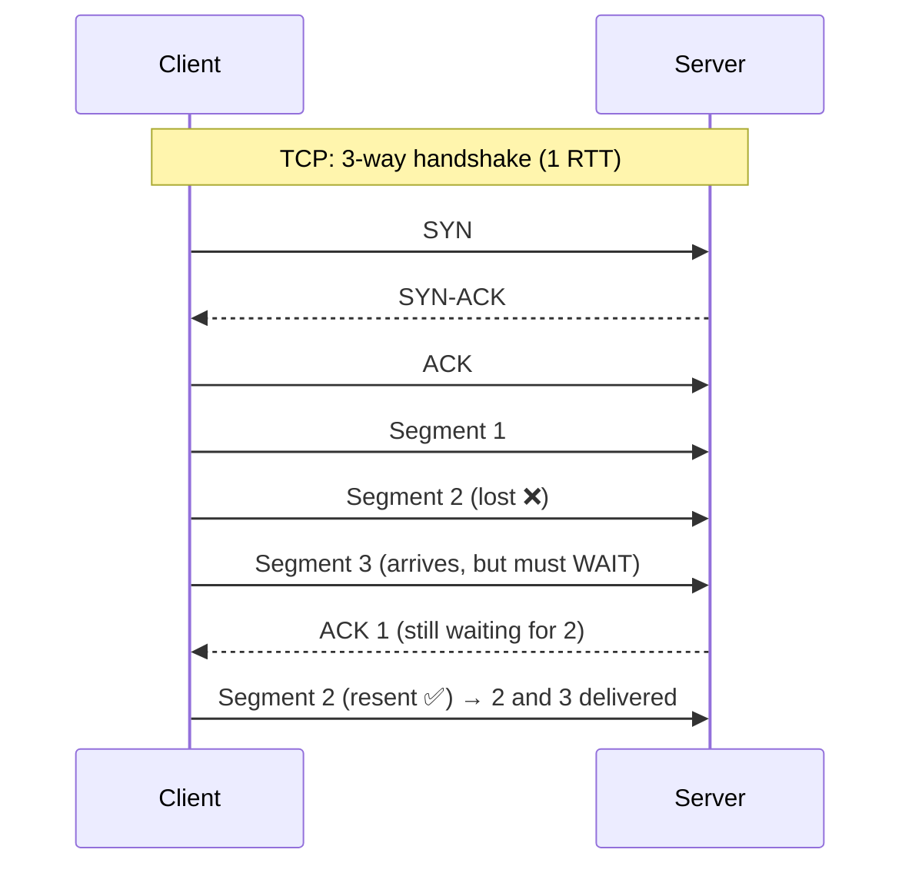
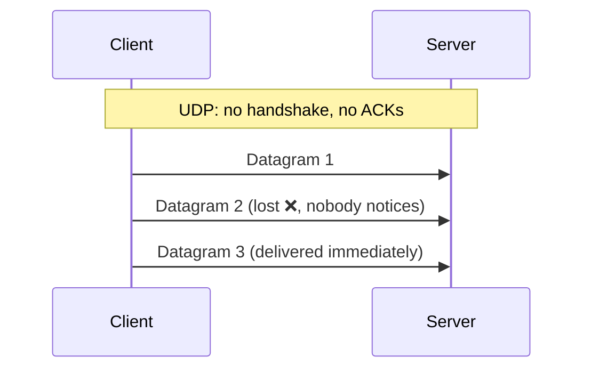

# 010 · TCP vs UDP

> ⏱ 9 min · 📈 10% · 🅰️ Part A (core) · Phase 02: Networking Essentials
>
> `██░░░░░░░░░░░░░░░░░░` 10% of the whole guide

---

## 📖 Story

Maya is building Pantry's **live courier map**: a little scooter icon gliding across the street grid toward your door.

In testing, the scooter doesn't glide. It **freezes**. For two full seconds it sits motionless at an intersection. Then it **teleports** half a block, stuttering through four stale positions in a blur.

She digs in. One GPS packet got lost on a flaky mobile connection. Her protocol, TCP, refused to deliver the *newer* positions until the *old* lost one had been resent. Fresh data was stuck behind stale data like cars behind a stalled truck.

Meanwhile, her order data, *one lasagna, card ending 4421*, absolutely must arrive perfectly, in order, every time.

Two kinds of data with two completely different needs. I'll show you the two ways to send bytes across the internet, and why each one suits its job.

## 🎯 One-sentence idea

**TCP is a reliable, ordered connection that resends anything lost, and UDP fires packets with no guarantees, so you pick based on whether late data is worse than missing data.**

## 🧸 Analogy

- 📞 **TCP = a phone call.** You dial, they answer, you both confirm. Miss a word? "Sorry, say that again?" Everything arrives, in order.
- 📬 **UDP = throwing postcards.** No setup, no confirmation. Some get lost or arrive out of order. But it's instant.

For a live map, a position from 2 seconds ago is worthless, so postcards win. For a payment, every byte matters, so the phone call wins.

## 🖼️ Visual

*Diagram brief:* two side-by-side timelines. On the left, TCP: a handshake, then a lost segment that blocks everything behind it until it's resent. On the right, UDP: datagrams flying with no ACKs, and a lost one simply gone.





## 🔬 How it works

- **TCP setup costs 1 RTT** (SYN → SYN-ACK → ACK) before any data, plus TLS on top. **UDP has no setup**: the first packet carries data.
- **TCP is reliable and ordered:** sequence numbers, ACKs, and retransmission timers guarantee every byte arrives, in order. It also does **flow control** (protect the receiver) and **congestion control** (protect the network: slow start, backoff on loss).
- **TCP's weakness is head-of-line (HOL) blocking:** one lost segment stalls every later byte, even ones that already arrived. That's exactly Maya's frozen scooter.
- **UDP is a bare datagram:** an 8-byte header (vs TCP's 20+), with no ordering, no ACKs, and no retransmits. The application adds *only* the reliability it needs.
- **QUIC (HTTP/3)** rebuilds reliability, congestion control, and TLS 1.3 **on top of UDP**, with independent streams so one loss doesn't block the others, 0-RTT resumption, and connection migration across networks.

## 🧩 Worked example

**Maya's protocol choices:**

| Pantry data | Protocol | Why |
|---|---|---|
| Courier GPS, every 2 s | **UDP** (or WebRTC/QUIC datagrams) | The next update replaces the old one, so resending stale positions is pointless |
| Voice call to the cook | **UDP** (WebRTC) | A 50 ms glitch beats a 500 ms delay |
| Chat messages | **TCP** (WebSocket) | Every message, in order |
| Checkout | **TCP** (HTTPS) | Money must be correct |

The cost of HOL blocking on a lossy mobile link, with 2% loss and a 300 ms retransmit timeout: across 50 updates, P(at least one loss) = 1 − 0.98⁵⁰ ≈ **64%** chance of a visible freeze. With UDP, the map just skips one dot.

```python
import socket
s = socket.socket(socket.AF_INET, socket.SOCK_DGRAM)          # DGRAM = UDP
s.sendto(b"courier:7 lat=51.507 lon=-0.127 t=1730", ("track.pantry.app", 9000))  # no handshake
```

## ⚖️ Trade-offs

| | TCP | UDP |
|---|---|---|
| Reliability | ✅ Guaranteed | ❌ Best effort |
| Order | ✅ In order | ❌ Any order |
| Setup | 1 RTT (+ TLS) | None |
| Latency under loss | High (retransmits, HOL) | Low |
| Use it for | APIs, DBs, files, email, payments | Voice/video, games, DNS, metrics, live telemetry |

## 🌍 Real world

- **HTTP/1.1 and HTTP/2** run on TCP. **HTTP/3** runs on **QUIC over UDP**, at Google, Cloudflare, Meta, and most large sites.
- **DNS** uses UDP for most queries and falls back to TCP for large responses.
- **Zoom, WebRTC, and multiplayer games** use UDP. **StatsD** ships metrics over UDP, where losing a few is acceptable.

## 📌 Cheat card

> - **TCP = phone call** (reliable, ordered, handshake). **UDP = postcards** (fast, fire-and-forget).
> - The deciding question: **"Is late data worse than lost data?"** Yes → UDP. No → TCP.
> - **TCP handshake = 1 RTT**, and TLS 1.3 adds 1 more.
> - **HOL blocking** is TCP's tax. **QUIC** removes it per stream.

## 🧪 Feynman check

Explain why a video call app would *rather lose* a bit of data than wait for it to be resent, and why your bank would never make that choice.

⚠️ **Common confusion:** "UDP is unreliable, so it's bad." UDP is **minimal**. Reliability is a feature you may not need, and it costs latency. QUIC proves you can build *better* reliability on top of UDP than TCP offers.

## ⚡ Quick recall

1. What does the TCP handshake cost before data can flow?
<details><summary>Reveal Answer</summary>

One round trip (SYN → SYN-ACK → ACK).
</details>

2. What is head-of-line blocking?
<details><summary>Reveal Answer</summary>

One lost segment makes all later, already-received data wait until the lost one is retransmitted, because TCP delivers bytes strictly in order.
</details>

3. Why does DNS usually use UDP?
<details><summary>Reveal Answer</summary>

Queries and answers are tiny and one-shot. A handshake would double the latency, and if a packet is lost the client simply asks again.
</details>

## 🎤 Interview practice

**Q. "HTTP/3 runs over UDP. Isn't that unreliable for loading web pages? Why did the industry move to it?"**
<details><summary>Model answer</summary>

- **It isn't unreliable.** HTTP/3 runs on **QUIC**, which implements reliable delivery, per-stream ordering, congestion control, and **TLS 1.3** inside the transport, in user space, **on top of UDP**.
- **Why UDP underneath:**
  - **No cross-stream HOL blocking.** HTTP/2 multiplexes many streams over *one* TCP connection, so a single lost packet stalls every stream. QUIC streams are independent.
  - **Faster setup.** The transport and TLS handshakes are combined into **1 RTT**, and **0-RTT** on resumption, vs 2–3 RTTs for TCP + TLS.
  - **Connection migration.** Connections are identified by a connection ID rather than the 5-tuple, so a phone switching from Wi-Fi to 5G keeps its session.
  - **Deployability.** TCP lives in OS kernels and middleboxes and evolves slowly. QUIC ships in the app and evolves fast.
- **Costs:** some networks block or rate-limit UDP (browsers **fall back to HTTP/2**), and there's higher CPU per byte from user-space crypto and less mature hardware offload.
- **Likely follow-up:** "When would you still pick plain TCP?" → database protocols and internal RPC inside a low-loss datacenter, where HOL blocking rarely triggers and the tooling is mature.
</details>

## 📖 Teaser

> 📖 *Customers type pantry.app, not 93.184.215.14, and Maya is about to find out who does the translating and how badly it can betray her.*

---

⬅️ [009 · IP, Ports & Packets](009-ip-ports-packets.md) · 🗺️ [Phase map](README.md) · ➡️ [✅ Checkpoint 10%](checkpoint-10.md)

✅ **Safe stopping point.** Tick lesson 010 in [PROGRESS.md](../../PROGRESS.md), then do the checkpoint!
