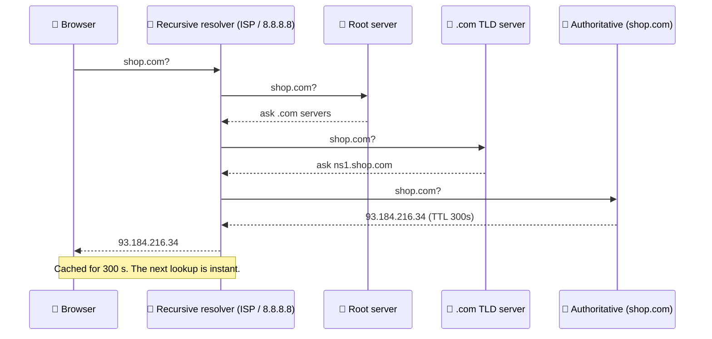

# 011 · DNS: The Internet's Phone Book

> ⏱ 8 min · 📈 11% · 🅰️ Part A (core) · Phase 02: Networking Essentials
>
> `██░░░░░░░░░░░░░░░░░░` 11% of the whole guide

---

## 📖 Story

Leo bought the domain pantry.com and pointed it at the new server. Half the customers saw the new site immediately, and the other half still saw the old one for hours. "Is the internet broken?" he asked. I laughed when I heard it, because I once asked the very same thing. The internet has a phone book, and that phone book is copied everywhere.

## 🎯 One-sentence idea

**DNS translates names like `shop.com` into IP addresses, using a hierarchy of servers and lots of caching. It's also a simple, powerful tool for routing traffic.**

## 🧸 Analogy

Finding a friend's phone number:

1. Check your **own memory** (browser cache).
2. Check your **phone's contacts** (OS cache).
3. Ask the **family know-it-all** (your ISP's recursive resolver).
4. The know-it-all asks the **national directory** (root) → the **".com" section** (TLD) → **the company's own receptionist** (authoritative server), who finally gives the number.
5. Everyone **remembers it for a while** (TTL), so next time it's instant.

## 🖼️ Visual



## 🔬 How it works

- **Resolution chain:** browser cache → OS cache → **recursive resolver** → root → TLD → **authoritative** name server.
- **TTL (time to live):** how long answers may be cached. **Low TTL** (30–60 s) means fast changes but more lookups. **High TTL** (hours) means fast and cheap, but changes spread slowly.
- **Common record types:**
  - **A** → IPv4 address · **AAAA** → IPv6 address
  - **CNAME** → alias to another name (`www.shop.com → shop.com`)
  - **MX** → mail server · **TXT** → verification/SPF · **NS** → which servers are authoritative
- **DNS as a traffic tool:**
  - **Round-robin DNS:** return several IPs, so clients spread across them (crude load balancing).
  - **GeoDNS / latency-based:** return the IP of the **nearest region**.
  - **Failover DNS:** health-check endpoints and stop returning dead ones.
- **Limits:** clients and resolvers cache (and sometimes ignore TTLs), so DNS changes are **not instant**. Don't rely on DNS alone for fast failover.

## 🧩 Worked example

```bash
$ dig shop.com A +noall +answer
shop.com.   300   IN   A   93.184.216.34
#           ^TTL       ^type ^answer

$ dig www.shop.com +noall +answer
www.shop.com.  3600  IN  CNAME  shop.com.
shop.com.       300  IN  A      93.184.216.34
```

**Planning a migration:** you'll move `shop.com` to new servers on Friday.

1. On **Monday**, lower the TTL from 86,400 s (1 day) → **60 s**.
2. Wait at least 1 day, so old long-TTL answers expire everywhere.
3. On **Friday**, switch the A record. Most clients move within about a minute.
4. Afterwards, raise the TTL again.

## ⚖️ Trade-offs

| You gain | You pay | Use it when |
|---|---|---|
| Low TTL (fast changes) | More DNS queries, slightly slower first loads | Migrations, failover setups |
| High TTL (fewer lookups) | Changes take hours to spread | Stable records |
| GeoDNS routing | Complexity, and it's only approximate (resolver location ≠ user location) | Multi-region apps |
| DNS round-robin | No health awareness, uneven load | Simple setups (use a real LB otherwise) |

## 🌍 Real world

- **AWS Route 53, Cloudflare DNS, Google Cloud DNS** offer latency-based, geo, weighted, and failover routing.
- **Big outages have been DNS outages.** The 2016 Dyn DDoS took down Twitter, GitHub, and Netflix for many users. That's why companies often use **two DNS providers**.
- **CDNs** use DNS to send you to the nearest edge server (lesson 023).

## 📌 Cheat card

> - **Name → IP**, via **resolver → root → TLD → authoritative**, **cached by TTL**.
> - Records: **A** (IPv4) · **AAAA** (IPv6) · **CNAME** (alias) · **MX** (mail) · **NS** · **TXT**.
> - **Lower the TTL before migrations.**
> - DNS can do **geo-routing, weighted routing, and failover**, but it's **slow to change** because of caching.
> - Uncached lookup ≈ **20–120 ms**. Cached ≈ **0 ms**.

## 🧪 Feynman check

Explain the phone-book analogy, and why changing a DNS record doesn't take effect for everyone immediately.

⚠️ **Common confusion:** "DNS is a load balancer." DNS can *spread* traffic, but it doesn't see server health or load in real time, and clients cache answers. Real load balancing happens after DNS (lesson 019).

## ⚡ Quick recall

1. What does TTL control in DNS?
<details><summary>Answer</summary>

How long resolvers and clients may cache a record before asking again.
</details>

2. What's the difference between an A record and a CNAME?
<details><summary>Answer</summary>

An A record maps a name to an IPv4 address. A CNAME maps a name to *another name* (an alias).
</details>

3. How can DNS send European users to a European server?
<details><summary>Answer</summary>

GeoDNS or latency-based routing: the authoritative server answers with different IPs depending on where the query comes from.
</details>

## 🎤 Interview practice

**Q1. "How would you route global users to the nearest data center?"**
<details><summary>Model answer</summary>

- **GeoDNS / latency-based DNS** (e.g., Route 53) returns the IP of the closest healthy region.
- Or use **Anycast**: the same IP is announced from many locations, and internet routing (BGP) delivers users to the nearest one. CDNs and Cloudflare use this.
- Add **health checks** so a failed region is removed from answers.
- Mention the caveat: DNS caching delays failover, so keep TTLs low for these records.
- **Likely follow-up:** "What about users whose resolver is far away?" → EDNS Client Subnet lets resolvers pass the user's subnet, or rely on Anycast.
</details>

**Q2. "Your site is down, and the servers are fine. What could DNS have to do with it?"**
<details><summary>Model answer</summary>

- An **expired domain**, a **misconfigured record** (wrong IP, deleted record), or **DNS provider outage/DDoS**.
- A **long TTL** is still pointing users to old, dead IPs after a migration.
- **DNSSEC** misconfiguration causing validation failures.
- Diagnose with `dig` from multiple locations, and check authoritative vs cached answers.
- **Likely follow-up:** "How do you make DNS more resilient?" → multiple DNS providers, reasonable TTLs, monitoring resolution from several regions.
</details>

> 📖 *Now that people can reach the server, I'll let you listen in on the conversation they're having with it.*

---

⬅️ [✅ Checkpoint 10%](checkpoint-10.md) · 🗺️ [Phase map](README.md) · ➡️ [012 · HTTP & Status Codes](012-http-and-status-codes.md)

✅ **Safe stopping point.** Tick lesson 011 in [PROGRESS.md](../../PROGRESS.md).
