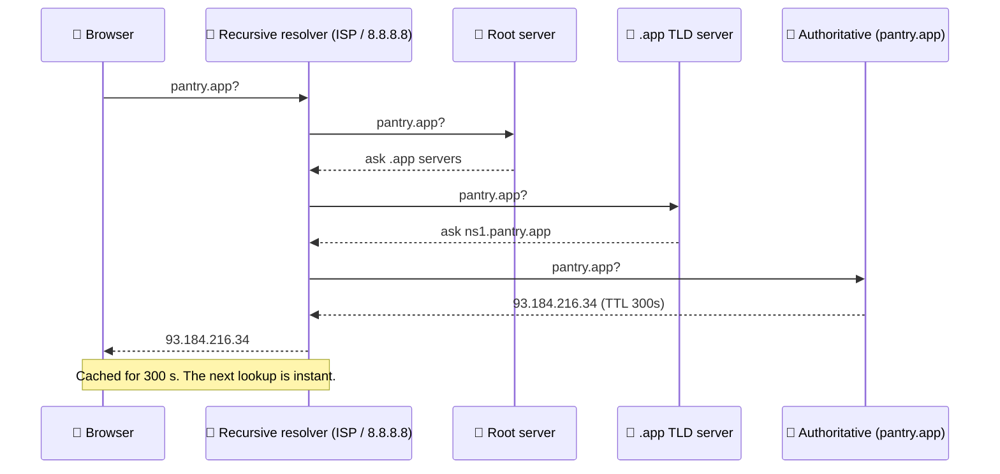

# 011 · DNS: The Internet's Phone Book

> ⏱ 8 min · 📈 11% · 🅰️ Part A (core) · Phase 02: Networking Essentials
>
> `██░░░░░░░░░░░░░░░░░░` 11% of the whole guide

---

## 📖 Story

Maya moves Pantry off the closet laptop and onto a real cloud server with a new IP address. She updates the domain record for `pantry.app`, refreshes her browser, and sees the shiny new site. Done.

Then the messages start.

*"Site looks broken."* *"Order button does nothing."* Half her customers are still landing on the **old laptop**, which she has already wiped. Hours pass and they're still landing there. The internet seems to be haunted by a server that no longer exists.

She hasn't made a mistake in her code. The answer to "where is pantry.app?" was photocopied into resolvers all over the world, and every copy carries an expiry date she set a year ago: **86,400 seconds**.

The internet has a phone book, and that phone book is cached everywhere.

## 🎯 One-sentence idea

**DNS translates names like `pantry.app` into IP addresses through a hierarchy of servers and aggressive caching, and it doubles as a simple, powerful traffic-routing tool.**

## 🧸 Analogy

Finding a friend's number:

1. Check your **memory** (browser cache).
2. Check your **phone's contacts** (OS cache).
3. Ask the **family know-it-all** (recursive resolver).
4. The know-it-all calls the **national directory** (root) → the **".app" section** (TLD) → the **company receptionist** (authoritative server), who gives the number.
5. Everyone **remembers it for a while** (TTL), even after the number changes.

## 🖼️ Visual

*Diagram brief:* a relay race. The browser asks the resolver, and the resolver hops root → TLD → authoritative, then hands the answer back with a TTL timer stamped on it.



## 🔬 How it works

- **Resolution chain:** browser cache → OS cache → **recursive resolver** → root → TLD → **authoritative** server. An uncached lookup costs **~20–120 ms**, and a cached one costs ~0 ms.
- **TTL is a cache contract:** a low TTL (30–60 s) means fast changes and more queries. A high TTL (hours) means cheap, fast lookups, and changes that crawl. Some resolvers clamp or ignore TTLs.
- **Record types:** **A** (IPv4), **AAAA** (IPv6), **CNAME** (alias to another name), **MX** (mail), **NS** (who is authoritative), **TXT** (verification, SPF).
- **DNS as a traffic tool:** **round-robin** (several IPs), **weighted** (send 10% to the canary), **GeoDNS/latency-based** (nearest region), and **failover** (health-checked records drop dead endpoints).
- **The hard limit:** caching makes DNS changes **eventually** consistent. Never rely on DNS alone for sub-minute failover. Use load balancers or Anycast for that.

## 🧩 Worked example

```bash
$ dig pantry.app A +noall +answer
pantry.app.   300   IN   A   93.184.216.34
#             ^TTL       ^type ^answer

$ dig www.pantry.app +noall +answer
www.pantry.app.  3600  IN  CNAME  pantry.app.
pantry.app.       300  IN  A      93.184.216.34
```

**How Maya should have migrated:**

1. **Monday:** lower the TTL from 86,400 s → **60 s**.
2. **Wait ≥ 24 h** (the old TTL) so every long-lived cached copy expires.
3. **Friday:** switch the A record. ~99% of clients move within about a minute.
4. Keep the **old server alive** for a day for stragglers, then raise the TTL again.

## ⚖️ Trade-offs

| Maya's choice | What she gains | What she pays |
|---|---|---|
| Low TTL | Fast migrations and failover | More DNS queries, slightly slower first loads |
| High TTL | Fewer lookups, resilience if the DNS provider blips | Changes take hours to spread |
| GeoDNS | Users routed to the nearest region | Only approximate (resolver location ≠ user location) |
| Round-robin DNS | Free, crude spreading | No health awareness, uneven load |

## 🌍 Real world

- **AWS Route 53, Cloudflare, and Google Cloud DNS** offer latency, geo, weighted, and failover routing.
- **The 2016 Dyn DDoS** knocked Twitter, GitHub, and Netflix offline for many users. That's why big companies run **two DNS providers**.
- **CDNs** use DNS (and Anycast) to steer you to the nearest edge (lesson 023).

## 📌 Cheat card

> - **Name → IP** via **resolver → root → TLD → authoritative**, **cached by TTL**.
> - Records: **A · AAAA · CNAME · MX · NS · TXT**.
> - **Lower the TTL at least one old-TTL before a migration.** Keep the old target alive afterwards.
> - DNS does **geo, weighted, and failover** routing, but it's **slow to change**.

## 🧪 Feynman check

Explain the phone-book chain and why changing a DNS record doesn't reach everyone at once.

⚠️ **Common confusion:** "DNS is a load balancer." DNS can *spread* traffic, but it doesn't see real-time health or load, and clients cache its answers. Real load balancing happens after DNS (lesson 019).

## ⚡ Quick recall

1. What does TTL control in DNS?
<details><summary>Reveal Answer</summary>

How long resolvers and clients may cache a record before asking again.
</details>

2. What's the difference between an A record and a CNAME?
<details><summary>Reveal Answer</summary>

An A record maps a name to an IPv4 address. A CNAME maps a name to *another name* (an alias).
</details>

3. How can DNS send European users to a European server?
<details><summary>Reveal Answer</summary>

GeoDNS or latency-based routing: the authoritative server answers with different IPs depending on where the query comes from.
</details>

## 🎤 Interview practice

**Q. "Route global users to the nearest healthy region, and survive a full region outage in under a minute."**
<details><summary>Model answer</summary>

- **Two layers, because DNS alone is too slow:**
  - **Layer 1, steering:** **latency-based/GeoDNS** (e.g. Route 53) returns the closest region's endpoint, with **health checks** and a **TTL of 30–60 s**. Use **EDNS Client Subnet** so the answer reflects the user's location, not their resolver's.
  - **Layer 2, fast failover:** put an **Anycast** front door in front of the regions (Cloudflare, AWS Global Accelerator, Google's global LB). One IP is announced from many PoPs, and BGP delivers users to the nearest one. When a region dies, the edge reroutes in **seconds**, with no client cache to wait out.
- **Why not DNS alone:** resolvers and clients cache answers and some ignore low TTLs, so failover takes minutes to hours for a long tail of users.
- **Resilience of DNS itself:** run **two DNS providers**, monitor resolution from several regions, and alert on **domain and certificate expiry**.
- **Likely follow-up:** "The servers are fine but the site is down. What could DNS have done?" → an expired domain, a deleted or incorrect record, a provider outage or DDoS, a broken DNSSEC signature, or a long TTL still pointing at a dead IP. Diagnose with `dig @authoritative` vs `dig @8.8.8.8` from multiple locations.
</details>

## 📖 Teaser

> 📖 *Customers can find Pantry again, but the app happily says "Order placed!" when nothing was placed, because nobody taught it to listen to HTTP status codes.*

---

⬅️ [✅ Checkpoint 10%](checkpoint-10.md) · 🗺️ [Phase map](README.md) · ➡️ [012 · HTTP & Status Codes](012-http-and-status-codes.md)

✅ **Safe stopping point.** Tick lesson 011 in [PROGRESS.md](../../PROGRESS.md).
