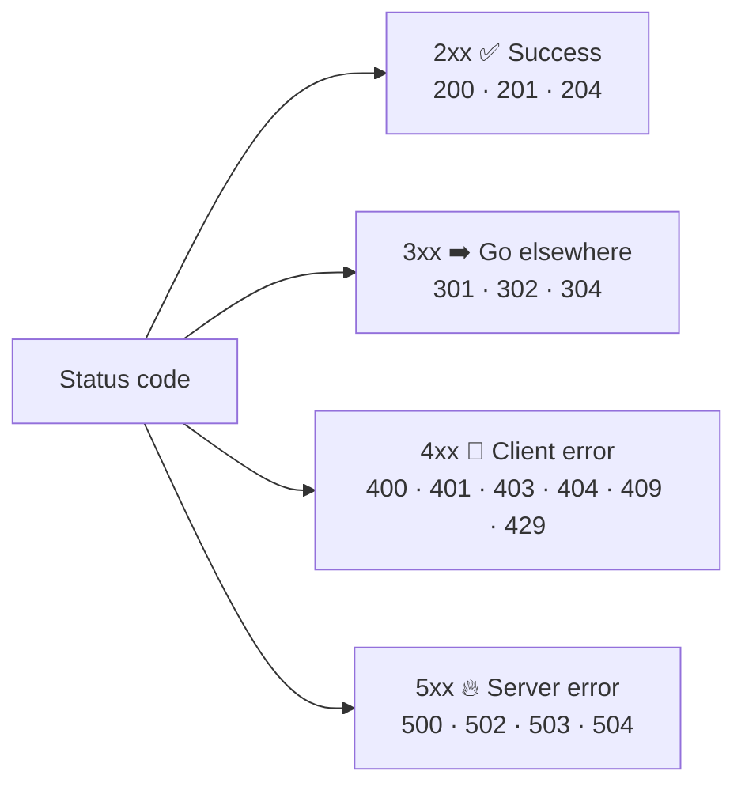

# 012 · HTTP & Status Codes

> ⏱ 9 min · 📈 12% · 🅰️ Part A (core) · Phase 02: Networking Essentials
>
> `██░░░░░░░░░░░░░░░░░░` 12% of the whole guide

---

## 📖 Story

The bug report is maddening: *"App said 'Order placed!' but my lasagna never came and I wasn't charged."*

Maya scrolls the server logs. They're a scrolling wall of three-digit numbers: `200 200 200 503 200 500 200 429 429 429`.

Then she opens the mobile app's code and finds the culprit:

```js
await fetch("/orders", { method: "POST", body });
showToast("Order placed!");   // 🙈 never checks the response
```

The server had been *screaming* "503 SERVICE UNAVAILABLE" and the app was nodding along and cheerfully lying to customers.

I've debugged that exact bug. Every browser and server speaks a shared language, and those numbers are its tone of voice. Let me teach you to hear it.

## 🎯 One-sentence idea

**HTTP is the web's language: a request carries a method, path, headers, and body, a response carries a status code, headers, and body, and every request stands alone because the protocol is stateless.**

## 🧸 Analogy

Ordering at a **café counter** with a different cashier every time:

- **Method** = what you want: *GET* a menu, *POST* a new order, *DELETE* my order.
- **Path** = which thing: `/orders/42`.
- **Headers** = sticky notes: "I'm a member (card attached)", "no nuts".
- **Status code** = the cashier's face: 😀 200, ➡️ 301 "we moved next door", 🙅 404 "don't have that", 🔥 500 "the kitchen's on fire".

The cashier doesn't remember you (**stateless**), so you show your membership card (**token/cookie**) every time.

## 🖼️ Visual

*Diagram brief:* a request card and a response card side by side, with the start line, headers, and body labelled. Below them, a four-way fork of status-code families.

```
REQUEST                                  RESPONSE
┌───────────────────────────────┐        ┌───────────────────────────────┐
│ POST /orders HTTP/1.1         │ ←line  │ HTTP/1.1 201 Created          │
│ Host: pantry.app              │        │ Content-Type: application/json│
│ Content-Type: application/json│ ←hdrs  │ Location: /orders/42          │
│ Authorization: Bearer abc123  │        │ Cache-Control: no-store       │
│                               │        │                               │
│ {"dish":17,"qty":2}           │ ←body  │ {"id":42,"status":"received"} │
└───────────────────────────────┘        └───────────────────────────────┘
```



## 🔬 How it works

- **Methods:** `GET` reads (safe, idempotent, cacheable), `POST` creates or acts (**not idempotent**), `PUT` replaces (idempotent), `PATCH` partially updates, `DELETE` removes (idempotent). **Idempotent** means doing it twice has the same effect as doing it once, which is what makes retries safe (lesson 055).
- **Status codes to know cold:** `200/201/204` · `301/302/304` · `400` bad input, `401` who are you?, `403` known but forbidden, `404`, `409` conflict, `429` rate-limited · `500` bug, `502` bad upstream reply, `503` overloaded/unavailable, `504` upstream too slow.
- **Headers carry the machinery:** `Content-Type`, `Authorization`, `Cookie`, `Cache-Control`, `ETag`/`If-None-Match`, `Retry-After`, `Location`.
- **Stateless by design:** every request carries its own auth and context, so *any* server can handle *any* request. That's the root of horizontal scaling (lesson 018).
- **Versions:** HTTP/1.1 (one in-flight request per connection) → **HTTP/2** (multiplexed streams on one TCP connection, HPACK header compression) → **HTTP/3** (QUIC over UDP, no TCP head-of-line blocking).

## 🧩 Worked example

**Conditional GET saves bandwidth:**

```bash
$ curl -i https://api.pantry.app/dishes/7
HTTP/2 200
ETag: "v5"
Cache-Control: max-age=60
{"id":7,"name":"Lasagna","price":12}

$ curl -i https://api.pantry.app/dishes/7 -H 'If-None-Match: "v5"'
HTTP/2 304          ← zero body bytes, the client reuses its copy
```

**Maya's fixed client:**

```js
const res = await fetch("/orders", { method: "POST", headers: { "Idempotency-Key": key }, body });
if (res.status === 201)      showToast("Order placed!");
else if (res.status === 429) retryAfter(res.headers.get("Retry-After"));
else if (res.status >= 500)  retryWithBackoff(key);        // same key → no double order
else                         showError(await res.json());
```

## ⚖️ Trade-offs

| | HTTP/1.1 | HTTP/2 | HTTP/3 |
|---|---|---|---|
| Transport | TCP | TCP | QUIC (UDP) |
| Parallel requests | Multiple connections | Multiplexed on 1 connection | Multiplexed, independent streams |
| Head-of-line blocking | Yes (per connection) | Yes (TCP level) | No |
| Best for | Simple and legacy clients | The default today | Mobile, lossy networks, global users |

## 🌍 Real world

- **Load balancers** eject backends that return too many 5xx responses or fail health checks.
- **SRE dashboards** chart the **5xx rate** as a core availability SLI (lesson 007).
- **Stripe, GitHub, and X** return **`429` + `Retry-After`** to tell clients to slow down.

## 📌 Cheat card

> - **"2 good · 3 go elsewhere · 4 you messed up · 5 we messed up."**
> - **401 = who are you? · 403 = I know you, but no.**
> - **502** bad upstream reply · **503** overloaded/no healthy backends · **504** upstream too slow.
> - **Idempotent:** GET, PUT, DELETE, HEAD, OPTIONS. **Not:** POST.

## 🧪 Feynman check

Explain the café counter, and why a cashier who *doesn't remember you* is actually great for a café with many cashiers.

⚠️ **Common confusion:** Returning `200 OK` with `{"error":"not found"}`. Caches, load balancers, retries, and monitoring all read the **status code**, not your JSON. A lying 200 breaks all of them, as Maya just learned the hard way.

## ⚡ Quick recall

1. What's the difference between 401 and 403?
<details><summary>Reveal Answer</summary>

401: not authenticated (we don't know who you are). 403: authenticated but not authorized (we know you, but you can't do this).
</details>

2. Which methods are idempotent?
<details><summary>Reveal Answer</summary>

GET, PUT, DELETE (plus HEAD and OPTIONS). POST is not.
</details>

3. What does 304 Not Modified do?
<details><summary>Reveal Answer</summary>

It tells the client that its cached copy (matching the ETag/Last-Modified) is still valid, so no body is re-sent.
</details>

## 🎤 Interview practice

**Q. "Your dashboard shows 504s spiking on checkout, and some clients retried and placed duplicate orders. Diagnose it and fix both problems."**
<details><summary>Model answer</summary>

- **Read the code precisely:** a 504 means a **gateway timed out waiting on the upstream**. The backend is *slow*, not necessarily down. Compare with 502 (garbage reply or a crash) and 503 (overload or no healthy targets).
- **Find the slowness:**
  - Trace p99 latency by span.
  - Check for DB slow queries and lock waits, connection-pool saturation (Little's Law), GC pauses, a slow payment provider, and recent deploys.
- **Fix the duplicates:**
  - A timeout tells the client *nothing* about whether the order was processed, so a blind retry of `POST /orders` duplicates it.
  - Require an **`Idempotency-Key`** header. The server stores `(key → result)` atomically with the order and replays the stored result on retries (lesson 055).
  - Clients retry with **exponential backoff + jitter**.
- **Stop the cascade:**
  - **Timeouts shorter than the caller's** (gateway 10 s > service 8 s > DB 5 s).
  - **Circuit breakers** on the payment provider.
  - **Load shedding** with 503 + `Retry-After` before queues explode (lessons 063–064).
- **Likely follow-up:** "How long do you keep idempotency keys?" → longer than the maximum client retry window, typically **24 h**, with a TTL.
</details>

## 📖 Teaser

> 📖 *Pantry's API finally speaks clearly, but every word of it, home addresses and card numbers included, is crossing coffee-shop Wi-Fi in plain text.*

---

⬅️ [011 · DNS](011-dns.md) · 🗺️ [Phase map](README.md) · ➡️ [013 · HTTPS & TLS](013-https-and-tls.md)

✅ **Safe stopping point.** Tick lesson 012 in [PROGRESS.md](../../PROGRESS.md).
