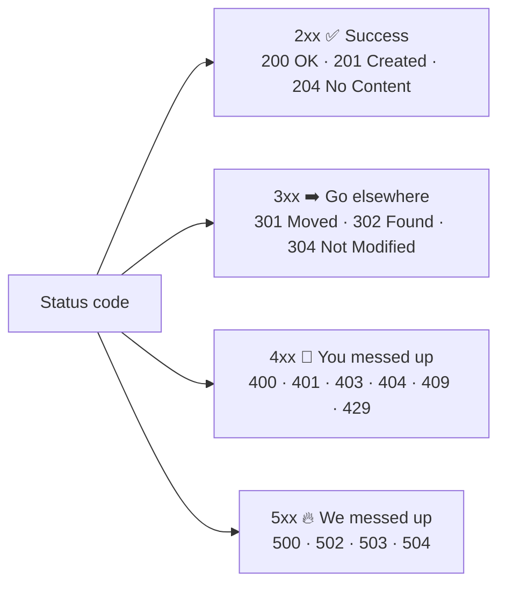

# 012 · HTTP & Status Codes

> ⏱ 9 min · 📈 12% · 🅰️ Part A (core) · Phase 02: Networking Essentials
>
> `██░░░░░░░░░░░░░░░░░░` 12% of the whole guide

---

## 📖 Story

A strange bug report arrived: the app said "Order placed!", but nothing was ordered. Maya checked the logs, which were full of numbers like 200, 404, and 500. The app ignored every one of them. I've debugged that exact bug. Every browser and server speaks a shared language, and those numbers are its tone of voice. Let me teach you to hear it.

## 🎯 One-sentence idea

**HTTP is the language of the web: a client sends a request (method + path + headers + body), and the server replies with a response (status code + headers + body). Each request stands alone. The protocol is stateless.**

## 🧸 Analogy

Ordering at a **café counter**, with a new cashier every time:

- **Method** = what you want to do: *GET* me a menu, *POST* a new order, *DELETE* my order.
- **Path** = which thing: `/orders/42`
- **Headers** = sticky notes on the order: "I speak English", "I'm a member (here's my card)", "No nuts".
- **Body** = the order details.
- **Status code** = the cashier's face: 😀 200 "here you go", ➡️ 301 "we moved next door", 🙅 404 "we don't have that", 🔥 500 "the kitchen's on fire".

The cashier doesn't remember you from last time (**stateless**), so you show your membership card (**cookie/token**) every time.

## 🖼️ Visual

```
REQUEST                                  RESPONSE
┌───────────────────────────────┐        ┌───────────────────────────────┐
│ POST /orders HTTP/1.1         │ ←line  │ HTTP/1.1 201 Created          │
│ Host: cafe.com                │        │ Content-Type: application/json│
│ Content-Type: application/json│ ←hdrs  │ Location: /orders/42          │
│ Authorization: Bearer abc123  │        │ Cache-Control: no-store       │
│                               │        │                               │
│ {"item":"latte","size":"L"}   │ ←body  │ {"id":42,"status":"received"} │
└───────────────────────────────┘        └───────────────────────────────┘
```



## 🔬 How it works

- **Methods (verbs):**
  - `GET` read (safe, idempotent, cacheable) · `POST` create/do something (**not idempotent**)
  - `PUT` replace (idempotent) · `PATCH` partial update · `DELETE` remove (idempotent)
  - **Idempotent** = doing it twice has the same effect as once. This matters for retries (lesson 055).
- **Key status codes to know cold:**
  - `200 OK`, `201 Created`, `204 No Content`
  - `301` permanent redirect, `302` temporary redirect, `304 Not Modified` (use your cached copy)
  - `400` bad input, `401` not logged in, `403` logged in but not allowed, `404` not found, `409` conflict, `429` too many requests (rate limited)
  - `500` server bug, `502` bad gateway (upstream sent garbage), `503` unavailable/overloaded, `504` gateway timeout (upstream too slow)
- **Important headers:** `Content-Type`, `Authorization`, `Cookie`/`Set-Cookie`, `Cache-Control`, `ETag`/`If-None-Match`, `Retry-After`, `Location`.
- **Stateless:** each request carries everything needed (auth token, etc.). This is *why* HTTP servers are easy to scale horizontally (lesson 018).
- **Versions:** HTTP/1.1 (one request at a time per connection, keep-alive) → **HTTP/2** (many requests multiplexed on one connection, header compression) → **HTTP/3** (over QUIC/UDP, no TCP head-of-line blocking).

## 🧩 Worked example

**Conditional GET saves bandwidth:**

```bash
# First request
$ curl -i https://api.shop.com/products/7
HTTP/2 200
ETag: "v5"
Cache-Control: max-age=60
{"id":7,"name":"Mug","price":12}

# Later: "I have version v5. Has it changed?"
$ curl -i https://api.shop.com/products/7 -H 'If-None-Match: "v5"'
HTTP/2 304          ← no body sent, the client reuses its copy
```

**Rate limit response:**

```
HTTP/1.1 429 Too Many Requests
Retry-After: 30
```

## ⚖️ Trade-offs

| | HTTP/1.1 | HTTP/2 | HTTP/3 |
|---|---|---|---|
| Transport | TCP | TCP | QUIC (UDP) |
| Parallel requests | Needs multiple connections | Multiplexed on 1 connection | Multiplexed, independent streams |
| Head-of-line blocking | Yes (per connection) | Yes (at TCP level) | No |
| Use it when | Simple/legacy | Default today | Mobile, lossy networks, global users |

## 🌍 Real world

- **Load balancers and API gateways** read status codes to detect unhealthy servers: many 5xx → take it out of rotation.
- **Monitoring dashboards** chart the **5xx rate** as a core SLI (lesson 007).
- **`429` + `Retry-After`** is how GitHub, Stripe, and Twitter APIs tell you to slow down.

## 📌 Cheat card

> - **"2 good, 3 go elsewhere, 4 you messed up, 5 we messed up."**
> - **401 = who are you? 403 = I know you, but no.**
> - **502** = upstream sent a bad reply · **503** = overloaded/down · **504** = upstream too slow.
> - **Idempotent:** GET, PUT, DELETE (and HEAD/OPTIONS). **Not:** POST (PATCH depends on how it's designed).
> - **HTTP is stateless.** Auth travels with every request.

## 🧪 Feynman check

Explain the café-counter analogy, including why the cashier "not remembering you" is actually a *good* thing for a busy café with many cashiers.

⚠️ **Common confusion:** Returning `200 OK` with `{"error": "not found"}` in the body. Use real status codes, because caches, load balancers, clients, and monitoring all depend on them.

## ⚡ Quick recall

1. What's the difference between 401 and 403?
<details><summary>Answer</summary>

401: not authenticated (we don't know who you are). 403: authenticated but not authorized (we know you, but you can't do this).
</details>

2. Which methods are idempotent?
<details><summary>Answer</summary>

GET, PUT, DELETE (plus HEAD, OPTIONS). POST is not.
</details>

3. What does 304 Not Modified do?
<details><summary>Answer</summary>

It tells the client its cached copy (matching the ETag/Last-Modified) is still valid, so no body is re-sent.
</details>

## 🎤 Interview practice

**Q1. "A client's payment request timed out. Should it retry? How do you make that safe?"**
<details><summary>Model answer</summary>

- A timeout doesn't tell you if the server processed it. Blindly retrying a `POST /payments` could **double-charge**.
- Make it safe with an **idempotency key**: the client sends `Idempotency-Key: <uuid>`, and the server stores the result per key and returns the same result on retries (lesson 055).
- Retry with **exponential backoff + jitter** (lesson 063).
- **Likely follow-up:** "How long do you keep idempotency keys?" → long enough to cover retry windows (e.g., 24 h), stored with a TTL.
</details>

**Q2. "Your dashboard shows a spike in 504s. What does that tell you, and what do you check?"**
<details><summary>Model answer</summary>

- 504 = a **gateway/proxy timed out waiting for the upstream**. The backend is slow, not necessarily down.
- Check: backend latency (p99), DB slow queries, thread/connection pool saturation, a slow downstream dependency, GC pauses, recent deploys.
- Compare with 502 (bad response or crash) and 503 (overload or no healthy backends).
- **Likely follow-up:** "How do you stop slowness from cascading?" → timeouts shorter than the caller's, circuit breakers, load shedding (lessons 063–064).
</details>

> 📖 *Next, Leo reads that strangers could snoop on customers' orders, and Maya has to lock the line.*

---

⬅️ [011 · DNS](011-dns.md) · 🗺️ [Phase map](README.md) · ➡️ [013 · HTTPS & TLS](013-https-and-tls.md)

✅ **Safe stopping point.** Tick lesson 012 in [PROGRESS.md](../../PROGRESS.md).
