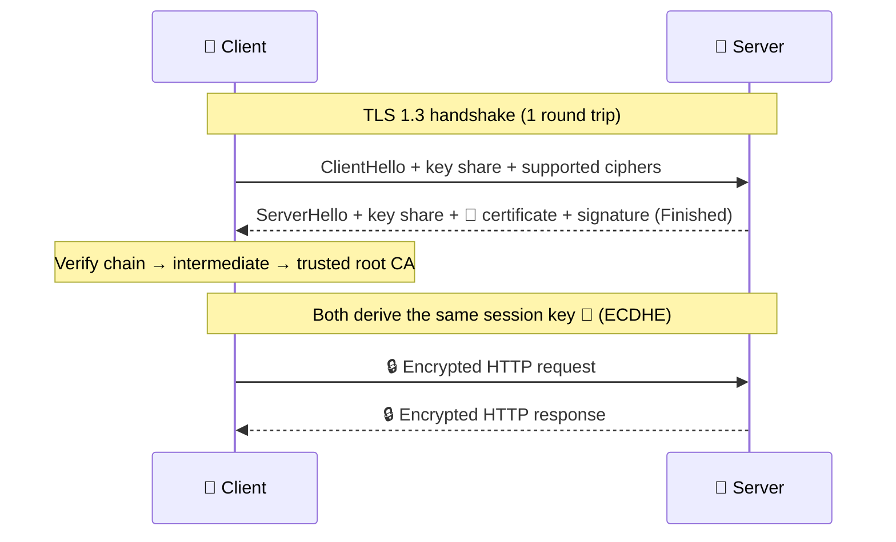

# 013 · HTTPS & TLS

> ⏱ 8 min · 📈 13% · 🅰️ Part A (core) · Phase 02: Networking Essentials
>
> `██░░░░░░░░░░░░░░░░░░` 13% of the whole guide

---

## 📖 Story

Maya is sitting in a café, laptop open, running a packet sniffer on the public Wi-Fi just to see what's out there.

Her own checkout request scrolls past in **plain text**:

```
POST /orders  name=…  address=14 Elm St, Flat 3  card=4421 …
```

Anyone at any table in this café could read it. So could anyone on the router, and anyone at the ISP. Worse: anyone in the path could *change* it, swapping the delivery address or injecting a fake login page that looks exactly like Pantry.

Her coffee goes cold in her hand.

This one makes my stomach drop every time. Maya has to do two things at once: make the conversation **private**, and **prove** that the other end really is Pantry.

## 🎯 One-sentence idea

**HTTPS is HTTP wrapped in TLS, which encrypts the conversation, proves the server's identity with a certificate, and detects any tampering.**

## 🧸 Analogy

A secret letter between strangers:

1. 🪪 **Certificate:** the shop shows an ID card signed by a trusted government office (a **Certificate Authority**). You check the signature.
2. 🔐 **Key exchange:** you agree on a secret code *out loud*, using clever math (Diffie–Hellman), so eavesdroppers learn nothing.
3. 📦 **Encryption:** every letter after that is locked with the code.
4. 🧾 **Integrity:** each letter has a tamper-evident seal.

## 🖼️ Visual

*Diagram brief:* a single round trip. The client sends a hello with its key share, and the server answers with its key share and certificate. Both sides compute the same session key, and a padlock closes over every message that follows.



## 🔬 How it works

- **Asymmetric crypto for the handshake only:** the server's private key **signs** the handshake to prove identity, and **ephemeral ECDHE** agrees on a key that is never sent over the wire. That gives **forward secrecy**: stealing the server key later can't decrypt past traffic.
- **Symmetric crypto for the data:** AES-GCM or ChaCha20-Poly1305 encrypt *and* authenticate every record at gigabytes per second (with hardware AES-NI).
- **Certificates bind a domain to a public key**, signed by a CA your OS trusts. The chain is leaf → intermediate → root. Clients check the name, the validity dates, and the signatures.
- **TLS 1.3** takes **1 RTT** (TLS 1.2 took 2), supports **0-RTT** resumption, and removed weak ciphers and RSA key exchange.
- **Where it ends:** usually at the **CDN/load balancer** (TLS termination). Inside the network you use plain HTTP in a private subnet, or **mTLS** (both sides present certificates) for zero-trust service-to-service traffic (lesson 071).

## 🧩 Worked example

```bash
$ openssl s_client -connect example.com:443 -servername example.com </dev/null 2>/dev/null \
    | grep -E "subject=|issuer=|Protocol"
subject=CN = www.example.org
issuer=C = US, O = DigiCert Inc, CN = DigiCert Global G2 TLS RSA SHA256 2020 CA1
Protocol  : TLSv1.3

$ certbot --nginx -d pantry.app      # free, auto-renewing (Let's Encrypt, 90-day certs)
```

**Latency math for a user 100 ms RTT away:**

| Setup | Round trips before the first request | Cost |
|---|---|---|
| TCP + TLS 1.2 | 1 + 2 = 3 | ~300 ms |
| TCP + TLS 1.3 | 1 + 1 = 2 | ~200 ms |
| QUIC (HTTP/3) | 1 (combined) | ~100 ms |
| TLS terminated at a CDN edge 10 ms away | 2 × 10 ms | **~20 ms** |

## ⚖️ Trade-offs

| Maya's choice | What she gains | What she pays |
|---|---|---|
| HTTPS everywhere | Privacy, identity, integrity, browser trust | ~1 RTT plus a little CPU |
| Terminate at the LB/CDN | Certificates in one place, L7 routing, WAF | Plaintext inside unless she re-encrypts |
| mTLS between services | Zero-trust: every caller is authenticated | Certificate issuance and rotation machinery |
| 0-RTT resumption | Instant reconnects | **Replay risk**, so only for idempotent requests |

## 🌍 Real world

- **Let's Encrypt** issues hundreds of millions of free certificates, and most web traffic is now HTTPS.
- **Browsers** label HTTP pages "Not secure", and browser HTTP/2 requires TLS.
- **Expired certificates** have caused major outages at Microsoft Teams, Spotify, and others. **Automate renewal and alert on expiry.**

## 📌 Cheat card

> - TLS = **confidentiality + authentication + integrity**.
> - **Asymmetric for the handshake, symmetric for the data.** ECDHE gives **forward secrecy**.
> - **TLS 1.3 = 1 RTT** (0-RTT on resume). TLS 1.2 = 2 RTT.
> - Terminate at the **edge**. Use **mTLS** between services for zero-trust.
> - 🚨 **Monitor certificate expiry.**

## 🧪 Feynman check

Explain how two strangers can agree on a secret while someone hears every word, and how you know the shop is really the shop.

⚠️ **Common confusion:** "HTTPS hides which site I'm visiting." Not fully. The **domain** usually leaks through DNS and the TLS **SNI** field (unless you use encrypted DNS and **ECH**). The **path, query, headers, and body** *are* encrypted.

## ⚡ Quick recall

1. What three things does TLS provide?
<details><summary>Reveal Answer</summary>

Confidentiality (encryption), authentication (certificates), and integrity (tamper detection).
</details>

2. Why not use asymmetric crypto for all the data?
<details><summary>Reveal Answer</summary>

It's orders of magnitude slower. It's used to authenticate and agree on a symmetric session key, which then encrypts data quickly.
</details>

3. What does "TLS termination at the load balancer" mean?
<details><summary>Reveal Answer</summary>

The LB decrypts incoming HTTPS and forwards requests to backends, so certificates and crypto work are centralized there.
</details>

## 🎤 Interview practice

**Q. "Where do you terminate TLS in a system with a CDN, a load balancer, and 200 microservices, and how do you keep the handshake from hurting latency?"**
<details><summary>Model answer</summary>

- **At the edge first:** the **CDN terminates TLS** at a PoP a few ms from the user, so the expensive handshake round trips are short. The CDN keeps **warm, long-lived connections** back to the origin.
- **At the load balancer:** terminate again (or pass through) so the LB can do **L7 routing, WAF, and rate limiting**. Certificates live in a managed store (ACM, Vault) with **automated renewal and expiry alerts**.
- **Between services:** choose by threat model.
  - Plain HTTP in a locked-down private VPC is acceptable for simple setups.
  - For zero-trust or compliance (PCI, HIPAA), use **mTLS** through a **service mesh** (Istio/Linkerd) with an internal CA that issues **short-lived certificates** (hours) automatically. That gives identity per service, not per IP.
- **Latency levers:**
  - **TLS 1.3** (1 RTT) and **session resumption**.
  - **0-RTT only for idempotent GETs**, because of replay.
  - Connection reuse (keep-alive, HTTP/2).
  - **HTTP/3** to merge the transport and crypto handshakes.
  - **OCSP stapling** so clients don't make an extra revocation lookup.
- **Likely follow-up:** "What does mTLS cost?" → CPU for the handshakes (amortized by connection reuse), sidecar memory, and running a CA. That's the price of authenticating every hop.
</details>

## 📖 Teaser

> 📖 *Pantry's line is locked. Now a delivery partner wants to plug straight into it, and Maya needs an API that strangers can understand without calling her.*

---

⬅️ [012 · HTTP & Status Codes](012-http-and-status-codes.md) · 🗺️ [Phase map](README.md) · ➡️ [014 · REST API Design](014-rest-api-design.md)

✅ **Safe stopping point.** Tick lesson 013 in [PROGRESS.md](../../PROGRESS.md).
