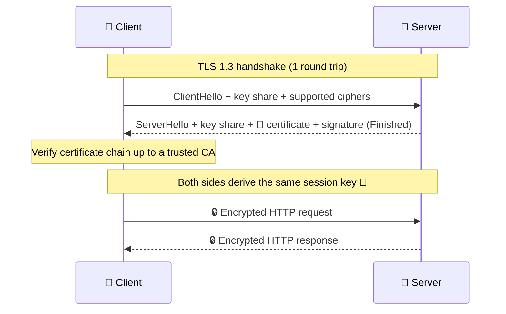

# 013 · HTTPS & TLS

> ⏱ 8 min · 📈 13% · 🅰️ Part A (core) · Phase 02: Networking Essentials
>
> `██░░░░░░░░░░░░░░░░░░` 13% of the whole guide

---

## 📖 Story

A careful customer emails: "Your checkout page isn't secure. My browser says so!" Leo panics. Home addresses and payment details are travelling across coffee-shop Wi-Fi in plain sight. Maya must make the conversation private, *and* prove to every customer that it's really Pantry on the other end.

## 🎯 One-sentence idea

**HTTPS is HTTP wrapped in TLS, which does three jobs: it encrypts the conversation (privacy), proves the server is who it claims to be (a certificate), and detects tampering (integrity).**

## 🧸 Analogy

Sending a secret letter:

1. 🪪 **Certificate** = the shop shows an ID card signed by a trusted government office (a **Certificate Authority**). You check the signature.
2. 🔐 **Key exchange** = you and the shop agree on a secret code **in public**, cleverly, so eavesdroppers can't figure it out (Diffie–Hellman).
3. 📦 **Encryption** = every letter from then on is locked with that code.
4. 🧾 **Integrity** = each letter has a tamper-evident seal, so if someone changes a word, you'll know.

## 🖼️ Visual



## 🔬 How it works

- **Asymmetric crypto** (public/private keys) is used only in the handshake: to **prove identity** and **agree on a key**. It's slow.
- **Symmetric crypto** (one shared session key, e.g., AES) encrypts the actual data. It's fast.
- **Certificates:** they bind a domain name to a public key, signed by a **Certificate Authority (CA)** that your OS/browser trusts. The chain: your cert → intermediate CA → root CA.
- **TLS 1.3:** 1-RTT handshake (TLS 1.2 needed 2), and **0-RTT resumption** for returning clients. It removed old, weak ciphers.
- **TLS termination:** the load balancer or CDN decrypts HTTPS, then forwards to backends (plain HTTP inside a private network, or re-encrypted with **mTLS** in zero-trust setups).
- **mTLS (mutual TLS):** *both* sides present certificates. Used for service-to-service authentication (service meshes, lesson 071).

## 🧩 Worked example

```bash
# See a site's certificate chain and TLS version
$ openssl s_client -connect example.com:443 -servername example.com </dev/null 2>/dev/null | grep -E "subject=|issuer=|Protocol"
subject=CN = www.example.org
issuer=C = US, O = DigiCert Inc, CN = DigiCert Global G2 TLS RSA SHA256 2020 CA1
Protocol  : TLSv1.3

# Free, auto-renewing certificate for your server
$ certbot --nginx -d shop.com
```

**Where TLS terminates in a typical design:**

```
User ──HTTPS──▶ CDN/LB (terminates TLS, holds cert) ──HTTP or mTLS──▶ app servers (private subnet)
```

Termination at the LB means certificates live in one place, and the LB can inspect HTTP (routing, WAF). Backends save CPU.

## ⚖️ Trade-offs

| You gain | You pay | Use it when |
|---|---|---|
| HTTPS everywhere | A small handshake cost (1 RTT) and some CPU | Always, for anything public |
| TLS termination at LB | Traffic is plaintext inside (unless re-encrypted) | Typical web apps in private networks |
| End-to-end TLS / mTLS | Certificate management, CPU | Zero-trust, compliance (PCI, HIPAA), service meshes |
| 0-RTT resumption | Replay risk for non-idempotent requests | Only for safe/idempotent requests |

## 🌍 Real world

- **Let's Encrypt** made certificates free and automatic. Most of the web is now HTTPS.
- **Browsers mark HTTP sites "Not secure"**, and HTTP/2 in browsers requires TLS.
- **Expired certificates** have caused major outages (e.g., at Microsoft Teams, Spotify, and many others). **Automate renewal and monitor expiry.**

## 📌 Cheat card

> - TLS = **encryption + authentication + integrity**.
> - **Asymmetric for the handshake, symmetric for the data.**
> - **TLS 1.3 = 1 RTT** (0-RTT on resume). **TLS 1.2 = 2 RTT.**
> - **Terminate at the LB/CDN.** Use **mTLS** between services for zero-trust.
> - 🚨 **Monitor certificate expiry.** It's a classic outage cause.

## 🧪 Feynman check

Explain how two strangers can agree on a secret code while someone listens to every word, and how you know the shop is really the shop. (The certificate and CA are the key parts.)

⚠️ **Common confusion:** "HTTPS hides which site I'm visiting." Not fully. The **domain** usually leaks through DNS and the TLS SNI field (unless you use encrypted DNS and ECH). The **path, headers, and body** *are* encrypted.

## ⚡ Quick recall

1. What three things does TLS provide?
<details><summary>Answer</summary>

Confidentiality (encryption), authentication (certificates), and integrity (tamper detection).
</details>

2. Why not use asymmetric crypto for all the data?
<details><summary>Answer</summary>

It's much slower. It's used to agree on a symmetric session key, which then encrypts data quickly.
</details>

3. What does "TLS termination at the load balancer" mean?
<details><summary>Answer</summary>

The LB decrypts incoming HTTPS and forwards requests to backends, so certificates and crypto work are centralized there.
</details>

## 🎤 Interview practice

**Q1. "Where would you terminate TLS in your design, and why?"**
<details><summary>Model answer</summary>

- At the **CDN/edge and load balancer**: it centralizes certificates, offloads CPU, and enables L7 routing, WAF, and caching.
- Inside the network: plain HTTP in a private VPC for simple setups, **or** re-encrypt/**mTLS** between services if the threat model or compliance requires it (zero-trust).
- **Likely follow-up:** "How do you manage certificates for 500 microservices?" → a service mesh (Istio/Linkerd) or an internal CA that issues short-lived certs automatically.
</details>

**Q2. "How does HTTPS affect latency, and how do you reduce the cost?"**
<details><summary>Model answer</summary>

- The handshake adds **1 RTT** (TLS 1.3) on top of the TCP handshake. Across the world, that's about 100+ ms.
- Reduce it with: **TLS 1.3**, **session resumption / 0-RTT**, **connection reuse (keep-alive, HTTP/2)**, **terminating TLS at a nearby CDN edge**, and **HTTP/3** (combined transport + crypto handshake).
- **Likely follow-up:** "Any risk with 0-RTT?" → replay attacks, so only allow it for idempotent requests.
</details>

> 📖 *Next time: A partner company wants to connect its software to Pantry. Maya needs a proper API.*

---

⬅️ [012 · HTTP & Status Codes](012-http-and-status-codes.md) · 🗺️ [Phase map](README.md) · ➡️ [014 · REST API Design](014-rest-api-design.md)

✅ **Safe stopping point.** Tick lesson 013 in [PROGRESS.md](../../PROGRESS.md).
