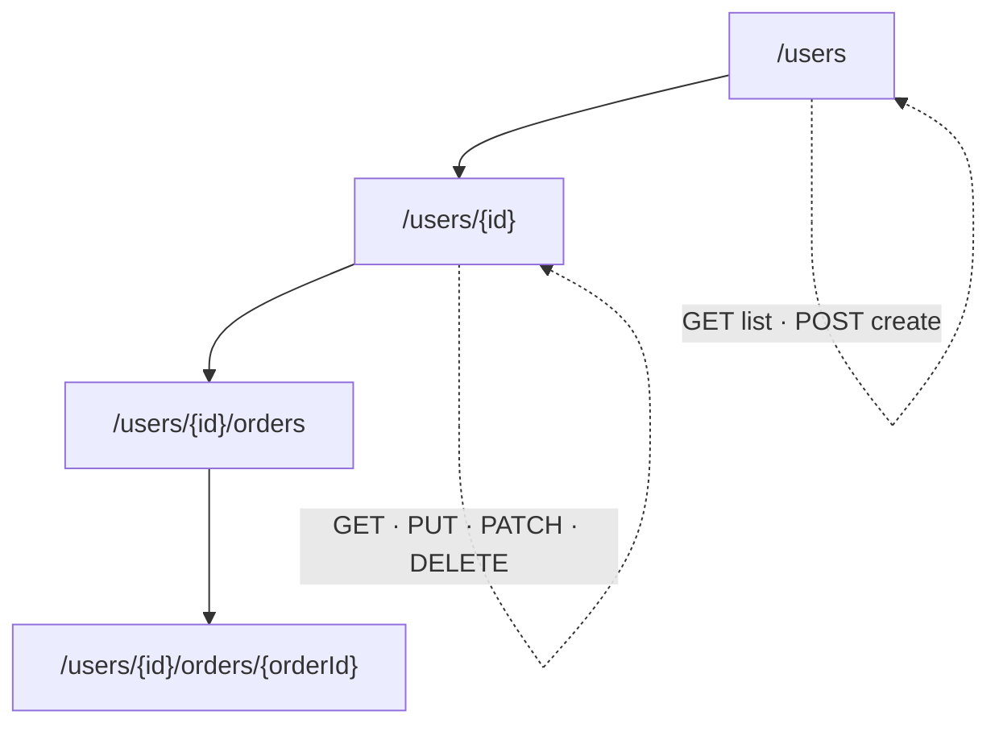

# 014 · REST API Design

> ⏱ 10 min · 📈 14% · 🅰️ Part A (core) · Phase 02: Networking Essentials
>
> `██░░░░░░░░░░░░░░░░░░` 14% of the whole guide

---

## 📖 Story

A grocery chain wanted to list its ingredients on Pantry automatically. Their developer asked, "Where's your API documentation?" Maya winced. Her endpoints were named things like `/getStuff` and `/doOrderNow`. I've shipped names like that too, and I've paid for it later. Before strangers build on top of it, let me show you how to design a clean, predictable menu of operations.

## 🎯 One-sentence idea

**A good REST API uses nouns for URLs (resources), HTTP methods for actions, and real status codes, and it plans ahead for pagination, versioning, idempotency, and errors so clients never break.**

## 🧸 Analogy

A **library**:

- The **shelves** are resources: `/books`, `/books/42`, `/members/7/loans`.
- The **actions** are always the same few verbs: *look* (GET), *add* (POST), *replace* (PUT), *edit* (PATCH), *remove* (DELETE).
- You don't have a special door for "borrow-book-now". You **create a loan**: `POST /loans`.
- When there are 10,000 books, the librarian hands you **one page at a time** (pagination).

## 🖼️ Visual



## 🔬 How it works

- **Resources are nouns, plural:** `/orders`, `/orders/123`. **Never verbs:** ❌ `/getOrder`, ❌ `/createOrder`.
- **Methods are the verbs:**

  | Action | Method + path | Success code |
  |---|---|---|
  | List | `GET /orders` | 200 |
  | Read one | `GET /orders/123` | 200 |
  | Create | `POST /orders` | 201 + `Location` |
  | Replace | `PUT /orders/123` | 200/204 |
  | Partial update | `PATCH /orders/123` | 200 |
  | Delete | `DELETE /orders/123` | 204 |

- **Pagination:** never return unbounded lists.
  - **Offset:** `?limit=20&offset=40`. Simple, but slow for deep pages and it shifts when data changes.
  - **Cursor (keyset):** `?limit=20&cursor=eyJpZCI6MTIzfQ`. Stable and fast, and the one to use at scale.
- **Filtering & sorting:** `GET /orders?status=shipped&sort=-created_at`.
- **Versioning:** `/v1/orders` (URL), or a header (`Accept: application/vnd.shop.v2+json`). **Never break existing clients.** Add fields, don't remove or rename them.
- **Idempotency:** `POST` with an `Idempotency-Key` header, so retries don't create duplicates (lesson 055).
- **Consistent errors:** a single shape, like `{"error": {"code": "OUT_OF_STOCK", "message": "...", "request_id": "..."}}`.
- **Other essentials:** auth (Bearer tokens), rate-limit headers, `ETag` for caching and optimistic concurrency, and HATEOAS links (optional).

## 🧩 Worked example

**Designing the API for a to-do app:**

```http
POST /v1/lists/9/tasks
Idempotency-Key: 5f1c7e...
Content-Type: application/json

{"title": "Buy milk", "due": "2026-10-01"}

→ 201 Created
Location: /v1/lists/9/tasks/311
{"id": 311, "title": "Buy milk", "done": false}
```

```http
GET /v1/lists/9/tasks?limit=2&cursor=MzEw

→ 200 OK
{
  "data": [{"id": 311, ...}, {"id": 312, ...}],
  "next_cursor": "MzEy"          ← the client passes this to get the next page
}
```

**Cursor pagination in SQL (why it's fast):**

```sql
-- Offset: the DB still walks past 100,000 rows 😩
SELECT * FROM tasks WHERE list_id = 9 ORDER BY id LIMIT 20 OFFSET 100000;

-- Cursor: jumps straight there using the index 🚀
SELECT * FROM tasks WHERE list_id = 9 AND id > 312 ORDER BY id LIMIT 20;
```

**Optimistic concurrency with ETag:**

```http
PUT /v1/tasks/311
If-Match: "v3"
→ 412 Precondition Failed   (someone else changed it, so re-fetch and retry)
```

## ⚖️ Trade-offs

| Choice | Gain | Cost |
|---|---|---|
| Offset pagination | Simple, can jump to page N | Slow deep pages, duplicates or skips on changes |
| Cursor pagination | Fast, stable | No "jump to page 50" |
| URL versioning (`/v1`) | Obvious, easy to route and cache | URL clutter |
| Header versioning | Clean URLs | Less visible, harder to test in a browser |
| Fine-grained resources | Clean, reusable | Chatty (many calls) → consider GraphQL/BFF (lesson 015) |

## 🌍 Real world

- **Stripe's API** is the gold standard: resource-oriented, idempotency keys, cursor pagination (`starting_after`), dated versions, and consistent errors.
- **GitHub's API** uses `Link` headers for pagination and `X-RateLimit-*` headers.

## 📌 Cheat card

> - **Nouns in URLs, verbs in methods, real status codes.**
> - **Always paginate.** Use a **cursor** at scale.
> - **Version from day one** (`/v1`). **Add, never break.**
> - **Idempotency-Key** on POSTs that create or charge.
> - **One error format** with a `request_id` for debugging.

## 🧪 Feynman check

Explain to a friend why `POST /createOrder` is worse than `POST /orders`, and why "page 5,000" is slow with offset pagination.

⚠️ **Common confusion:** "REST = JSON over HTTP." REST is a *style* (resources, uniform interface, stateless). Plenty of "REST" APIs are really RPC with JSON, and that's OK, as long as they're consistent.

## ⚡ Quick recall

1. Design the endpoint to cancel order 55.
<details><summary>Answer</summary>

Either `POST /orders/55/cancellation` (create a cancellation resource) or `PATCH /orders/55 {"status":"cancelled"}`. Not `POST /cancelOrder?id=55`.
</details>

2. Why is cursor pagination better at scale?
<details><summary>Answer</summary>

It uses an index to jump directly to the next page (`WHERE id > last_id`), and it doesn't skip or duplicate rows when data changes.
</details>

3. How do you evolve an API without breaking clients?
<details><summary>Answer</summary>

Only make additive changes (new optional fields/endpoints). Introduce a new version for breaking changes, and deprecate old versions with notice.
</details>

## 🎤 Interview practice

**Q1. "Design the API for a URL shortener."**
<details><summary>Model answer</summary>

- `POST /v1/links` with `{"url": "...", "custom_alias": "opt", "expires_at": "opt"}` → `201 {"short": "abc123", "url": "..."}`.
- `GET /{short}` → `301/302` redirect with a `Location` header (302 if you need click analytics on every hit).
- `GET /v1/links/{short}/stats` → click counts.
- `DELETE /v1/links/{short}` → `204`.
- Auth for creation, rate limits per user, and an idempotency key for creation.
- **Likely follow-up:** "301 or 302?" → 301 is cached by browsers (less load, but you lose analytics). 302 hits your server every time.
</details>

**Q2. "Your mobile app needs data from 6 endpoints to render the home screen. What do you do?"**
<details><summary>Model answer</summary>

- The client makes 6 round trips on a slow mobile network, which is slow.
- Options: a **Backend-for-Frontend (BFF)** endpoint `GET /home` that aggregates server-side. **GraphQL**, so the client asks for exactly what it needs in one query. Or **HTTP/2 multiplexing** to at least run the calls in parallel.
- Trade-off: a BFF couples the endpoint to one screen. GraphQL adds complexity (caching, query cost limits).
- **Likely follow-up:** "How do you cache a GraphQL response?" → per-field/entity caching (DataLoader), persisted queries, CDN caching of persisted query IDs.
</details>

> 📖 *Next, the mobile team says REST is too chatty, so I'll show you the other ways software can talk.*

---

⬅️ [013 · HTTPS & TLS](013-https-and-tls.md) · 🗺️ [Phase map](README.md) · ➡️ [015 · REST vs gRPC vs GraphQL](015-rest-grpc-graphql.md)

✅ **Safe stopping point.** Tick lesson 014 in [PROGRESS.md](../../PROGRESS.md).
