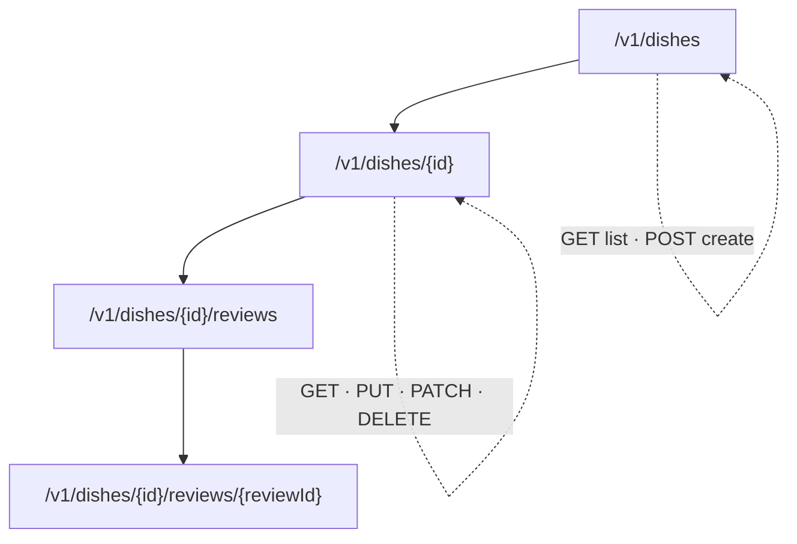

# 014 · REST API Design

> ⏱ 10 min · 📈 14% · 🅰️ Part A (core) · Phase 02: Networking Essentials
>
> `██░░░░░░░░░░░░░░░░░░` 14% of the whole guide

---

## 📖 Story

A grocery chain wants to stock ingredients on Pantry automatically. Their developer sends one polite line: *"Where's your API documentation?"*

Maya opens her route file, and her face goes hot.

```
/getStuff
/doOrderNow
/orders_list_v2_FINAL
/deleteThingById?id=
```

Her API reads like the junk drawer in a kitchen. Every endpoint is a surprise. The order list returns **all 400,000 orders at once**, a JSON blob so big the partner's test client freezes. If she renames anything, the mobile app breaks. If a request retries, it might create a **duplicate order**.

Strangers are about to build their business on top of this. I've shipped names like these too, and I paid for them for years.

Let me show you how to design a clean, predictable menu of operations.

## 🎯 One-sentence idea

**A good REST API uses nouns for URLs, HTTP methods for actions, and real status codes, and it plans from day one for pagination, versioning, idempotency, and consistent errors so that clients never break.**

## 🧸 Analogy

A **library**:

- The **shelves** are resources: `/books`, `/books/42`, `/members/7/loans`.
- There are only a few **verbs**: look (GET), add (POST), replace (PUT), edit (PATCH), remove (DELETE).
- There's no special "borrow-book-now" door. You **create a loan**: `POST /loans`.
- With 10,000 books, the librarian hands you **one page at a time**.

## 🖼️ Visual

*Diagram brief:* a resource tree. Collections branch into items, and items into sub-collections. Dotted self-loops show which verbs apply at each level.



## 🔬 How it works

- **Nouns + methods:** `GET /orders` (200), `GET /orders/123` (200), `POST /orders` (**201 + `Location`**), `PUT`/`PATCH /orders/123` (200/204), `DELETE /orders/123` (204). Never ❌ `/getOrder` or ❌ `/createOrder`.
- **Always paginate:** **offset** (`?limit=20&offset=40`) is simple but scans and discards rows, and pages shift as data changes. **Cursor/keyset** (`?limit=20&cursor=…` → `WHERE id > last_id`) is O(page) via the index and stable. Use cursors at scale.
- **Version from day one, evolve additively:** `/v1/…` (or an `Accept` header). Add optional fields freely. Never remove, rename, or change the meaning of a field without a new version and a deprecation window.
- **Make writes retry-safe:** `POST` accepts an **`Idempotency-Key`**, so a retry returns the original result instead of a duplicate (lesson 055). `ETag` + `If-Match` gives **optimistic concurrency** (412 on conflict).
- **One error shape everywhere:** `{"error":{"code":"OUT_OF_STOCK","message":"…","request_id":"…"}}`, plus rate-limit headers and Bearer auth.

## 🧩 Worked example

```http
POST /v1/orders
Idempotency-Key: 5f1c7e2a-…
Content-Type: application/json

{"dish_id": 17, "qty": 2}

→ 201 Created
Location: /v1/orders/311
{"id": 311, "status": "received"}
```

```http
GET /v1/orders?limit=2&cursor=MzEw
→ 200 OK
{"data": [{"id": 311, …}, {"id": 312, …}], "next_cursor": "MzEy"}
```

**Why the cursor wins, at page 5,000:**

```sql
-- Offset: reads and throws away 100,000 rows 😩  (~hundreds of ms)
SELECT * FROM orders WHERE cook_id = 9 ORDER BY id LIMIT 20 OFFSET 100000;
-- Cursor: one index seek 🚀  (~1 ms)
SELECT * FROM orders WHERE cook_id = 9 AND id > 312 ORDER BY id LIMIT 20;
```

## ⚖️ Trade-offs

| Maya's choice | What she gains | What she pays |
|---|---|---|
| Offset pagination | "Jump to page N", simple | Slow deep pages, duplicates or skips during writes |
| Cursor pagination | Fast and stable at any depth | No random page access |
| URL versioning (`/v1`) | Obvious, easy to route and cache | URL clutter |
| Header versioning | Clean URLs | Invisible, harder to test |
| Fine-grained resources | Clean and reusable | Chatty clients → consider a BFF or GraphQL (lesson 015) |

## 🌍 Real world

- **Stripe** is the gold standard: resource-oriented URLs, idempotency keys, cursor pagination (`starting_after`), dated versions, and consistent errors.
- **GitHub** uses `Link` headers for pagination and `X-RateLimit-*` headers for quotas.

## 📌 Cheat card

> - **Nouns in URLs, verbs in methods, real status codes.**
> - **Always paginate. Use cursors at scale.**
> - **Version from day one. Add, never break.**
> - **`Idempotency-Key`** on every POST that creates or charges.
> - **One error format** with a `request_id`.

## 🧪 Feynman check

Explain why `POST /createOrder` is worse than `POST /orders`, and why "page 5,000" is slow with offset pagination.

⚠️ **Common confusion:** "REST = JSON over HTTP." REST is a *style*: resources, a uniform interface, statelessness. Plenty of "REST" APIs are really RPC with JSON. That's fine if they're **consistent**. Inconsistency is what hurts.

## ⚡ Quick recall

1. Design the endpoint to cancel order 55.
<details><summary>Reveal Answer</summary>

`POST /orders/55/cancellation` (create a cancellation resource) or `PATCH /orders/55 {"status":"cancelled"}`. Not `POST /cancelOrder?id=55`.
</details>

2. Why is cursor pagination better at scale?
<details><summary>Reveal Answer</summary>

It seeks straight to the next page through the index (`WHERE id > last_id`) instead of scanning and discarding rows, and it doesn't skip or duplicate rows as data changes.
</details>

3. How do you evolve an API without breaking clients?
<details><summary>Reveal Answer</summary>

Make only additive changes (new optional fields or endpoints). Ship breaking changes as a new version and deprecate the old one with notice.
</details>

## 🎤 Interview practice

**Q. "Design the public API for a URL shortener. Cover creation, redirects, stats, retries, and how you'd evolve it."**
<details><summary>Model answer</summary>

- **Endpoints:**
  - `POST /v1/links` with `{"url": "…", "custom_alias?": "…", "expires_at?": "…"}` → `201 Created`, `Location: /v1/links/abc123`, body `{"short":"abc123","url":"…"}`. Return `409` if the alias is taken and `422` for an invalid URL.
  - `GET /{short}` → **301 or 302** with a `Location` header. Return `404` for unknown links and `410 Gone` for expired ones.
  - `GET /v1/links/{short}/stats?from=…&to=…` → click counts, cursor-paginated time buckets.
  - `DELETE /v1/links/{short}` → `204`.
- **301 vs 302:** a 301 is cached by browsers (less load, but you **lose per-click analytics**). A 302 hits you every time. Pick 302 if analytics matter.
- **Retries:** `Idempotency-Key` on `POST /v1/links`, so a mobile retry doesn't mint two short codes.
- **Protection:** Bearer auth for creation, **per-key rate limits** returning `429 + Retry-After`, and a consistent error envelope with `request_id`.
- **Evolution:** `/v1` from day one. New fields (e.g. `tags`) are optional and additive. A breaking change becomes `/v2`, with a `Sunset` header on v1 and a migration window.
- **Likely follow-up:** "The mobile home screen needs 6 of your endpoints. What now?" → a **BFF** endpoint that aggregates server-side, GraphQL, or at least parallel calls over HTTP/2 (lesson 015).
</details>

## 📖 Teaser

> 📖 *The partner is happy, but Pantry's own mobile app needs six round trips to draw one screen on a weak signal, and Maya starts to wonder whether REST is the right language at all.*

---

⬅️ [013 · HTTPS & TLS](013-https-and-tls.md) · 🗺️ [Phase map](README.md) · ➡️ [015 · REST vs gRPC vs GraphQL](015-rest-grpc-graphql.md)

✅ **Safe stopping point.** Tick lesson 014 in [PROGRESS.md](../../PROGRESS.md).
