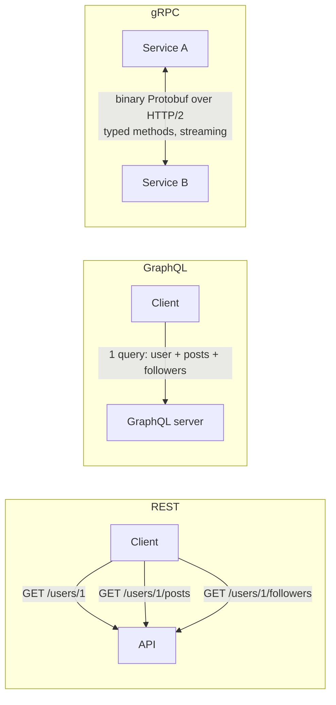

# 015 · REST vs gRPC vs GraphQL (and JSON vs Protobuf)

> ⏱ 9 min · 📈 15% · 🅰️ Part A (core) · Phase 02: Networking Essentials
>
> `███░░░░░░░░░░░░░░░░░` 15% of the whole guide

---

## 🎯 One-sentence idea

**REST is simple and universal (great for public APIs), gRPC is fast and strongly typed (great between internal services), and GraphQL lets clients ask for exactly the data they need (great for varied front-ends).**

## 🧸 Analogy

Ordering food:

- 🍽️ **REST** = a **fixed menu**. Each dish (endpoint) comes as it comes. Want soup *and* salad? Order twice.
- 📞 **gRPC** = **calling the kitchen on a direct intercom** with a strict order form. Super fast, and both sides know the exact format. But customers off the street (browsers) can't easily use the intercom.
- 🥗 **GraphQL** = a **build-your-own bowl**. One order, and you list exactly the ingredients you want: "rice, chicken, no beans, extra sauce."

## 🖼️ Visual



## 🔬 How it works

- **REST** (lesson 014): resources + HTTP methods, usually JSON. Easy to cache (GET + CDN), works in every browser and tool.
  - ⚠️ **Over-fetching** (you get fields you don't need) and **under-fetching** (you need several calls).
- **gRPC:** you define services in a `.proto` file, and code is generated for many languages. It uses **HTTP/2 + Protobuf (binary)**.
  - ✅ Small, fast payloads, strict types, and **streaming** (client, server, or both directions), plus deadlines.
  - ⚠️ Browsers need a proxy (gRPC-Web), messages aren't human-readable, and HTTP caching is harder.
- **GraphQL:** a single endpoint (`POST /graphql`). The client sends a **query** describing the shape it wants, and the server resolves each field.
  - ✅ No over- or under-fetching, one round trip, a typed schema, and front-ends can move fast.
  - ⚠️ Harder caching, **N+1 resolver problems** (fix with DataLoader batching), and expensive queries (add depth/complexity limits).
- **JSON vs Protobuf:** JSON is text, self-describing, and readable. Protobuf is binary, schema-based, **about 3–10× smaller and faster to parse**, and supports safe schema evolution (field numbers).

## 🧩 Worked example

**The same "get user" in each style:**

REST:
```http
GET /v1/users/42
→ {"id":42,"name":"Ada","email":"ada@x.com","bio":"...","created_at":"..."}
```

GraphQL:
```graphql
query {
  user(id: 42) {
    name
    posts(last: 3) { title }
  }
}
```

gRPC (`user.proto`):
```protobuf
service UserService {
  rpc GetUser (GetUserRequest) returns (User);
  rpc StreamUpdates (UserFilter) returns (stream User);   // server streaming
}
message GetUserRequest { int64 id = 1; }
message User { int64 id = 1; string name = 2; string email = 3; }
```

**A common real architecture that mixes all three:**

```
Browser/Mobile ──GraphQL or REST──▶ API Gateway / BFF ──gRPC──▶ internal microservices
Partners       ──REST (public)───▶ API Gateway
```

## ⚖️ Trade-offs

| | REST | gRPC | GraphQL |
|---|---|---|---|
| Format | JSON (text) | Protobuf (binary) | JSON |
| Transport | HTTP/1.1+ | HTTP/2 | HTTP |
| Browser-friendly | ✅ | ⚠️ needs a proxy | ✅ |
| HTTP caching | ✅ easy | ❌ | ⚠️ hard |
| Performance | Good | 🚀 Best | Good (can be heavy) |
| Streaming | ⚠️ (SSE/WebSocket) | ✅ built in | ⚠️ subscriptions |
| Flexibility for clients | Low | Low | 🚀 High |
| Best for | Public APIs, simple CRUD | Internal service-to-service calls | Many clients with different data needs |

## 🌍 Real world

- **Google** uses gRPC (Stubby) internally everywhere. **Netflix, Square, Uber** use gRPC between services.
- **GitHub, Shopify, Facebook** offer **GraphQL** APIs. Facebook invented it for mobile apps.
- **Stripe, Twilio, AWS** public APIs are **REST**.

## 📌 Cheat card

> - **Public → REST. Internal → gRPC. Many hungry front-ends → GraphQL.**
> - gRPC = **HTTP/2 + Protobuf + codegen + streaming + deadlines**.
> - GraphQL pitfalls: **N+1 (use DataLoader), caching, query cost limits**.
> - Protobuf ≈ **3–10× smaller** than JSON. Never reuse field numbers.
> - Mixing them is normal: **GraphQL/REST at the edge, gRPC inside**.

## 🧪 Feynman check

Use the restaurant analogy to explain when you'd pick each style. Then say what "over-fetching" means.

⚠️ **Common confusion:** "GraphQL is faster than REST." Not inherently. It *reduces round trips and payload size for clients*, but a badly written GraphQL query can hammer your DB much harder than a REST endpoint.

## ⚡ Quick recall

1. Why is gRPC popular for internal microservices?
<details><summary>Answer</summary>

Fast binary Protobuf over HTTP/2, strongly typed contracts with generated clients, streaming, and deadlines.
</details>

2. What problem was GraphQL designed to solve?
<details><summary>Answer</summary>

Over-fetching and under-fetching, where clients (especially mobile) needed many round trips or got too much data from fixed REST endpoints.
</details>

3. What's the N+1 problem in GraphQL?
<details><summary>Answer</summary>

Resolving a list of N items and then fetching a related field for each one separately, which makes 1 + N database calls. Fix it by batching (DataLoader).
</details>

## 🎤 Interview practice

**Q1. "You're designing a platform with a web app, iOS app, Android app, and 30 internal microservices. What API styles do you use where?"**
<details><summary>Model answer</summary>

- **Internal:** gRPC for performance, typed contracts, and streaming, with deadlines propagated across calls.
- **Client-facing:** GraphQL (or a REST BFF per client) behind an **API gateway**, so each app fetches exactly what its screens need.
- **Third-party/public:** REST with versioning, since it's the most accessible and has the best tooling.
- The gateway handles auth, rate limiting, and translation (lesson 022).
- **Likely follow-up:** "How do you evolve Protobuf schemas safely?" → only add fields with new numbers, never reuse or renumber, and use `reserved` for removed fields.
</details>

**Q2. "What are the risks of exposing GraphQL publicly?"**
<details><summary>Model answer</summary>

- **Expensive or malicious queries** (deeply nested, huge lists) → enforce **depth and complexity limits**, timeouts, pagination caps, and **persisted queries** (allow-list).
- **Caching is harder** (it's one POST endpoint) → persisted queries over GET plus entity-level caching.
- **N+1 DB load** → DataLoader.
- **Authorization per field**, since the schema exposes a lot.
- **Likely follow-up:** "How do you rate limit GraphQL?" → by query cost points, not by request count.
</details>

---

⬅️ [014 · REST API Design](014-rest-api-design.md) · 🗺️ [Phase map](README.md) · ➡️ [✅ Checkpoint 15%](checkpoint-15.md)

✅ **Safe stopping point.** Tick lesson 015 in [PROGRESS.md](../../PROGRESS.md), then do the checkpoint!
