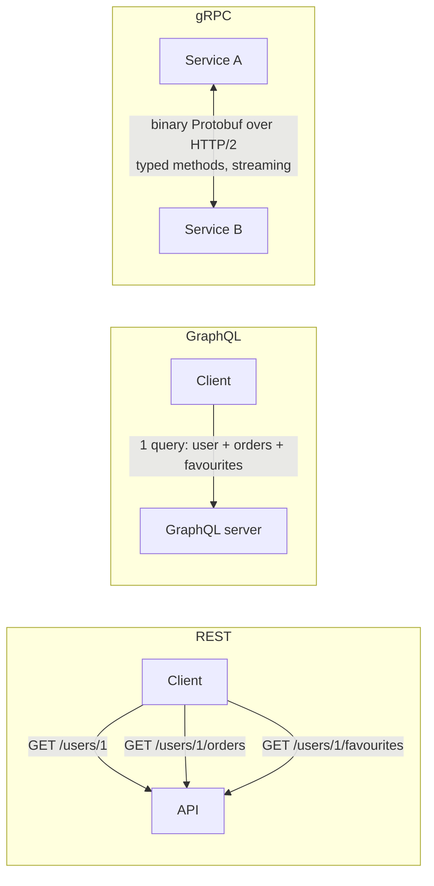

# 015 · REST vs gRPC vs GraphQL (and JSON vs Protobuf)

> ⏱ 9 min · 📈 15% · 🅰️ Part A (core) · Phase 02: Networking Essentials
>
> `███░░░░░░░░░░░░░░░░░` 15% of the whole guide

---

## 📖 Story

Maya rides the bus home with Pantry's app open on a one-bar signal. She taps the home screen and watches.

**Request 1**: the user profile. 400 ms. **Request 2**: nearby dishes. 600 ms. **Request 3**: reviews for each dish. **Request 4**: cook profiles. **Request 5**: the cart. **Request 6**: promotions.

Six round trips, one after another, and each one drags back a fat JSON blob full of fields the screen never shows. By the time the screen paints, the bus has passed two stops.

Back in the datacentre, things are no better. Pantry's backend has started splitting into services that chatter at each other thousands of times per second, each call serializing and parsing bloated text.

Maya asks me which API style is *best*. My answer, as usual: *"It depends."* Let me show you three styles and exactly where each one shines.

## 🎯 One-sentence idea

**REST is simple and universal (great for public APIs), gRPC is fast and strongly typed (great between internal services), and GraphQL lets each client ask for exactly the data it needs (great for many different front-ends).**

## 🧸 Analogy

Ordering food:

- 🍽️ **REST** = a **fixed menu**. Each dish comes as it comes. Soup *and* salad? Order twice.
- 📞 **gRPC** = a **direct intercom to the kitchen** with a strict order form. Lightning fast, but walk-in customers (browsers) can't easily use it.
- 🥗 **GraphQL** = a **build-your-own bowl**. One order listing exactly the ingredients you want.

## 🖼️ Visual

*Diagram brief:* three panels. REST shows three separate arrows from client to API. GraphQL shows one arrow carrying a shaped query. gRPC shows two services joined by a thick, two-way binary pipe.



## 🔬 How it works

- **REST:** resources + HTTP verbs, usually JSON. **HTTP caching and CDNs just work**, and every tool understands it. The weaknesses are **over-fetching** (fields you don't need) and **under-fetching** (N calls per screen).
- **gRPC:** contracts in `.proto`, generated clients in ~10 languages, **HTTP/2 + Protobuf**, plus **deadlines** and client, server, and bidirectional **streaming**. Browsers need gRPC-Web or a proxy, and HTTP caching doesn't apply.
- **GraphQL:** a single endpoint and a typed schema. The client sends the **exact shape** it wants, and per-field resolvers fill it. Watch for the **N+1 resolver problem** (fix with DataLoader batching), harder caching, and expensive queries (enforce depth and cost limits).
- **JSON vs Protobuf:** JSON is self-describing text. Protobuf is schema-based binary, **~3–10× smaller and faster to parse**, and it evolves safely through **field numbers** (add new numbers, never reuse old ones).
- **Mixing them is normal:** GraphQL or REST at the edge, gRPC between internal services.

## 🧩 Worked example

**The same "get user":**

```http
GET /v1/users/42
→ {"id":42,"name":"Maya","email":"…","bio":"…","created_at":"…", …}   # everything, always
```

```graphql
query { user(id: 42) { name  orders(last: 3) { dish { name } } } }    # exactly this shape
```

```protobuf
service UserService {
  rpc GetUser (GetUserRequest) returns (User);
  rpc StreamUpdates (UserFilter) returns (stream User);   // server streaming
}
message GetUserRequest { int64 id = 1; }
message User { int64 id = 1; string name = 2; string email = 3; }
```

**Maya's bus ride, fixed:** 6 sequential REST calls × ~400 ms RTT ≈ **2.4 s** → **1 GraphQL query ≈ 450 ms**, with a ~70% smaller payload. Internally, swapping JSON for Protobuf cut a hot service's serialization CPU by roughly **5×**.

```
Mobile/Web ──GraphQL──▶ API Gateway / BFF ──gRPC──▶ internal services
Partners   ──REST─────▶ API Gateway
```

## ⚖️ Trade-offs

| | REST | gRPC | GraphQL |
|---|---|---|---|
| Format | JSON (text) | Protobuf (binary) | JSON |
| Browser-friendly | ✅ | ⚠️ needs a proxy | ✅ |
| HTTP/CDN caching | ✅ easy | ❌ | ⚠️ hard |
| Performance | Good | 🚀 Best | Good (can be heavy) |
| Streaming | ⚠️ SSE/WS | ✅ built in | ⚠️ subscriptions |
| Client flexibility | Low | Low | 🚀 High |
| Best for | Public APIs, CRUD | Internal service-to-service calls | Many varied front-ends |

## 🌍 Real world

- **Google** runs gRPC (from Stubby) internally. **Netflix, Square, and Uber** use gRPC between services.
- **GitHub, Shopify, and Meta** expose **GraphQL**. Meta invented it for its mobile apps.
- **Stripe, Twilio, and AWS** public APIs are **REST**.

## 📌 Cheat card

> - **Public → REST. Internal → gRPC. Many hungry front-ends → GraphQL.**
> - gRPC = **HTTP/2 + Protobuf + codegen + streaming + deadlines**.
> - GraphQL pitfalls: **N+1 (DataLoader), caching, query cost limits**.
> - Protobuf ≈ **3–10× smaller** than JSON. **Never reuse field numbers.**

## 🧪 Feynman check

Use the restaurant to explain when you'd pick each style, then explain "over-fetching" in one sentence.

⚠️ **Common confusion:** "GraphQL is faster than REST." Not inherently. It **cuts client round trips and payload size**, but one careless nested query can fan out into thousands of database calls and hammer the backend far harder than a REST endpoint would.

## ⚡ Quick recall

1. Why is gRPC popular for internal microservices?
<details><summary>Reveal Answer</summary>

Compact binary Protobuf over HTTP/2, typed contracts with generated clients, built-in streaming, and deadline propagation.
</details>

2. What problem was GraphQL designed to solve?
<details><summary>Reveal Answer</summary>

Over-fetching and under-fetching: mobile clients needed many round trips or got far more data than they needed from fixed REST endpoints.
</details>

3. What's the N+1 problem in GraphQL?
<details><summary>Reveal Answer</summary>

Resolving a list of N items and then fetching a related field for each one individually, which makes 1 + N backend calls. Fix it by batching with DataLoader.
</details>

## 🎤 Interview practice

**Q. "You have web, iOS, and Android apps, 30 internal microservices, and partners who want an API. Which API styles go where, and what are the risks of exposing GraphQL publicly?"**
<details><summary>Model answer</summary>

- **Internal, service-to-service:** **gRPC**. It has typed contracts, small payloads, streaming, and **deadline propagation**, so a timeout at the edge cancels work deep inside. Evolve schemas by only *adding* fields and marking removed numbers `reserved`.
- **First-party clients:** **GraphQL** (or a REST **BFF** per client) behind an **API gateway**, so each screen fetches exactly what it needs in one round trip.
- **Partners:** **versioned REST**. It's the most accessible, cacheable, and best documented, with idempotency keys and rate limits.
- **The gateway** owns auth, rate limiting, and protocol translation (lesson 022).
- **Public GraphQL risks and mitigations:**
  - **Malicious or expensive queries:** enforce depth and complexity limits, pagination caps, and timeouts, or allow only **persisted queries**.
  - **Rate limiting:** limit by **query cost points**, not by request count.
  - **N+1 load:** batch with DataLoader.
  - **Caching:** use persisted queries over GET (CDN-cacheable) plus entity-level caches.
  - **Authorization:** check per field, because the schema exposes a lot.
- **Likely follow-up:** "Why not gRPC all the way to the browser?" → browsers can't speak raw HTTP/2 framing to gRPC, so you need gRPC-Web plus a proxy, and you lose HTTP caching and easy debugging.
</details>

## 📖 Teaser

> 📖 *The home screen loads fast now, but customers keep hammering refresh on the tracking page, and Maya needs the server to speak first.*

---

⬅️ [014 · REST API Design](014-rest-api-design.md) · 🗺️ [Phase map](README.md) · ➡️ [✅ Checkpoint 15%](checkpoint-15.md)

✅ **Safe stopping point.** Tick lesson 015 in [PROGRESS.md](../../PROGRESS.md), then do the checkpoint!
