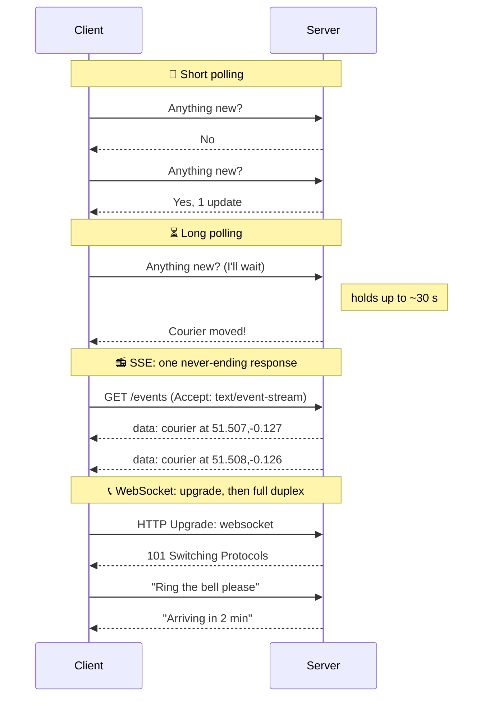
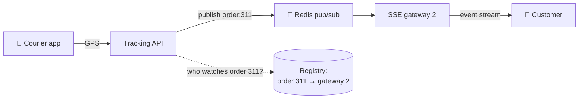

# 016 · Real-Time: Polling, Long Polling, SSE, WebSockets

> ⏱ 9 min · 📈 16% · 🅰️ Part A (core) · Phase 02: Networking Essentials
>
> `███░░░░░░░░░░░░░░░░░` 16% of the whole guide

---

## 📖 Story

*"Where's my food?"*

It's now the most common message in Pantry's support inbox. So customers do what anxious, hungry people do: they **refresh the tracking page. Again. And again.**

Maya watches the request graph at 7 p.m. It looks like a seismograph during an earthquake. Twelve thousand people are each refreshing every few seconds, and the server is drowning in **4,000 requests per second** of the same question, *anything new?*, to which the answer is almost always **no**.

It's like a crowd of people each walking to their mailbox every thirty seconds, all evening, to find it empty.

Maya wants the **server** to speak up when a courier moves. But plain HTTP has an iron rule: **the client always speaks first.**

I'll show you the four ways around that rule, from clumsy to elegant.

## 🎯 One-sentence idea

**To push updates over a protocol where the client always speaks first, you can poll repeatedly, long-poll (the server holds the request until there's news), stream with Server-Sent Events (one-way), or open a WebSocket (two-way, always on).**

## 🧸 Analogy

Waiting for a package:

- 🔁 **Polling** = walking to the mailbox every 5 minutes. Usually empty.
- ⏳ **Long polling** = standing at the mailbox **until** the carrier comes, then immediately coming back.
- 📻 **SSE** = a **radio**. The station keeps broadcasting, but you can't talk back.
- 📞 **WebSocket** = an **open phone line**. Either side can talk any time.

## 🖼️ Visual

*Diagram brief:* four horizontal strips, one per technique. Polling shows many empty round trips. Long polling shows one held request. SSE shows one request answered by a stream of events. WebSocket shows an upgrade followed by arrows in both directions.



## 🔬 How it works

- **Short polling** asks every N seconds. It's trivial and works everywhere, but it **wastes requests** and adds up to **N seconds of latency**.
- **Long polling**: the server **parks the request** until data arrives or ~30 s passes, and the client re-asks immediately. Near-real-time over plain HTTP, but one request per message.
- **SSE**: one long-lived HTTP response in `text/event-stream` format. **Server → client only**, with built-in auto-reconnect and resume via `Last-Event-ID`. It multiplexes cleanly over HTTP/2.
- **WebSocket**: an HTTP request **upgrades** into a persistent, **full-duplex** connection with ~2–14 bytes of framing per message. Best for chat, games, and collaborative editing.
- **The real challenge is scaling persistent connections:** servers become **stateful**. You need a **connection registry** (`user → gateway`, in Redis with a TTL), **pub/sub** to route messages to the right gateway (lesson 058), LBs tuned for long-lived connections, and **jittered reconnects** to survive deploys.

## 🧩 Worked example

**Cost check for Maya's 12,000 trackers:**

| Approach | Load |
|---|---|
| Polling every 3 s | 12,000 ÷ 3 = **4,000 req/s**, ~99% returning "nothing new" |
| SSE | **12,000 idle connections** (~a few KB each ≈ tens of MB of RAM), traffic only on real updates (~1 per courier every 5 s) |

```javascript
// SSE: about 3 lines, auto-reconnects for free
const es = new EventSource("/v1/orders/311/track");
es.onmessage = (e) => moveScooter(JSON.parse(e.data));
```



## ⚖️ Trade-offs

| | Short polling | Long polling | SSE | WebSocket |
|---|---|---|---|---|
| Direction | Client → server | Client → server | **Server → client** | **Both** |
| Latency | Up to the interval | Low | Low | Lowest |
| Server cost | Many wasted requests | Parked requests | Open connections | Open connections |
| Complexity | 🟢 Trivial | 🟡 | 🟢 Easy | 🔴 Stateful scaling |
| Best for | Rare updates | Legacy fallback | Tracking, notifications, scores, token streaming | Chat, games, co-editing |

## 🌍 Real world

- **Slack, Discord, and WhatsApp Web** run on WebSockets. Discord holds millions of concurrent connections on Elixir gateways.
- **LLM chat apps** stream tokens over **SSE**.
- **Early Facebook chat** used long polling before WebSockets were widely supported.

## 📌 Cheat card

> - **Mailbox (poll) · wait at the mailbox (long poll) · radio (SSE) · phone line (WebSocket).**
> - **One-way push → SSE. Two-way → WebSocket. Rare updates → polling.**
> - Persistent connections = **stateful servers** → **registry + pub/sub** + **jittered reconnects**.
> - Backgrounded mobile apps → **APNs/FCM push**, not sockets (lesson 078).

## 🧪 Feynman check

Explain mailbox, radio, and phone line to a friend, and say which one a live football-score app should use and why.

⚠️ **Common confusion:** "WebSockets are always better." They bring stateful infrastructure, sticky routing, and harder deploys. If only the server talks (tracking, scores, notifications), **SSE is simpler** and runs through ordinary HTTP load balancers and proxies.

## ⚡ Quick recall

1. Which technique is one-way, server-to-client, over plain HTTP?
<details><summary>Reveal Answer</summary>

Server-Sent Events (SSE).
</details>

2. What makes scaling WebSockets harder than scaling a REST API?
<details><summary>Reveal Answer</summary>

Connections are long-lived and stateful. You must track which server holds each user, route messages across servers with pub/sub, and handle reconnect storms.
</details>

3. How does long polling reduce waste compared with short polling?
<details><summary>Reveal Answer</summary>

The server holds each request until there's real data (or a timeout), so clients stop sending streams of empty requests.
</details>

## 🎤 Interview practice

**Q. "Deliver real-time chat messages to 10M concurrent users. Walk me through connections, routing, offline users, and deploys."**
<details><summary>Model answer</summary>

- **Connections:** clients hold a **WebSocket** to a fleet of **gateway servers**, ~50–100k connections each → **100–200 gateways** behind an L4 load balancer that supports long-lived TCP.
- **Registry:** on connect, write `user → gateway-id` to Redis with a TTL refreshed by **heartbeats** (every ~30 s). Missing heartbeats mean a dead connection.
- **Send path:**
  1. Persist the message (durable store, ordered per conversation).
  2. Look up the recipient's gateway.
  3. Publish via **pub/sub** or a direct RPC.
  4. The gateway pushes it down the socket.
  5. The client ACKs, and the server marks it delivered.
- **Offline users:** the message stays stored, a **mobile push** (APNs/FCM) is sent, and on reconnect the client **syncs from its last-seen message ID**.
- **Big groups (10k members):** a pub/sub topic per group, or pull-on-open for huge rooms, to avoid write amplification (lesson 077).
- **Deploys:** **drain** gateways gradually, send a "reconnect" frame, and have clients reconnect with **exponential backoff + jitter** to avoid a thundering herd of 10M reconnects.
- **Likely follow-up:** "A dashboard updates once a minute. WebSockets?" → No. **Poll every 30–60 s with ETags** behind a CDN, or use SSE. Statefulness buys nothing there.
</details>

## 📖 Teaser

> 📖 *Chapter 3 is next. A food festival article goes live at noon, traffic multiplies by 50, and Maya's single server starts to smoke.*

---

⬅️ [✅ Checkpoint 15%](checkpoint-15.md) · 🗺️ [Phase map](README.md) · ➡️ [017 · Vertical vs Horizontal Scaling](../03-scaling-basics/017-vertical-vs-horizontal-scaling.md)

✅ **Safe stopping point.** Tick lesson 016 in [PROGRESS.md](../../PROGRESS.md). 🎉 **Phase 02 complete!** Review the [cheatsheet](CHEATSHEET.md) and [interview bank](INTERVIEW-QUESTIONS.md).
