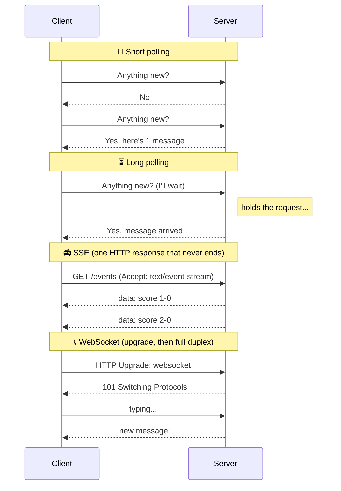
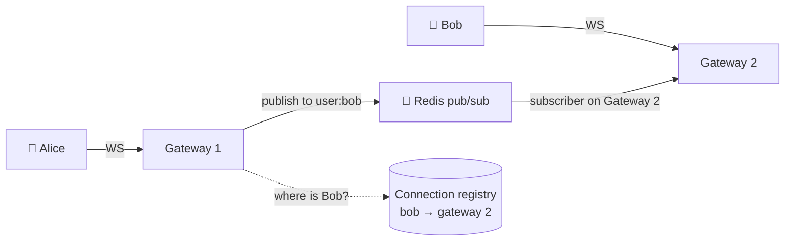

# 016 · Real-Time: Polling, Long Polling, SSE, WebSockets

> ⏱ 9 min · 📈 16% · 🅰️ Part A (core) · Phase 02: Networking Essentials
>
> `███░░░░░░░░░░░░░░░░░` 16% of the whole guide

---

## 📖 Story

"Where's my food?" is Pantry's most common support question. Customers keep refreshing the tracking page, and the server groans under the load. Maya wants the *server* to speak up when something changes, but plain HTTP only lets the customer speak first.

## 🎯 One-sentence idea

**Plain HTTP only lets the client speak first. To push updates from the server, you can poll repeatedly, long-poll (the server holds the request until there's news), stream with Server-Sent Events (one-way), or open a WebSocket (two-way, always on).**

## 🧸 Analogy

Waiting for a package:

- 🔁 **Polling** = walking to the mailbox every 5 minutes. Usually empty. Wasteful.
- ⏳ **Long polling** = standing at the mailbox **until** the mail carrier comes, then going home and coming right back.
- 📻 **SSE** = a **radio**. The station keeps broadcasting to you, but you can't talk back on it.
- 📞 **WebSocket** = an **open phone line**. Either side can talk any time.

## 🖼️ Visual



## 🔬 How it works

- **Short polling:** the client asks every N seconds. Simple, works everywhere, but **wastes requests** and adds **up to N seconds of delay**.
- **Long polling:** the server **holds the request open** until data arrives or a timeout (~30 s), then the client immediately re-asks. Near real-time over plain HTTP, but each message costs a new request.
- **SSE (Server-Sent Events):** one long HTTP response with the `text/event-stream` format. **Server → client only.** Auto-reconnects, and it resumes with `Last-Event-ID`. Easy through proxies and HTTP/2.
- **WebSockets:** starts as HTTP, **upgrades** to a persistent TCP connection. **Two-way**, with low overhead per message (a few bytes of framing).
- **Scaling persistent connections (the real design challenge):**
  - Servers become **stateful**: each holds thousands to millions of open connections.
  - You need a **connection registry** ("user 42 is connected to gateway-7"), usually in Redis.
  - Use **pub/sub** (Redis, Kafka) to route messages to whichever server holds the recipient's connection (lesson 058).
  - Load balancers need to support long-lived connections. Plan for **reconnect storms** after deploys (add jitter).

## 🧩 Worked example

**SSE in the browser (it's about 3 lines):**

```javascript
const es = new EventSource("/v1/games/7/score");
es.onmessage = (e) => render(JSON.parse(e.data));   // auto-reconnects for you
```

**WebSocket chat client:**

```javascript
const ws = new WebSocket("wss://chat.example.com/ws?token=...");
ws.onmessage = (e) => showMessage(JSON.parse(e.data));
ws.send(JSON.stringify({ to: "room-9", text: "hi!" }));
```

**Routing a chat message across servers:**



**Cost check:** 1M connected users polling every 5 s = **200,000 requests/s** of mostly "nothing new." The same users on WebSockets = **1M idle connections** (memory) and only real messages as traffic.

## ⚖️ Trade-offs

| | Short polling | Long polling | SSE | WebSocket |
|---|---|---|---|---|
| Direction | Client → server | Client → server | **Server → client** | **Both** |
| Latency | Up to interval | Low | Low | Lowest |
| Server cost | Many wasted requests | Held requests | Open connections | Open connections |
| Complexity | 🟢 Trivial | 🟡 | 🟢 Easy | 🔴 Stateful scaling |
| Best for | Rare updates, dashboards | Legacy fallback | Feeds, notifications, live scores, AI token streaming | Chat, games, collaborative editing |

## 🌍 Real world

- **Slack, Discord, WhatsApp Web** use WebSockets. Discord runs millions of concurrent WebSocket connections on its Elixir gateways.
- **ChatGPT-style token streaming** commonly uses **SSE**.
- **Old Facebook chat** used long polling before WebSockets were everywhere.

## 📌 Cheat card

> - **Mailbox (poll) · wait at mailbox (long poll) · radio (SSE) · phone line (WebSocket).**
> - **One-way push → SSE. Two-way → WebSocket. Rare updates → polling.**
> - Persistent connections make servers **stateful**, so you need a **connection registry + pub/sub** to route messages.
> - **Reconnect with jitter** to avoid thundering herds after deploys.
> - Mobile apps in the background → use **push notifications** (APNs/FCM), not sockets (lesson 078).

## 🧪 Feynman check

Explain the four mailbox/radio/phone options to a friend, and which one a live football score app should use and why.

⚠️ **Common confusion:** "WebSockets are always better." They add stateful infrastructure. If the server only pushes (notifications, scores), **SSE is simpler** and works well over normal HTTP infrastructure.

## ⚡ Quick recall

1. Which option is one-way server-to-client over plain HTTP?
<details><summary>Answer</summary>

Server-Sent Events (SSE).
</details>

2. What makes scaling WebSockets harder than scaling a REST API?
<details><summary>Answer</summary>

Connections are long-lived and stateful. You must track which server holds each user's connection and route messages between servers (pub/sub), and handle reconnect storms.
</details>

3. How does long polling reduce wasted requests compared with short polling?
<details><summary>Answer</summary>

The server holds each request until there's actually data (or a timeout), so the client isn't making many empty requests.
</details>

## 🎤 Interview practice

**Q1. "Design how a chat app delivers messages in real time to 10M concurrent users."**
<details><summary>Model answer</summary>

- Clients keep a **WebSocket** to a fleet of **gateway servers** (about 50–100k connections each → ~100–200 gateways).
- On connect, record `user → gateway` in a **connection registry** (Redis with TTL and heartbeats).
- On send: persist the message (DB) → look up the recipient's gateway → deliver via **pub/sub** or direct RPC → the gateway pushes it down the socket.
- Offline recipients → store it, and send a **mobile push notification**.
- Handle reconnects (resume from the last message ID), heartbeats to detect dead connections, and graceful drains on deploy.
- **Likely follow-up:** "What about group chats with 10k members?" → fan-out via pub/sub topics per group, and maybe pull-based delivery for huge groups (lesson 077).
</details>

**Q2. "A dashboard shows metrics that update every minute. Do you need WebSockets?"**
<details><summary>Model answer</summary>

- No. **Polling every 30–60 s** (with HTTP caching/ETags) is simple and cheap for this update rate. **SSE** is a good option if you want push semantics.
- WebSockets add stateful infrastructure for no real benefit here.
- **Likely follow-up:** "What if 1M users watch it?" → put a CDN or cache in front of the polled endpoint, since everyone reads the same data.
</details>

> 📖 *Next time: Chapter 3 begins. The festival article goes live tomorrow, and one server won't be enough.*

---

⬅️ [✅ Checkpoint 15%](checkpoint-15.md) · 🗺️ [Phase map](README.md) · ➡️ [017 · Vertical vs Horizontal Scaling](../03-scaling-basics/017-vertical-vs-horizontal-scaling.md)

✅ **Safe stopping point.** Tick lesson 016 in [PROGRESS.md](../../PROGRESS.md). 🎉 **Phase 02 complete!** Review the [cheatsheet](CHEATSHEET.md) and [interview bank](INTERVIEW-QUESTIONS.md).
