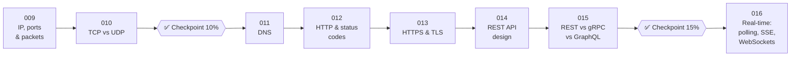

# 🌐 Phase 02: Networking Essentials

> **Lessons 009–016 · 9% → 16% · 🅰️ Part A (core)**
> By the end of this phase you'll **follow a request across the internet**, know **which protocol to pick and why**, and **design clean APIs**.

## 📖 Chapter 2: Strangers from Far Away

Pantry's first customers from other towns (and soon, other countries) start arriving. Their requests cross oceans of cables and dozens of machines to reach Maya's server. In this chapter, Maya follows those messages hop by hop: how they're addressed, delivered, secured, and understood, and how Pantry can talk back in real time.

## 🗺️ Phase map

| # | Lesson | ⏱ | One-line idea |
|---|---|---|---|
| 009 | [IP, ports & packets](009-ip-ports-packets.md) | 8 min | IP = the building's address, port = the apartment number, packets = envelopes |
| 010 | [TCP vs UDP](010-tcp-vs-udp.md) | 9 min | TCP = reliable phone call, UDP = fast postcards |
| ✅ | [Checkpoint 10%](checkpoint-10.md) | 15 min | 🎉 Level-up! |
| 011 | [DNS](011-dns.md) | 8 min | The internet's phone book, cached everywhere |
| 012 | [HTTP & status codes](012-http-and-status-codes.md) | 9 min | Request = method + path + headers + body. Response = status + headers + body |
| 013 | [HTTPS & TLS](013-https-and-tls.md) | 8 min | Encrypt, prove identity, detect tampering |
| 014 | [REST API design](014-rest-api-design.md) | 10 min | Nouns as URLs, verbs as methods, plus pagination, versioning, idempotency |
| 015 | [REST vs gRPC vs GraphQL](015-rest-grpc-graphql.md) | 9 min | Three API styles, each best at something |
| ✅ | [Checkpoint 15%](checkpoint-15.md) | 15 min | |
| 016 | [Real-time: polling, SSE, WebSockets](016-real-time-communication.md) | 9 min | How the server talks *first* |

📌 [Phase cheatsheet](CHEATSHEET.md) · 🎤 [Phase interview questions](INTERVIEW-QUESTIONS.md)

⬅️ Previous phase: [01 Foundations](../01-foundations/README.md) · ➡️ Next phase: [03 Scaling basics](../03-scaling-basics/README.md)
