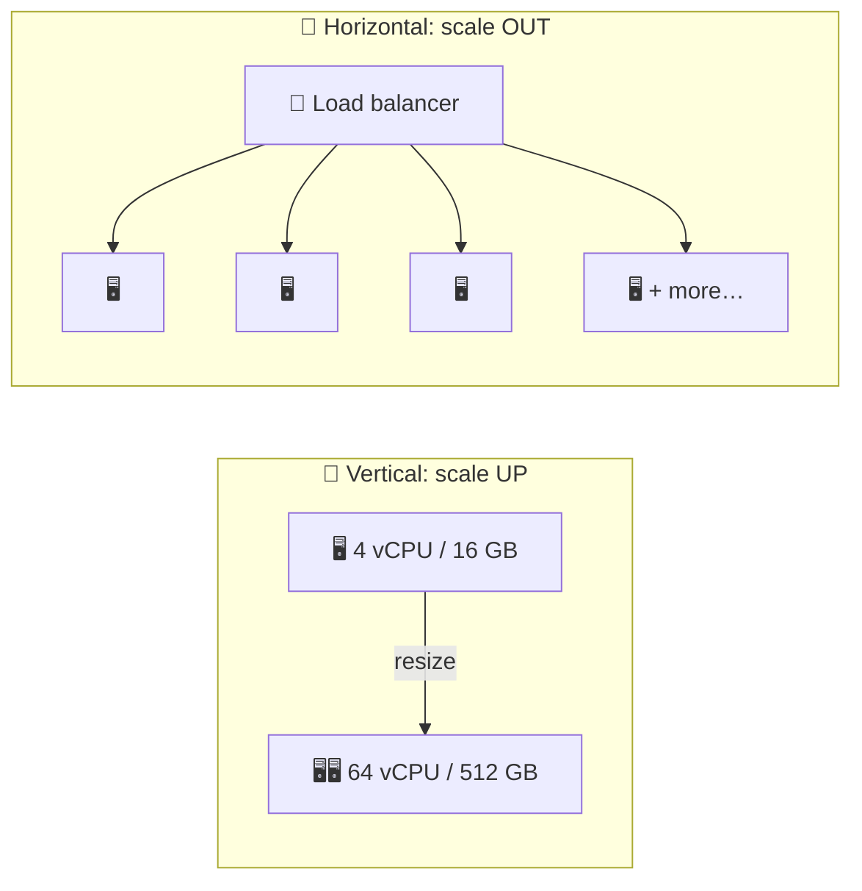

# 017 · Vertical vs Horizontal Scaling

> ⏱ 8 min · 📈 17% · 🅰️ Part A (core) · Phase 03: Scaling Basics
>
> `███░░░░░░░░░░░░░░░░░` 17% of the whole guide

---

## 📖 Story

12:00 p.m. The festival article goes live.

12:03 p.m. Maya's monitoring graph, normally a lazy wave, goes **vertical**, like a heart-rate monitor in an action movie. Requests per second: 40… 300… **2,000**.

The server's CPU pegs at **100%** and stays there. Pages that loaded in 80 ms now take **ten seconds**. The machine's fans are howling. She can almost smell the heat through the cloud console.

Two buttons glow on her screen. **"Resize instance"**: a bigger machine, four times the cores. **"Launch more instances"**: more machines, side by side.

One is a bandage that might hold for months. The other changes how Pantry is built forever. She has one afternoon to choose.

I've lived through afternoons like that. Let's decide together.

## 🎯 One-sentence idea

**Vertical scaling buys a bigger machine (simple, but with a ceiling and a single point of failure), and horizontal scaling adds more machines (nearly unlimited and redundant, but the system must be designed for it).**

## 🧸 Analogy

Your bakery is swamped:

- 💪 **Vertical:** hire one **super-baker** with a giant oven. No coordination needed, but if they're sick, the bakery closes, and ovens only get so big.
- 👯 **Horizontal:** hire **many normal bakers**. Keep adding them, and if one is sick the others cover. But now you need a manager handing out orders and a shared recipe book.

## 🖼️ Visual

*Diagram brief:* on the left, one machine inflating into a giant one. On the right, a door (load balancer) fanning out to a growing row of identical small machines.

## 🔬 How it works

- **Vertical (scale up):** more CPU, RAM, and IOPS on one box. **No code changes, no distributed-systems problems**, and transactions stay easy. But there's a **hard ceiling**, the price per unit climbs at the top end, it's a **SPOF**, and resizing often means a restart.
- **Horizontal (scale out):** N copies behind a **load balancer**. Near-linear capacity, **redundancy**, commodity hardware, and **autoscaling** (lesson 025). It requires **stateless** app servers (lesson 018) and brings partial failures and consistency problems.
- **The data tier is the hard part:** app servers clone easily, but databases resist splitting. So databases usually **scale up first**, then add read replicas, and shard last.
- **The canonical order:** **Cache → Clone (stateless + LB) → Split (services) → Shard (data).**
- **Real systems do both:** scale up until it's awkward or expensive, then scale out.

## 🧩 Worked example

**Maya's afternoon, and the year after:**

| Load | Move | Why |
|---|---|---|
| 40 req/s | 1 VM, 4 vCPU | Fine |
| 2,000 req/s (festival) | Resize to 16 vCPU (**vertical**) | Back up in 3 minutes, no code change |
| 8,000 req/s (month 3) | 6 × 8-vCPU VMs behind an LB (**horizontal**) | The single box is near its limit, and she wants redundancy |
| DB at 90% CPU | Bigger DB instance (**vertical**) + read replicas | The DB is harder to scale out |
| DB at max instance size | **Shard** (lesson 049) | The vertical ceiling is reached |

**Cost shape:** in the cloud, 2 × 16-vCPU ≈ 1 × 32-vCPU in price, but the pair **survives one failure**. Above ~96 vCPUs, prices often rise faster than linearly.

## ⚖️ Trade-offs

| | Vertical | Horizontal |
|---|---|---|
| Simplicity | 🟢 Very simple | 🔴 Distributed complexity |
| Ceiling | 🔴 Hard limit | 🟢 Very high |
| Fault tolerance | 🔴 SPOF | 🟢 Redundant |
| Downtime to scale | Often | None (add nodes live) |
| Best for | Databases, early stage, emergencies | Stateless web/app tiers at scale |

## 🌍 Real world

- **Stack Overflow** served enormous traffic for years on a handful of powerful servers. Vertical is a legitimate strategy.
- **Google and Netflix** run fleets of hundreds of thousands of commodity machines.
- Cloud VMs reach **hundreds of vCPUs and 24+ TB of RAM**. The vertical ceiling is higher than people assume.

## 📌 Cheat card

> - **Up = bigger box. Out = more boxes.**
> - Vertical: **simple, but ceiling + SPOF**. Horizontal: **scalable + redundant, but complex**.
> - **Cache → Clone → Split → Shard.**
> - **App tiers scale out easily (if stateless). The data tier is the hard part.**

## 🧪 Feynman check

Explain super-baker vs many bakers, and why horizontal scaling *requires* a manager (load balancer) and a shared recipe book (shared state).

⚠️ **Common confusion:** "Horizontal is always better." It brings network hops, partial failures, and consistency puzzles. If one bigger box carries you for two years, that's often the right engineering call, and the cheaper one.

## ⚡ Quick recall

1. Name two downsides of vertical scaling.

Reveal Answer

A hardware ceiling and a single point of failure (plus rising cost at the top end and downtime to resize).

2. What must be true of app servers to scale them horizontally?

Reveal Answer

They must be stateless: no session or user data stored only on one server.

3. Why do databases usually scale vertically first?

Reveal Answer

Sharding breaks joins and transactions and needs rebalancing, so a bigger box buys time cheaply.

## 🎤 Interview practice

**Q. "Your single-server app is at 90% CPU, and traffic doubles every quarter. Walk me through the next 12 months."**

Model answer

- **Today, profile first:** is it the app or the DB on the same box? Look for a hot endpoint, a missing index, or N+1 queries. Fix the cheap things.
- **This week:**
  - **Move the DB to its own server** so they stop competing.
  - **Resize vertically** for immediate headroom. It's minutes of work and low risk.
- **This month, prepare to scale out by making the app stateless:**
  - Sessions → Redis or JWT.
  - Uploads → S3.
  - Cron → one scheduler (or a lock).
  - In-memory caches → Redis.
  - Requests idempotent.
  Then put **N ≥ 2 copies behind a load balancer** across two zones. That gives capacity *and* redundancy.
- **This quarter:** add a **cache** for hot reads and a **CDN** for static files, plus **autoscaling** on CPU or request rate.
- **Within the year, the database:** scale up → **read replicas** for read-heavy traffic → partition or **shard** only when the write volume or data size outgrows the largest instance (lessons 046, 049).
- **Likely follow-up:** "Can you scale a relational DB horizontally?" → reads, easily (replicas). Writes, via sharding (Vitess, Citus) or NewSQL (Spanner, CockroachDB), at the cost of harder cross-shard joins and transactions.

## 📖 Teaser

> 📖 *Maya launches a second server, and within minutes customers are being logged out at random and their carts are vanishing into thin air.*

---

⬅️ [016 · Real-time Communication](../02-networking/016-real-time-communication.md) · 🗺️ [Phase map](README.md) · ➡️ [018 · Stateless Services](018-stateless-services.md)

✅ **Safe stopping point.** Tick lesson 017 in [PROGRESS.md](../../PROGRESS.md).
