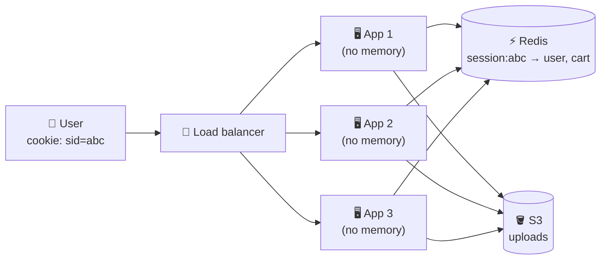

# 018 · Stateless Services & Sessions

> ⏱ 8 min · 📈 18% · 🅰️ Part A (core) · Phase 03: Scaling Basics
>
> `███░░░░░░░░░░░░░░░░░` 18% of the whole guide

---

## 📖 Story

Two servers are now humming side by side. Maya leans back. Double the capacity. Victory.

Eleven minutes later: *"Why do I keep getting logged out?"* *"My cart just EMPTIED. Three dishes, gone."*

She reproduces it herself. Log in, and it works. Click "Add to cart", and it works. Click "Checkout", and a login screen appears. Click again, and suddenly she's logged in again, with an empty cart.

It feels like talking to identical twins who don't share memories. One twin knows her. The other has never seen her before. The load balancer is flipping a coin between them on every click.

Each server keeps its own private notebook of who's logged in. Land on the wrong twin and you're a stranger.

I love this bug, because it teaches the whole idea in one painful afternoon.

## 🎯 One-sentence idea

**A stateless server remembers nothing between requests, so any server can handle any request, and the state (sessions, carts, files) moves out to a shared store like Redis, a database, or S3.**

## 🧸 Analogy

A **call centre**:

- 😖 **Stateful:** only one agent knows your issue, because it's in her head. If she's at lunch, you start over.
- 😌 **Stateless:** every agent pulls your **ticket from the shared system**. Any agent can help, more agents can be added at rush hour, and nobody is special.

## 🖼️ Visual

*Diagram brief:* three identical servers with empty "brains", all reaching into one shared Redis box for sessions and one shared S3 bucket for files. The user's cookie is the only thing that travels with the request.



## 🔬 How it works

- **State** is anything remembered between requests: sessions, carts, uploaded files, in-memory caches, rate-limit counters, scheduled jobs, socket connections.
- **Move it out:** sessions → **Redis with a TTL** or **signed tokens (JWT, lesson 069)**. Files → **object storage** (lesson 042). Durable data → the **database**. Cron → **one scheduler or a distributed lock**, so 10 servers don't each send the email.
- **Sticky sessions are a crutch:** pinning a user to one server hides the bug, but causes **uneven load** and **loses sessions** when that server dies or is redeployed.
- **The payoff:** any server can die at any time with **zero data loss**, and **autoscaling, rolling deploys, and Kubernetes pod churn** just work.
- **Some components are inherently stateful** (databases, caches, brokers, WebSocket gateways). Isolate them and scale them with their own techniques (replication, sharding).

## 🧩 Worked example

**Before: each server's private notebook.**

```python
sessions = {}                         # lives in THIS process 😬

@app.post("/login")
def login(user):
    sid = new_id()
    sessions[sid] = user              # the next request lands on the twin → "who are you?"
    return set_cookie("sid", sid)
```

**After: the shared ticket system.**

```python
@app.post("/login")
def login(user):
    sid = new_id()
    redis.setex(f"session:{sid}", 3600, user.id)          # shared, expires in 1 h
    return set_cookie("sid", sid, secure=True, httponly=True)

@app.get("/cart")
def cart(req):
    user_id = redis.get(f"session:{req.cookies['sid']}")  # ~0.5 ms, any server can answer
    ...
```

The cost is one extra Redis round trip per request (~**0.3–1 ms** in the same zone). The gain is unlimited, disposable servers.

## ⚖️ Trade-offs

| Maya's choice | What she gains | What she pays |
|---|---|---|
| In-memory sessions | Fastest, simplest | Can't scale out, lost on every restart |
| Sticky sessions | A quick fix for legacy apps | Uneven load, sessions lost on failure |
| Shared Redis store | Any server works, instant revocation | ~0.5 ms per request, and Redis must be highly available |
| Signed tokens (JWT) | No lookup at all | Hard to revoke before expiry, larger requests |

## 🌍 Real world

- **The Twelve-Factor App**, factor VI: "Execute the app as one or more **stateless processes**."
- **Kubernetes** treats pods as cattle: killed, rescheduled, replaced. Stateless apps thrive there, and stateful ones need StatefulSets and care.

## 📌 Cheat card

> - **Stateless = any server can handle any request.**
> - **Sessions → Redis/JWT · files → S3 · data → DB · cron → one leader.**
> - **Sticky sessions are a crutch, not a design.**
> - Stateless unlocks **horizontal scaling, autoscaling, rolling deploys, and failure tolerance**.

## 🧪 Feynman check

Explain the call centre, and why a stateless design makes it safe to kill *any* server at *any* moment.

⚠️ **Common confusion:** "Stateless means the app has no state." The *system* is full of state. It lives in **dedicated, replicated stores** instead of inside disposable app processes.

## ⚡ Quick recall

1. Where should user uploads go in a horizontally scaled app?
<details><summary>Reveal Answer</summary>

Object storage (e.g. S3), never the local disk of one server.
</details>

2. What's the main problem with sticky sessions?
<details><summary>Reveal Answer</summary>

Uneven load, and lost sessions when the pinned server dies. It also complicates scaling in and out.
</details>

3. Name two inherently stateful components.
<details><summary>Reveal Answer</summary>

Any two of: databases, caches, message brokers, WebSocket gateways.
</details>

## 🎤 Interview practice

**Q. "We moved our monolith to Kubernetes. Users keep getting logged out, and last night all 20 pods ran the billing cron, so customers were charged 20×. Fix both."**
<details><summary>Model answer</summary>

- **Root cause for both:** the app keeps **state inside the process**. Pods are replaced on every deploy, reschedule, and scale event, and nothing coordinates them.
- **Logouts:**
  - Move sessions to **Redis** (replicated, with automatic failover, TTL = session lifetime) or to **signed tokens**.
  - Audit for other hidden local state: uploads on local disk → S3, in-memory caches → Redis, per-pod rate limits → a shared limiter.
- **20× billing:**
  - Scheduled work is state too, so exactly **one** runner should do it: a Kubernetes **CronJob**, a dedicated scheduler, or a **distributed lock with a lease/fencing token** (lesson 086).
  - **And** make billing **idempotent**: a unique key `(customer_id, billing_period)`, enforced by a DB unique constraint. Even a double run can't double-charge (lesson 055).
  - Refund the affected customers by reconciling against the ledger.
- **What if Redis dies?** Use Redis with replicas and Sentinel/Cluster (or a managed service). Degrading to "please log in again" in a rare outage is acceptable. Billing never depends on it.
- **Likely follow-up:** "What if the lock holder dies mid-job?" → the lease expires, another instance takes over, and idempotency makes the partial re-run harmless.
</details>

## 📖 Teaser

> 📖 *The twins now share one memory. Next, Maya has to decide who stands at the door and sends each request to a server.*

---

⬅️ [017 · Vertical vs Horizontal Scaling](017-vertical-vs-horizontal-scaling.md) · 🗺️ [Phase map](README.md) · ➡️ [019 · Load Balancers](019-load-balancers.md)

✅ **Safe stopping point.** Tick lesson 018 in [PROGRESS.md](../../PROGRESS.md).
