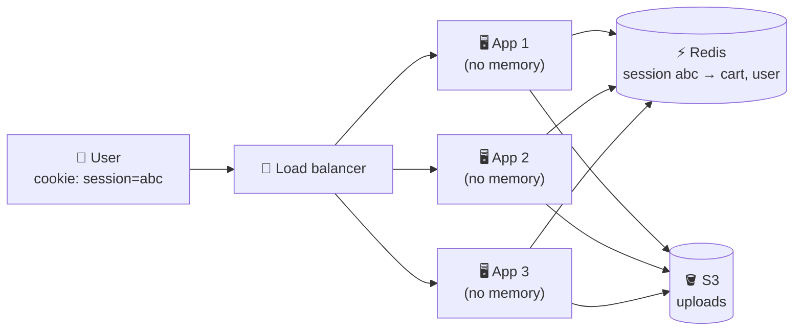

# 018 · Stateless Services & Sessions

> ⏱ 8 min · 📈 18% · 🅰️ Part A (core) · Phase 03: Scaling Basics
>
> `███░░░░░░░░░░░░░░░░░` 18% of the whole guide

---

## 🎯 One-sentence idea

**A stateless server keeps no memory of past requests, so any server can handle any request. Push the state (sessions, files, carts) out to a shared store like Redis, a database, or S3.**

## 🧸 Analogy

A **call center**:

- 😖 **Stateful:** only *Alice* knows your issue, because it's in her head. If she's at lunch, you start over. If she quits, it's lost.
- 😌 **Stateless:** every agent pulls your **ticket from the shared system**. Any agent can help you, agents can be added at rush hour, and nobody's "special".

## 🖼️ Visual



## 🔬 How it works

- **State** = anything a server remembers between requests: logged-in sessions, shopping carts, uploaded files, in-memory caches, WebSocket connections.
- **Stateless service:** each request carries (or points to) everything needed, like a session ID or token. The server looks up state in a **shared store**, or doesn't need it.
- **Where the state goes:**
  - Sessions → **Redis** (fast, with TTL) or **signed tokens (JWT)** carried by the client (lesson 069)
  - Files → **object storage (S3)** (lesson 042)
  - Durable data → the **database**
  - Scheduled jobs → a **single scheduler or distributed lock**, so 10 servers don't all send the same email
- **Sticky sessions** (the LB always sends a user to the same server) is a **workaround** for stateful apps. It causes uneven load, and it loses sessions when that server dies.
- **Why it matters:** stateless → **add or remove servers freely**, **any server can die** with no data lost, and **rolling deploys** and **autoscaling** just work.
- Some things are **inherently stateful**: databases, caches, WebSocket gateways. Isolate them, and scale them with their own techniques.

## 🧩 Worked example

**Before (stateful, breaks with 2+ servers):**

```python
sessions = {}                      # lives in THIS server's memory 😬

@app.post("/login")
def login(user):
    sid = new_id()
    sessions[sid] = user           # the next request may hit a different server → "not logged in"
    return set_cookie("sid", sid)
```

**After (stateless):**

```python
@app.post("/login")
def login(user):
    sid = new_id()
    redis.setex(f"session:{sid}", 3600, user.id)   # shared by all servers, expires in 1h
    return set_cookie("sid", sid, secure=True, httponly=True)

@app.get("/cart")
def cart(req):
    user_id = redis.get(f"session:{req.cookies['sid']}")   # any server can answer
    ...
```

## ⚖️ Trade-offs

| Approach | Gain | Cost | Use when |
|---|---|---|---|
| Server memory sessions | Fastest, simplest | Can't scale out, lost on restart | Single-server prototypes only |
| Sticky sessions | Quick fix for legacy apps | Uneven load, lost on failure | Temporary migration |
| Shared store (Redis) | Any server works, easy revocation | An extra network hop (~0.5 ms), Redis must be HA | Most web apps |
| Client tokens (JWT) | No lookup, fully stateless | Hard to revoke, token size | Many services validating the user |

## 🌍 Real world

- **The Twelve-Factor App** rule #6: "Execute the app as one or more **stateless processes**."
- **Kubernetes** assumes pods are disposable, and a pod can be killed any time. Only stateless apps thrive there without extra work.

## 📌 Cheat card

> - **Stateless = any server can handle any request.**
> - Move state out: **sessions → Redis/JWT · files → S3 · data → DB · cron → one leader**.
> - **Sticky sessions are a crutch**, not a design.
> - Stateless unlocks **horizontal scaling, autoscaling, rolling deploys, and failure tolerance**.

## 🧪 Feynman check

Explain the call-center analogy, and why a stateless design makes it safe to kill any server at any moment.

⚠️ **Common confusion:** "Stateless means the app has no state." The *system* has lots of state. It just lives in **dedicated stores** instead of inside the app servers.

## ⚡ Quick recall

1. Where should user-uploaded files go in a horizontally scaled app?
<details><summary>Answer</summary>

Object storage (e.g., S3), not the local disk of one server.
</details>

2. What's the main problem with sticky sessions?
<details><summary>Answer</summary>

Uneven load, and sessions are lost when the "sticky" server dies. It also makes scaling in and out harder.
</details>

3. Name two components that are inherently stateful.
<details><summary>Answer</summary>

Databases, caches, message brokers, WebSocket gateways (any two).
</details>

## 🎤 Interview practice

**Q1. "We're moving our monolith to Kubernetes, and users keep getting logged out. Why?"**
<details><summary>Model answer</summary>

- Sessions are stored **in process memory**. Pods are replaced (deploys, rescheduling, scaling), and requests land on different pods.
- Fix: store sessions in **Redis** (replicated, with TTL) or switch to **signed tokens**. Also check for other local state: uploaded files, local caches, and in-memory rate limits.
- **Likely follow-up:** "Redis is now a dependency. What if it goes down?" → Redis replication with automatic failover (Sentinel/Cluster/managed), and graceful behaviour (re-login is acceptable in a rare outage).
</details>

**Q2. "Every one of our 20 servers runs the nightly billing cron. Customers got billed 20×. How do you fix it?"**
<details><summary>Model answer</summary>

- Scheduled work is state too. Only **one** instance should run it.
- Options: a dedicated **scheduler service/job runner** (k8s CronJob), a **distributed lock** with a lease (lesson 086), or **leader election**.
- **And** make billing **idempotent** (unique key per customer per billing period), so even a double run doesn't double-charge (lesson 055).
- **Likely follow-up:** "What if the lock holder dies mid-job?" → the lease expires, another instance takes over, and idempotency protects against partial re-runs.
</details>

---

⬅️ [017 · Vertical vs Horizontal Scaling](017-vertical-vs-horizontal-scaling.md) · 🗺️ [Phase map](README.md) · ➡️ [019 · Load Balancers](019-load-balancers.md)

✅ **Safe stopping point.** Tick lesson 018 in [PROGRESS.md](../../PROGRESS.md).
