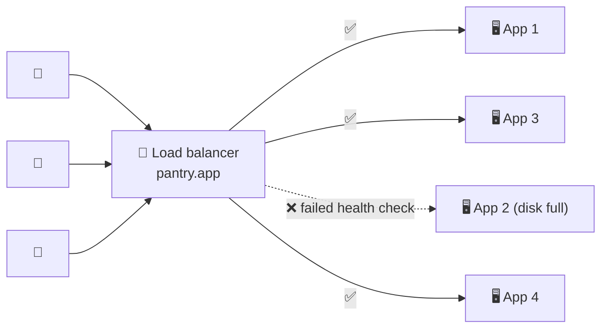

# 019 · Load Balancers

> ⏱ 9 min · 📈 19% · 🅰️ Part A (core) · Phase 03: Scaling Basics
>
> `███░░░░░░░░░░░░░░░░░` 19% of the whole guide

---

## 📖 Story

Three identical servers now sit in a row, polished and stateless, like three fresh cashiers in a new shop. But customers only know **one** address: `pantry.app`.

Something has to stand at the front door, greet every single request, and send it to a cashier who is awake.

Then, at 12:31 p.m. on Tuesday, mid-lunch-rush, **server two's disk fills up and its process crashes**. In the old world, a third of Pantry's customers would stare at error pages until Maya noticed. They'd be refreshing, giving up, and ordering from somewhere else.

Maya wants a world where server two can drop dead and **nobody notices**. Not the customers, and not even her phone.

Let me introduce you to the doorman.

## 🎯 One-sentence idea

**A load balancer sits in front of many servers, spreads requests across them, and stops sending traffic to any server that fails its health checks, which is what makes horizontal scaling and redundancy actually work.**

## 🧸 Analogy

The **host at a busy restaurant**:

- Guests arrive at **one door**.
- The host seats each party with a **free waiter**.
- If a waiter goes home sick, the host **stops seating people in that section**.
- Add waiters on a busy night, and guests never notice.

## 🖼️ Visual

*Diagram brief:* users stream into one door. Arrows fan out to four servers, and one server is greyed out with a red ❌ because it failed its health check. No arrow reaches it.



## 🔬 How it works

- **One virtual address, many targets:** clients see one IP/DNS name, and the LB picks a backend from the pool for each connection or request using an algorithm (lesson 020).
- **Health checks decide who gets traffic:** **active** checks (`GET /ready` every 5 s, eject after 3 failures) plus **passive** checks (errors and timeouts on real traffic). Separate **liveness** (is the process alive?) from **readiness** (can it serve right now?).
- **Graceful operations:** **connection draining** on deploys (stop new requests, let in-flight requests finish), `X-Forwarded-For` so backends see the real client IP, TLS termination, and connection reuse to backends.
- **The LB must not be the new SPOF:** run it **active-passive with a floating IP**, or **active-active** behind DNS/Anycast, or use a **managed cloud LB**, which is redundant across zones by default.
- **LBs live at every tier:** at the edge (users → web), **between services** (web → internal APIs), and **in front of databases** (PgBouncer/ProxySQL spreading reads across replicas).

## 🧩 Worked example

```nginx
upstream app_servers {
    least_conn;                                       # algorithm (lesson 020)
    server 10.0.1.11:8080 max_fails=3 fail_timeout=10s;
    server 10.0.1.12:8080 max_fails=3 fail_timeout=10s;
    server 10.0.1.13:8080 max_fails=3 fail_timeout=10s;
}
server {
    listen 443 ssl;
    location / {
        proxy_pass http://app_servers;
        proxy_set_header X-Forwarded-For $remote_addr;
        proxy_next_upstream error timeout http_502 http_503;   # retry the next server on failure
    }
}
```

**Timeline of Maya's crash, now:** 12:31:00 server two dies → 12:31:10 the third failed check (5 s interval) ejects it → in those ~10 s, failed requests are **retried on another server** via `proxy_next_upstream` → customers see at most a slightly slower page.

**Zero-downtime deploy:** drain App 1 → in-flight requests finish (≤ 30 s) → deploy → wait for **readiness** → back in the pool → repeat.

## ⚖️ Trade-offs

| Maya's choice | What she gains | What she pays |
|---|---|---|
| Managed cloud LB (ALB/NLB, GCP LB) | HA and autoscaling built in, no ops | Per-hour and per-GB cost, less control |
| Software LB (Nginx, HAProxy, Envoy) | Full control, portable, cheap | She runs its HA and scaling |
| Hardware LB (F5) | Massive throughput | Expensive, inflexible |
| DNS-only balancing | No extra hop | No health awareness, cached answers |

## 🌍 Real world

- **AWS ELB (ALB/NLB), Google Cloud Load Balancing, and Azure Load Balancer** are the cloud defaults.
- **HAProxy and Nginx** front a huge share of the web. **Envoy** is the proxy inside most service meshes.
- **Kubernetes Services and Ingress** are load balancers too.

## 📌 Cheat card

> - LB = **one front door → many servers + health checks**.
> - **Liveness ≠ readiness.** Never route to a server before it's ready.
> - **Drain before you stop.** That's how you get zero-downtime deploys.
> - **Make the LB redundant** (a pair, or managed).
> - Real client IP → **`X-Forwarded-For`**.

## 🧪 Feynman check

Explain the restaurant host, what the host does when a waiter gets sick, and why you'd want *two* hosts.

⚠️ **Common confusion:** making readiness check *shared* dependencies too aggressively. If `/ready` fails whenever the shared database blips, **every** server goes unhealthy at once and the LB has nowhere to send traffic, which turns a blip into a total outage. Check what's **local** to the instance, and handle shared-dependency failures with timeouts and degradation.

## ⚡ Quick recall

1. What happens when a backend fails its health checks?
<details><summary>Reveal Answer</summary>

The LB stops routing new requests to it until it passes again.
</details>

2. How do you keep the LB from being a single point of failure?
<details><summary>Reveal Answer</summary>

Run multiple LB instances (active-passive with a floating IP, or active-active behind DNS/Anycast), or use a managed LB that's redundant across zones.
</details>

3. What is connection draining?
<details><summary>Reveal Answer</summary>

Letting in-flight requests on a server finish while sending it no new ones, before taking it out for a deploy or shutdown.
</details>

## 🎤 Interview practice

**Q. "Users see a burst of 502s for a few seconds on every deploy. Where do load balancers sit in your 3-tier app, and how do you make deploys invisible?"**
<details><summary>Model answer</summary>

- **Placement:**
  - **Edge:** DNS → CDN/WAF → a public L7 LB → API servers.
  - **Internal:** API → an internal LB (or service discovery with client-side balancing) → services.
  - **Data:** a proxy (PgBouncer/ProxySQL) pooling connections and spreading reads across replicas.
  - Every layer is redundant across **≥ 2 availability zones**, with separate LBs to limit blast radius and keep public and private traffic apart.
- **Why the 502s happen:** pods are killed **mid-request**, or receive traffic **before they're ready** (cold JIT, empty connection pools, unloaded config).
- **Fixes:**
  - **Deregistration delay / connection draining** (e.g. 30 s) on the LB.
  - A **graceful shutdown handler**: on SIGTERM, fail readiness → wait for the LB to notice → finish in-flight requests → exit.
  - **Readiness probes** that pass only after warm-up.
  - **Rolling or blue-green** deploys with `maxUnavailable` limits (lesson 068).
  - **LB retries** on idempotent requests (`proxy_next_upstream` / Envoy retry policy).
- **Long-lived connections:** WebSockets drain over a longer window, and the server sends a "reconnect" frame so clients reconnect elsewhere **with jitter**.
- **Likely follow-up:** "Why not one giant LB for everything?" → blast radius, different routing needs (L4 vs L7), and security boundaries.
</details>

## 📖 Teaser

> 📖 *The door works, but Maya's graphs show one server drowning while two others sit idle, because how the doorman chooses matters as much as having one.*

---

⬅️ [018 · Stateless Services](018-stateless-services.md) · 🗺️ [Phase map](README.md) · ➡️ [020 · Load Balancing Algorithms](020-load-balancing-algorithms.md)

✅ **Safe stopping point.** Tick lesson 019 in [PROGRESS.md](../../PROGRESS.md).
