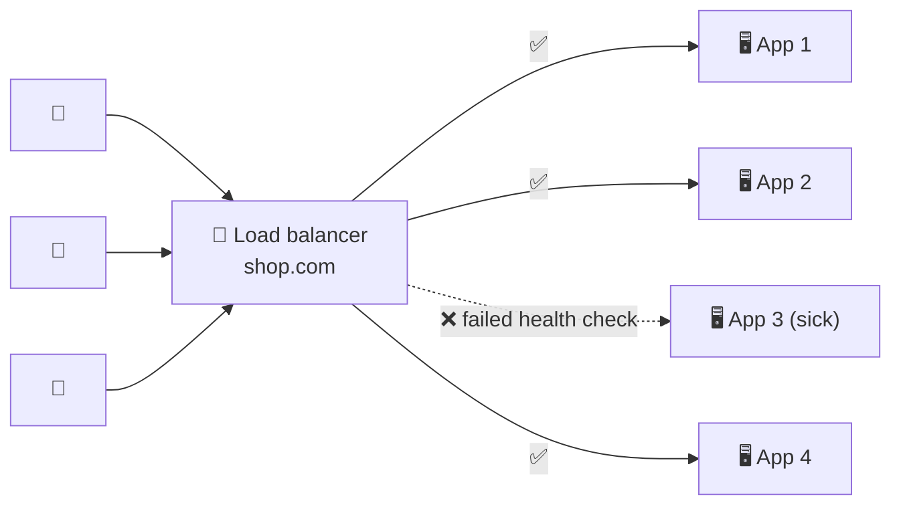

# 019 · Load Balancers

> ⏱ 9 min · 📈 19% · 🅰️ Part A (core) · Phase 03: Scaling Basics
>
> `███░░░░░░░░░░░░░░░░░` 19% of the whole guide

---

## 📖 Story

Maya now had three identical servers, but customers still knew only one address. Something had to stand at the front door, greet every request, and send it to a server that was awake. And when server two crashed during the lunch rush, I wanted nobody to notice. Let me introduce you to the doorman.

## 🎯 One-sentence idea

**A load balancer sits in front of many servers, spreads incoming requests across them, and stops sending traffic to servers that fail health checks. It's what makes horizontal scaling and redundancy work.**

## 🧸 Analogy

The **host at a busy restaurant**:

- Guests arrive at **one door** (one address).
- The host sends each party to a **table with a free waiter** (spreads the load).
- If a waiter goes home sick, the host **stops seating people in their section** (health checks).
- The kitchen can add waiters on a busy night, and guests never notice (scaling).

## 🖼️ Visual



## 🔬 How it works

- **One virtual address** (IP/DNS name) fronts many **backend targets** (a pool or target group).
- **Distribution:** chooses a backend per connection or request, using an algorithm (lesson 020).
- **Health checks:**
  - **Active:** the LB pings `/health` every few seconds and removes a target after N failures.
  - **Passive:** it notices errors and timeouts on real traffic.
  - Make `/health` meaningful but cheap. Separate **liveness** (process is up) from **readiness** (ready to serve, dependencies OK).
- **Extra jobs LBs often do:** TLS termination, connection reuse to backends, request buffering, **connection draining** during deploys, and adding `X-Forwarded-For` so the backend knows the client IP.
- **The LB must not be a single point of failure:** run LBs in **pairs or clusters** (active-passive with a floating IP, or active-active), or use a **managed cloud LB**, which is redundant by default.
- **Where LBs appear:** at the edge (users → web tier), **between tiers** (web → internal services), and **in front of databases** (e.g., a proxy spreading reads across replicas).

## 🧩 Worked example

**Nginx as a simple load balancer:**

```nginx
upstream app_servers {
    least_conn;                                  # algorithm (lesson 020)
    server 10.0.1.11:8080 max_fails=3 fail_timeout=10s;
    server 10.0.1.12:8080 max_fails=3 fail_timeout=10s;
    server 10.0.1.13:8080 backup;                # only used if the others are down
}
server {
    listen 443 ssl;
    location / {
        proxy_pass http://app_servers;
        proxy_set_header X-Forwarded-For $remote_addr;
    }
}
```

**Zero-downtime deploy with draining:**

1. Mark App 1 as "draining". The LB stops sending *new* requests to it.
2. In-flight requests finish (e.g., up to a 30 s timeout).
3. Deploy the new version to App 1, and wait for it to pass the **readiness** check.
4. Put it back in rotation. Repeat for App 2, 3…

## ⚖️ Trade-offs

| Option | Gain | Cost | Use when |
|---|---|---|---|
| Managed cloud LB (AWS ALB/NLB, GCP LB) | HA built in, autoscaling, no ops | Cost per GB/hour, less control | Most cloud apps |
| Software LB (Nginx, HAProxy, Envoy) | Full control, cheap, portable | You run the HA and scaling | On-prem, custom routing, service mesh |
| Hardware LB (F5) | Huge throughput | Expensive, inflexible | Legacy enterprise datacenters |
| DNS-only balancing | No extra hop | No health awareness, cached | Coarse global distribution only |

## 🌍 Real world

- **AWS ELB (ALB/NLB)**, **Google Cloud Load Balancing**, **Azure Load Balancer** are the cloud defaults.
- **HAProxy** and **Nginx** power a huge share of the web. **Envoy** is the modern proxy inside service meshes.
- **Kubernetes Services** and **Ingress** are load balancers too.

## 📌 Cheat card

> - LB = **one front door → many servers + health checks**.
> - **Liveness ≠ readiness.** Don't send traffic before the app is ready.
> - **Drain connections** before stopping a server, for zero-downtime deploys.
> - **Make the LB itself redundant** (pair or managed).
> - Backends see the LB's IP, so use **X-Forwarded-For** for the real client IP.

## 🧪 Feynman check

Explain the restaurant-host analogy, including what the host does when a waiter gets sick, and why you'd want two hosts.

⚠️ **Common confusion:** A health check that returns 200 whenever the process is running, even though its DB connection is broken. The LB keeps sending traffic to a server that can only fail. Make **readiness** check critical dependencies (carefully, so one shared DB blip doesn't mark *every* server unhealthy at once).

## ⚡ Quick recall

1. What happens when a backend fails its health checks?
<details><summary>Answer</summary>

The LB stops routing new requests to it until it passes again.
</details>

2. How do you avoid the LB being a single point of failure?
<details><summary>Answer</summary>

Run multiple LB instances (active-passive with a floating IP, or active-active behind DNS/Anycast), or use a managed LB with built-in redundancy.
</details>

3. What is connection draining?
<details><summary>Answer</summary>

Letting in-flight requests on a server finish while sending it no new ones, before taking it out for deploy or shutdown.
</details>

## 🎤 Interview practice

**Q1. "Where would you put load balancers in a typical 3-tier web app?"**
<details><summary>Model answer</summary>

- **Edge:** DNS → a public LB (often behind a CDN/WAF) → web/API servers.
- **Internal:** API servers → an internal LB, or service discovery with client-side balancing → internal services.
- **Data tier:** a proxy (e.g., PgBouncer/ProxySQL) spreading reads across replicas and pooling connections.
- Each is redundant across availability zones.
- **Likely follow-up:** "Why not one giant LB for everything?" → blast radius, different routing needs (L4 vs L7), and security boundaries (public vs private).
</details>

**Q2. "During deploys users see errors for a few seconds. How do you fix it?"**
<details><summary>Model answer</summary>

- The likely cause is servers being killed while serving requests, or getting traffic before they're ready.
- Fixes: **connection draining / deregistration delay**, a graceful shutdown handler (stop accepting, finish in-flight, then exit), **readiness probes** before adding to the pool, **rolling or blue-green** deploys (lesson 068), and making sure client retries on idempotent requests.
- **Likely follow-up:** "What about WebSocket connections?" → drain over a longer window, tell clients to reconnect elsewhere with jitter.
</details>

> 📖 *The front door works, but next I'll show you why some servers drowned while others sat idle.*

---

⬅️ [018 · Stateless Services](018-stateless-services.md) · 🗺️ [Phase map](README.md) · ➡️ [020 · Load Balancing Algorithms](020-load-balancing-algorithms.md)

✅ **Safe stopping point.** Tick lesson 019 in [PROGRESS.md](../../PROGRESS.md).
