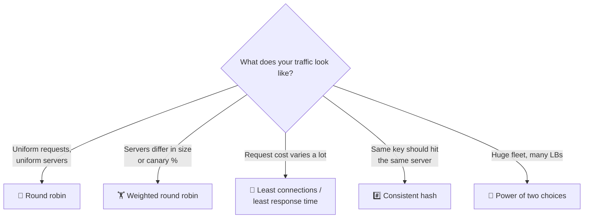

# 020 · Load Balancing Algorithms

> ⏱ 8 min · 📈 20% · 🅰️ Part A (core) · Phase 03: Scaling Basics
>
> `████░░░░░░░░░░░░░░░░` 20% of the whole guide

---

## 📖 Story

Maya pulls up the per-server CPU graphs and squints. Something is badly wrong.

**Server 1: 98%**, a solid red wall. **Server 2: 11%.** **Server 3: 9%.**

Pantry now lets cooks upload recipe videos. Each upload is a **10-second, 200 MB monster**. Menu clicks are **5-millisecond** sparrows. The load balancer is using **round robin**, politely taking turns, and by sheer bad luck three monsters in a row landed on Server 1. It's choking on video while its neighbours sit around doing nothing.

It's like a supermarket where one cashier has three overflowing trolleys queued up and the next two lanes are empty, all because the store manager insists everyone take turns.

When Maya showed me those graphs, I recognized them instantly. *How* the doorman picks a server matters as much as having one.

## 🎯 One-sentence idea

**The algorithm decides who gets the next request: take turns (round robin), pick the least busy (least connections), sample two and take the better one (power of two choices), or send the same key to the same server (hashing), and each fits a different shape of traffic.**

## 🧸 Analogy

Supermarket checkouts:

- 🔁 **Round robin:** lane 1, lane 2, lane 3, repeat. Fair only if every trolley is the same size.
- 🧮 **Least connections:** join the **shortest line**.
- 🏋️ **Weighted:** the fast cashier gets 2× the customers.
- #️⃣ **Hashing:** surnames A–F always use lane 1, so the cashier remembers you (cache locality).
- 🎲 **Power of two choices:** glance at **two random lanes** and pick the shorter one.

## 🖼️ Visual

*Diagram brief:* a decision tree that starts from "what does your traffic look like?" and ends at the right algorithm.



## 🔬 How it works

- **Round robin / weighted round robin:** stateless cycling, blind to actual load. Weights handle mixed instance sizes and **canaries** ("5% to v2").
- **Least connections / least response time:** route to the backend with the fewest in-flight requests (or the lowest latency). Ideal for **long or uneven work** like uploads and WebSockets, but it needs fresh per-backend state.
- **Power of two choices (P2C):** sample 2 random backends and pick the less loaded one. The maximum load drops from **Θ(log n / log log n)** for pure random to **Θ(log log n)**, with no global coordination. That's why Envoy's "least request" uses it.
- **Hash-based:** `hash(user_id)` → the same backend every time, for **cache locality and stickiness**. Plain `% N` remaps **~all** keys when N changes. **Consistent hashing** (lesson 051) moves only **~1/N**.
- **Outlier detection** complements any algorithm: temporarily **eject** backends whose error rate or latency is far worse than their peers.

## 🧩 Worked example

**Six requests, three servers.** Durations: `R1=10s, R2=1s, R3=1s, R4=10s, R5=1s, R6=1s`

```
Round robin:         S1: R1(10s), R4(10s)   ← 20 s of work, drowning 😩
                     S2: R2(1s),  R5(1s)
                     S3: R3(1s),  R6(1s)

Least connections:   S1: R1(10s)            ← busy, so skipped
                     S2: R2, R4(10s)
                     S3: R3, R5, R6         ← spread by real load 😌
```

**Why modulo hashing bites when Maya adds a 4th cache node:**

```
hash("dish:42") = 7 → 7 % 3 = node 1
                      7 % 4 = node 3   ← moved!
With % N, ~75% of keys move → cache-miss storm on the DB.
With consistent hashing, ~25% move.
```

## ⚖️ Trade-offs

| Algorithm | What Maya gains | What she pays | Best for |
|---|---|---|---|
| Round robin | Simplest, stateless | Blind to load | Uniform short requests |
| Weighted RR | Mixed sizes, canaries | Manual weights | Heterogeneous fleets, rollouts |
| Least connections | Adapts to uneven work | Needs connection tracking | Uploads, WebSockets |
| Least response time | Avoids slow servers | Can oscillate | Latency-sensitive APIs |
| Power of two choices | Near-optimal, no coordination | Slight randomness | Big fleets, many LBs |
| Consistent hash | Cache locality | Hot keys → skew | Caches, sharded services |

## 🌍 Real world

- **Nginx** defaults to round robin, and offers `least_conn`, `ip_hash`, and `hash … consistent`.
- **Envoy** offers round robin, least request (P2C), ring hash, and **Maglev**.
- **Google's Maglev** is a consistent-hashing L4 balancer at Google's edge.

## 📌 Cheat card

> - **Uniform → round robin. Uneven → least connections. Affinity → consistent hash.**
> - **P2C:** pick 2 at random and take the better one. Cheap and excellent.
> - **Weights** for different sizes and canary percentages.
> - **`% N` reshuffles everything** → use consistent hashing.
> - Add **outlier ejection** on top of any algorithm.

## 🧪 Feynman check

Explain to a friend why "shortest line" beats "take turns" when some shoppers have 100 items and others have 1.

⚠️ **Common confusion:** "Least connections is always best." With **many independent LBs**, each sees only its own slice of the connections, so their "least loaded" views disagree and they all **herd onto the same backend** at once. P2C's randomness breaks that herd.

## ⚡ Quick recall

1. Which algorithm suits WebSocket connections that last for hours?
<details><summary>Reveal Answer</summary>

Least connections. The connections are long and uneven, and round robin would pile them up unevenly.
</details>

2. What does consistent hashing fix compared with `hash % N`?
<details><summary>Reveal Answer</summary>

When servers are added or removed, only ~1/N of keys move instead of nearly all of them.
</details>

3. How would you send 5% of traffic to a new version?
<details><summary>Reveal Answer</summary>

Weighted routing: v2 weight 5, v1 weight 95 (a canary release).
</details>

## 🎤 Interview practice

**Q. "You run 40 Redis cache nodes plus 200 API servers on mixed hardware, and some old boxes keep timing out. How do you balance traffic to each tier?"**
<details><summary>Model answer</summary>

- **Cache tier: consistent hashing on the cache key.**
  - Each key lives on exactly one node, so the hit rate stays high.
  - Adding or removing a node remaps ~1/40 of keys, not all of them.
  - Use **virtual nodes** (100–200 per node) for an even spread.
  - Handle **hot keys** with local L1 caches or key splitting (lesson 032).
  - When a node dies, its keys fall to ring neighbours → expect a miss spike, and protect the DB with single-flight.
  - Round robin here would scatter each key everywhere and destroy the hit rate.
- **API tier: least request with power of two choices**, so the work adapts to real load without coordination across many LB instances.
  - **Weights** proportional to capacity on the older boxes, so they get less traffic.
  - **Outlier detection:** eject any host whose 5xx rate or p99 is far above its peers (e.g. 5 consecutive errors → eject for 30 s, capped at 20% of the fleet).
- **Long term:** standardize instance types, autoscale, and if the slowness comes from one noisy tenant, **isolate it with bulkheads** and rate limits (lesson 064).
- **Likely follow-up:** "Why cap ejection at 20%?" → so a shared-dependency failure that makes *every* host look bad can't eject the whole fleet.
</details>

## 📖 Teaser

> 📖 *Traffic is balanced, but now Maya needs `/api` to go one way, `/videos` another, and chat a third, and her doorman can't read the requests.*

---

⬅️ [019 · Load Balancers](019-load-balancers.md) · 🗺️ [Phase map](README.md) · ➡️ [✅ Checkpoint 20%](checkpoint-20.md)

✅ **Safe stopping point.** Tick lesson 020 in [PROGRESS.md](../../PROGRESS.md), then do the checkpoint!
