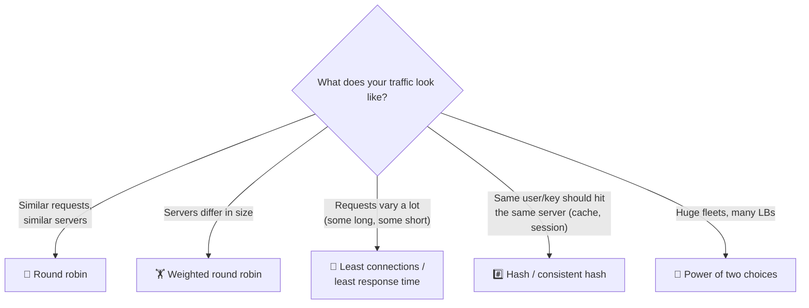

# 020 · Load Balancing Algorithms

> ⏱ 8 min · 📈 20% · 🅰️ Part A (core) · Phase 03: Scaling Basics
>
> `████░░░░░░░░░░░░░░░░` 20% of the whole guide

---

## 📖 Story

Cooking-video uploads are huge and slow, while menu clicks are tiny and quick. Simply taking turns has just sent three giant uploads to one poor server while the others relax. Maya realizes that *how* the doorman picks a server matters as much as having a doorman at all.

## 🎯 One-sentence idea

**The algorithm decides which server gets the next request: take turns (round robin), pick the least busy (least connections), or always send the same key to the same server (hashing). Each fits a different kind of traffic.**

## 🧸 Analogy

Supermarket checkouts:

- 🔁 **Round robin:** "Next customer to lane 1, next to lane 2, next to lane 3…" Fair if every cart is the same size.
- 🧮 **Least connections:** "Go to the lane with the **shortest line**." Better when carts vary a lot.
- 🏋️ **Weighted:** the express lane with the fast cashier gets 2× the customers.
- #️⃣ **Hashing:** "Everyone with surname A–F uses lane 1," so regulars always see the same cashier, who remembers them (cache locality).
- 🎲 **Power of two choices:** pick **2 random lanes** and join the shorter one. Nearly as good as checking every lane, and much cheaper.

## 🖼️ Visual



## 🔬 How it works

- **Round robin:** cycle through servers in order. Stateless and simple. ❌ Ignores how busy each server actually is.
- **Weighted round robin:** servers get traffic in proportion to their weight (a big box gets 3, a small one gets 1). Handy during migrations and canaries ("send 5% to v2").
- **Least connections:** send to the server with the fewest active connections. ✅ Great for **long or uneven requests** (uploads, WebSockets).
- **Least response time:** factor in latency too. It adapts to slow servers.
- **Random:** surprisingly decent at scale, and needs no shared state.
- **Power of two choices:** pick 2 random servers and choose the less loaded one. It gives **dramatically better balance than pure random** with almost no coordination, and it's used by Envoy and many others.
- **IP hash / key hash:** `hash(client_ip or user_id) % N` → the same server each time. ✅ **Cache locality and stickiness**. ❌ Adding or removing a server reshuffles almost every key, so use **consistent hashing** (lesson 051) to move only about 1/N of the keys.

## 🧩 Worked example

**3 servers, 6 requests: round robin vs least connections.**

Request durations: `R1=10s, R2=1s, R3=1s, R4=10s, R5=1s, R6=1s`

```
Round robin:         S1: R1(10s), R4(10s)   ← overloaded 😩
                     S2: R2(1s),  R5(1s)
                     S3: R3(1s),  R6(1s)

Least connections:   S1: R1(10s)            ← still busy with R1, so skipped
                     S2: R2, R4(10s)
                     S3: R3, R5, R6         ← spread by actual load 😌
```

**Why plain modulo hashing hurts when scaling:**

```
hash(key) % 3 → key "alice" = 7 % 3 = server 1
Add a 4th server:
hash(key) % 4 → key "alice" = 7 % 4 = server 3   ← moved!
~75% of all keys move → cache miss storm
Consistent hashing → only ~25% move
```

## ⚖️ Trade-offs

| Algorithm | Gain | Cost | Best for |
|---|---|---|---|
| Round robin | Simplest, stateless | Blind to load | Uniform short requests |
| Weighted RR | Handles mixed server sizes, canaries | Manual weights | Heterogeneous fleets, gradual rollouts |
| Least connections | Adapts to uneven work | Must track connections | Long-lived or variable requests |
| Least response time | Avoids slow servers | Needs latency tracking, can oscillate | Latency-sensitive services |
| Power of two choices | Near-optimal, scalable | Slight randomness | Big fleets, distributed LBs |
| Hash / consistent hash | Cache locality, stickiness | Hot keys → uneven load | Caches, sharded services, sessions |

## 🌍 Real world

- **Nginx** defaults to round robin, and offers `least_conn`, `ip_hash`, and `hash ... consistent`.
- **Envoy** offers round robin, least request (power of two choices), ring hash, and Maglev.
- **Google's Maglev** is a consistent-hashing L4 load balancer used at Google's edge.

## 📌 Cheat card

> - **Same-size work → round robin. Uneven work → least connections. Need affinity → consistent hash.**
> - **Power of two choices** = pick 2 at random, take the better one. Cheap and excellent.
> - **Weights** for different server sizes and canary percentages.
> - **Modulo hashing reshuffles everything** when N changes → use **consistent hashing**.

## 🧪 Feynman check

Explain the supermarket lanes to a friend, and why "shortest line" beats "take turns" when some shoppers have 100 items and others have 1.

⚠️ **Common confusion:** "Least connections is always best." It needs up-to-date state. With **many independent LBs** each seeing only part of the traffic, their views differ, so power-of-two-choices or random often works better in practice.

## ⚡ Quick recall

1. Which algorithm suits WebSocket connections that last hours?
<details><summary>Answer</summary>

Least connections (connections are long and uneven, and round robin would pile them up unevenly).
</details>

2. What problem does consistent hashing solve compared with `hash % N`?
<details><summary>Answer</summary>

When servers are added or removed, only about 1/N of keys move instead of nearly all of them.
</details>

3. How would you send 5% of traffic to a new version?
<details><summary>Answer</summary>

Weighted routing: weight 5 for v2 and 95 for v1 (a canary release).
</details>

## 🎤 Interview practice

**Q1. "You have a fleet of cache servers. How should requests be distributed to them?"**
<details><summary>Model answer</summary>

- **Consistent hashing on the cache key**, so each key lives on one server (high hit rate), and adding or removing a server only remaps about 1/N of keys.
- Use **virtual nodes** to even out the distribution. Handle **hot keys** with replication or a local L1 cache.
- Round robin would scatter the same key everywhere and wreck the hit rate.
- **Likely follow-up:** "What if one cache node dies?" → its keys map to the next node on the ring. Expect a temporary miss spike, so protect the DB (lesson 032).
</details>

**Q2. "Some of our servers are much slower than others (older hardware). Requests time out there. What do you do?"**
<details><summary>Model answer</summary>

- Short term: **weighted** balancing (less traffic to old boxes) or **least response time / least request**.
- Add **outlier detection**: temporarily eject servers whose error rate or latency is far above their peers (Envoy supports this).
- Long term: replace or rightsize the hardware, and autoscale on consistent instance types.
- **Likely follow-up:** "What if the slowness is caused by one noisy tenant?" → isolate it with bulkheads or a separate pool, and rate-limit that tenant.
</details>

> 📖 *Next time: Maya wants `/api` requests to go one way and `/images` requests another.*

---

⬅️ [019 · Load Balancers](019-load-balancers.md) · 🗺️ [Phase map](README.md) · ➡️ [✅ Checkpoint 20%](checkpoint-20.md)

✅ **Safe stopping point.** Tick lesson 020 in [PROGRESS.md](../../PROGRESS.md), then do the checkpoint!
