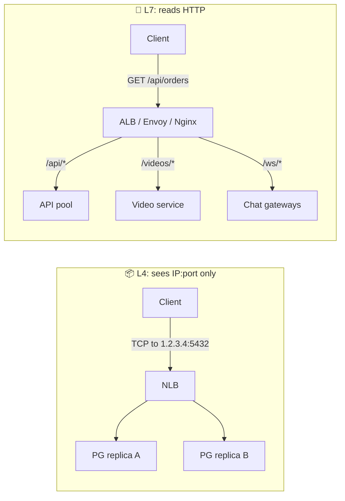
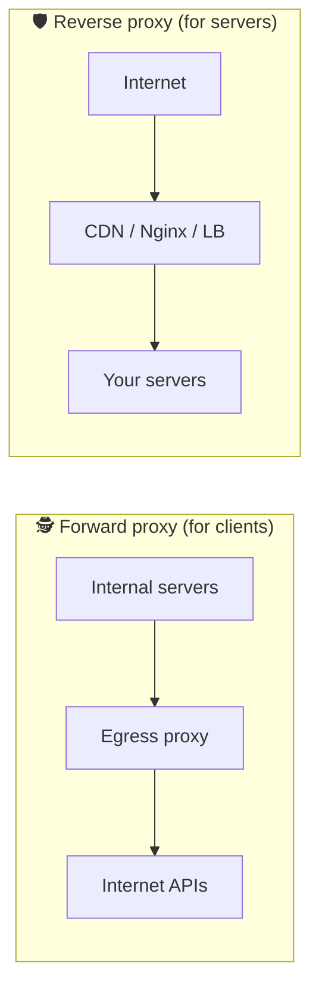

# 021 · L4 vs L7 Load Balancing & Proxies

> ⏱ 9 min · 📈 21% · 🅰️ Part A (core) · Phase 03: Scaling Basics
>
> `████░░░░░░░░░░░░░░░░` 21% of the whole guide

---

## 📖 Story

Pantry has grown three heads under one name. There's the **API**, the **video service**, and the **chat server**, all reachable only through `pantry.app`.

Maya's load balancer sees every request as a sealed envelope addressed to port 443. It cannot tell a menu click from a 200 MB video upload from a chat socket. So it sprays them all at the same pool, and the API servers choke on video bytes they were never built to handle.

She needs a doorman who can **open the envelope and read it**.

But there's a twist. Her Postgres read replicas and a new IoT temperature sensor in the cooks' kitchens don't speak HTTP at all. For them, a doorman who reads letters is useless.

Two kinds of doormen for two kinds of jobs. Let me show you how to tell which one you need.

## 🎯 One-sentence idea

**An L4 load balancer routes by IP and port without reading content (fast, protocol-agnostic), an L7 load balancer reads the HTTP request and routes by path, header, or cookie (smart, heavier), and reverse proxies front servers while forward proxies front clients.**

## 🧸 Analogy

A **mailroom**:

- 📦 **L4:** the clerk reads only the **address on the envelope** and forwards it. Fast, and never opens anything.
- 📖 **L7:** the clerk **opens the letter**, sees "invoice", and routes it to accounting. Slower, much smarter.
- 🛡️ **Reverse proxy** = the company **receptionist**, who represents the servers.
- 🕵️ **Forward proxy** = **your assistant** making calls for you, who represents the clients.

## 🖼️ Visual

*Diagram brief:* top panel, an L4 box that only sees `IP:port` and splits connections blindly. Middle panel, an L7 box reading `/api`, `/videos`, `/ws` and routing each to its own pool. Bottom panel, forward vs reverse proxy, mirrored.





## 🔬 How it works

- **L4 (TCP/UDP):** forwards connections by IP + port. No HTTP parsing, and TLS can pass straight through. It handles **millions of connections** with little CPU, works for **any protocol** (Postgres, MQTT, game UDP), and can use **direct server return**. But it can't route by path or retry per request.
- **L7 (HTTP/gRPC):** **terminates** the client connection, parses the request, and opens its own connection to a backend. It does **path/host/header/cookie routing**, TLS termination, auth, rewrites, compression, caching, per-request retries, and **per-RPC gRPC balancing**, at the cost of more CPU, plus it sees plaintext.
- **Reverse proxy jobs:** load balancing, TLS, caching, compression, **hiding backend topology**, WAF, serving static files.
- **Forward proxy jobs:** corporate filtering, **egress control** ("our servers may call only Stripe and S3"), anonymity, client-side caching.
- **The layered pattern:** **L4 at the edge** (cheap, absorbs floods and SYN storms) → a fleet of **L7 proxies** (smart routing) → services.

## 🧩 Worked example

```nginx
server {
  listen 443 ssl;
  server_name pantry.app;

  location /api/     { proxy_pass http://api_pool; }
  location /videos/  { proxy_pass http://video_pool; client_max_body_size 500m;
                       proxy_request_buffering off; }      # stream uploads, don't buffer 200 MB
  location /ws/      { proxy_pass http://chat_pool;
                       proxy_set_header Upgrade $http_upgrade;
                       proxy_set_header Connection "upgrade"; }
  location /         { root /var/www/static; }
}
```

**Why gRPC needs L7:** gRPC multiplexes thousands of RPCs over **one long-lived HTTP/2 connection**. An L4 balancer pins that connection to one backend, so **100% of the RPCs hit one pod** while the others idle. An L7 proxy (Envoy) balances **each RPC** separately.

## ⚖️ Trade-offs

| | L4 | L7 |
|---|---|---|
| Sees | IP, port, protocol | URL, headers, cookies, body |
| Speed | 🚀 Very fast | Fast (more CPU) |
| Routing smarts | Low | High |
| TLS | Pass-through or terminate | Terminates |
| Protocols | Any TCP/UDP | HTTP, gRPC, WebSocket |
| Examples | AWS NLB, Maglev, LVS, HAProxy TCP mode | AWS ALB, Envoy, Nginx, Traefik, HAProxy HTTP mode |

## 🌍 Real world

- **AWS:** NLB is L4, ALB is L7. **Google:** Maglev (L4) in front of GFE (L7).
- **Cloudflare and Fastly** are planet-scale reverse proxies (CDN + WAF + L7 routing).
- **Kubernetes Ingress controllers** are L7 reverse proxies.

## 📌 Cheat card

> - **L4 = envelope address. L7 = opens the letter.**
> - Path, header, or cookie routing, retries, auth → **L7**. Raw speed or non-HTTP → **L4**.
> - **gRPC needs L7 (per-RPC) balancing.**
> - **Reverse proxy fronts servers. Forward proxy fronts clients.**
> - Common stack: **L4 edge → L7 fleet → services**.

## 🧪 Feynman check

Explain the clerk who reads only envelopes versus the one who opens letters, and give one job where each is the right clerk.

⚠️ **Common confusion:** "Reverse proxy and load balancer are different things." They overlap almost completely. A load balancer is usually a reverse proxy with multiple backends, and one Nginx process can be both at the same time.

## ⚡ Quick recall

1. Can an L4 load balancer route `/api` and `/videos` to different servers?
<details><summary>Reveal Answer</summary>

No. It never reads HTTP paths. You need L7.
</details>

2. Give one use of a forward proxy.
<details><summary>Reveal Answer</summary>

Corporate web filtering, egress control for servers, anonymity, or client-side caching.
</details>

3. Why put L4 in front of L7?
<details><summary>Reveal Answer</summary>

L4 cheaply absorbs huge connection volumes (and some DDoS) and spreads them across a fleet of L7 proxies that do the expensive smart routing.
</details>

## 🎤 Interview practice

**Q. "Under one domain you serve a mobile API, browser traffic, WebSocket chat, and internal gRPC services. Design the proxy layers, and explain why you wouldn't use L7 everywhere."**
<details><summary>Model answer</summary>

- **Edge:** an **Anycast/L4** layer (NLB or a CDN edge) absorbs floods and terminates or passes TLS at scale.
- **L7 routing tier** (ALB/Envoy/Nginx) with **path rules:**
  - `/api/*` → API pool (least request).
  - `/ws/*` → chat gateways (WebSocket upgrade, least connections, long idle timeouts).
  - `/` → CDN/static.
  - **Header rules** for canaries (`X-Canary: true` or weighted targets).
  - It adds `X-Forwarded-For` and a **request ID** for tracing.
- **Internal gRPC:** an **L7 proxy or sidecar** (Envoy/mesh) so each **RPC** is balanced, not each connection, plus retries, deadlines, and mTLS.
- **Databases and non-HTTP:** an **L4** balancer or protocol-aware proxy (PgBouncer).
- **Why not L7 everywhere:**
  - **CPU and cost**: every request is parsed and TLS terminated.
  - **Protocol limits**: Postgres, MQTT, and custom UDP aren't HTTP.
  - **End-to-end encryption** rules may forbid decrypting in the middle.
  - **Latency**: L4 can use **direct server return**, where responses (video!) bypass the LB entirely.
- **Likely follow-up:** "What's direct server return?" → the L4 LB forwards the inbound packets, and the backend replies directly to the client using the shared VIP. Great for asymmetric, response-heavy traffic.
</details>

## 📖 Teaser

> 📖 *Requests now land in the right place, but every one of Maya's services is re-checking logins and rate limits its own slightly broken way.*

---

⬅️ [✅ Checkpoint 20%](checkpoint-20.md) · 🗺️ [Phase map](README.md) · ➡️ [022 · API Gateway](022-api-gateway.md)

✅ **Safe stopping point.** Tick lesson 021 in [PROGRESS.md](../../PROGRESS.md).
