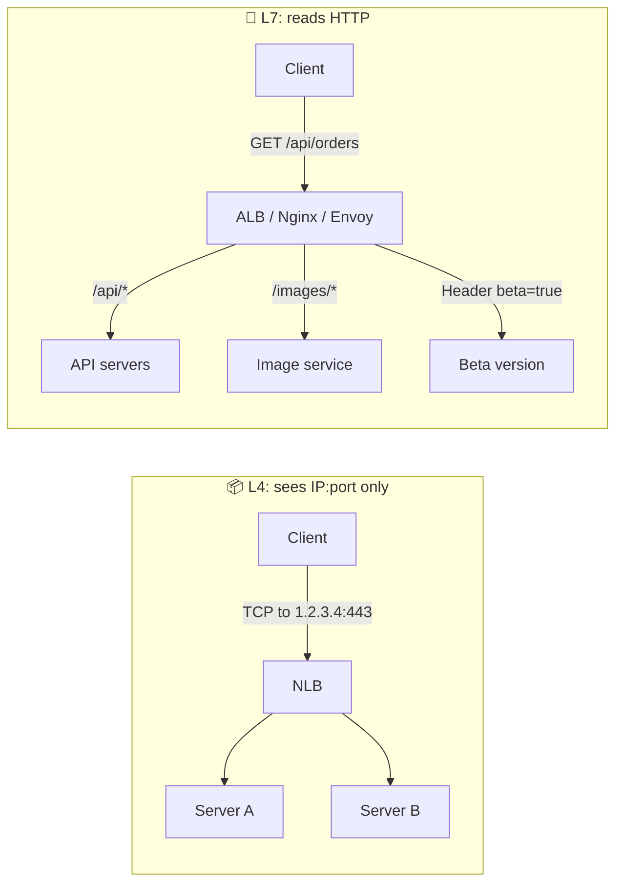
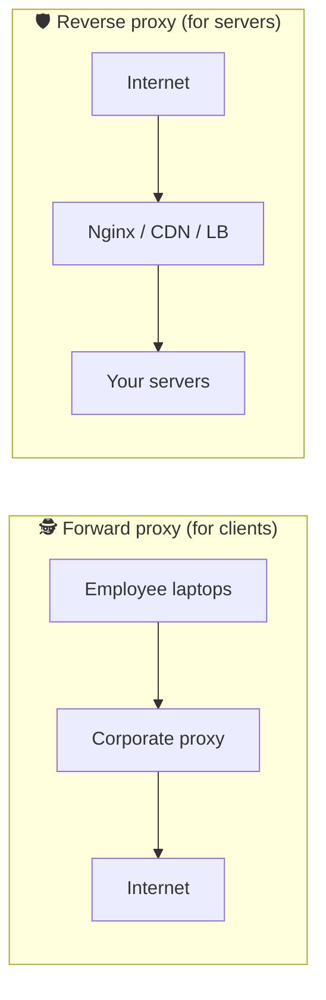

# 021 · L4 vs L7 Load Balancing & Proxies

> ⏱ 9 min · 📈 21% · 🅰️ Part A (core) · Phase 03: Scaling Basics
>
> `████░░░░░░░░░░░░░░░░` 21% of the whole guide

---

## 📖 Story

Pantry now has an API, an image service, and a chat server, all living behind pantry.com. Maya needs the front door to *read* each request and route it by its path. But some traffic, like the database's, doesn't even speak HTTP. Two kinds of doormen, for two kinds of jobs.

## 🎯 One-sentence idea

**An L4 load balancer routes by network address and port without reading the content (fast, dumb). An L7 load balancer reads the HTTP request and can route by URL, header, or cookie (smart, slower). A reverse proxy stands in front of servers, and a forward proxy stands in front of clients.**

## 🧸 Analogy

A **mailroom**:

- 📦 **L4 (transport layer):** the clerk looks only at the **address on the envelope** and forwards it. Very fast, never opens anything.
- 📖 **L7 (application layer):** the clerk **opens the letter**, reads "this is an invoice" or "this is a job application", and routes it to accounting or HR. Slower, but much smarter.

And:
- 🛡️ **Reverse proxy** = the company's **receptionist**. Visitors talk to them, not to employees directly. *Protects and represents the servers.*
- 🕵️ **Forward proxy** = **your assistant** who makes calls on your behalf. *Represents the clients* (e.g., a corporate web filter).

## 🖼️ Visual





## 🔬 How it works

- **L4 load balancer (TCP/UDP):**
  - Forwards packets or connections based on IP + port. It **doesn't decrypt or parse HTTP**.
  - ✅ Very fast (millions of connections), protocol-agnostic (databases, gaming, MQTT), preserves end-to-end TLS.
  - ❌ Can't route by path or header, can't retry per request, and has no HTTP-aware health checks.
- **L7 load balancer (HTTP/gRPC):**
  - Terminates the connection, **parses the request**, then opens its own connection to a backend.
  - ✅ **Path/host/header routing**, TLS termination, auth checks, rewrites, compression, caching, per-request retries, gRPC balancing, WAF rules.
  - ❌ More CPU per request, and it sees plaintext (so it must be trusted).
- **Reverse proxy uses:** load balancing, TLS termination, caching, compression, **hiding backend topology**, WAF/security, serving static files.
- **Forward proxy uses:** corporate filtering, anonymity, egress control ("our servers can only reach approved APIs"), caching for clients.
- **A common layered pattern:** **L4 at the very edge** (cheap, absorbs floods) → **L7 behind it** (smart routing) → services.

## 🧩 Worked example

**L7 routing rules for one domain serving many services:**

```nginx
server {
  listen 443 ssl;
  server_name shop.com;

  location /api/      { proxy_pass http://api_pool; }
  location /images/   { proxy_pass http://image_pool;  proxy_cache img_cache; }
  location /ws/       { proxy_pass http://chat_pool;
                        proxy_set_header Upgrade $http_upgrade;
                        proxy_set_header Connection "upgrade"; }
  location /          { root /var/www/static; }        # serve static files directly
}
```

**When to pick L4 instead:** your Postgres read replicas, an MQTT broker for IoT, or a game server using UDP. None of them speak HTTP, so an L7 LB can't help.

## ⚖️ Trade-offs

| | L4 | L7 |
|---|---|---|
| Sees | IP, port, protocol | URL, headers, cookies, body |
| Speed | 🚀 Very fast | Fast (more CPU) |
| Routing smarts | Low | High |
| TLS | Pass-through (or terminate) | Terminates |
| Protocols | Any TCP/UDP | HTTP, gRPC, WebSocket |
| Examples | AWS NLB, Maglev, LVS, HAProxy (TCP mode) | AWS ALB, Nginx, Envoy, HAProxy (HTTP mode), Traefik |

## 🌍 Real world

- **AWS:** NLB = L4, ALB = L7. **Google:** Maglev (L4) in front of GFE (L7).
- **Cloudflare, Fastly** are giant reverse proxies (CDN + WAF + L7 routing).
- **Kubernetes Ingress controllers** (Nginx, Traefik, Envoy-based) are L7 reverse proxies.

## 📌 Cheat card

> - **L4 = envelope address (fast, any protocol). L7 = opens the letter (smart HTTP routing).**
> - Need path, header, or cookie routing, retries, or auth → **L7**. Need raw speed or non-HTTP → **L4**.
> - **Reverse proxy protects servers. Forward proxy represents clients.**
> - Common stack: **L4 edge → L7 routing → services**.

## 🧪 Feynman check

Explain the mailroom clerk who reads only envelopes versus the one who opens letters, and give one situation where each is the right clerk.

⚠️ **Common confusion:** "Reverse proxy and load balancer are different things." They overlap heavily. A load balancer is usually a reverse proxy with multiple backends. Nginx can be both, at the same time.

## ⚡ Quick recall

1. Can an L4 LB route `/api` and `/images` to different servers?
<details><summary>Answer</summary>

No. It doesn't read HTTP paths. You need L7.
</details>

2. Give one use of a forward proxy.
<details><summary>Answer</summary>

Corporate web filtering, egress control for servers, anonymity, or client-side caching.
</details>

3. Why might you want L4 in front of L7?
<details><summary>Answer</summary>

L4 is cheap and fast at absorbing huge connection volumes (and some DDoS), and spreads load across a fleet of L7 proxies that do the smart routing.
</details>

## 🎤 Interview practice

**Q1. "You need to route mobile API traffic, web traffic, and WebSocket chat under one domain. What do you use?"**
<details><summary>Model answer</summary>

- An **L7 load balancer / reverse proxy** (ALB, Envoy, Nginx) with **path-based rules**: `/api/*` → API pool, `/ws/*` → chat gateways (WebSocket upgrade support, least-connections), `/` → static/CDN.
- TLS terminates at the L7 layer, and it adds `X-Forwarded-For` and request IDs for tracing.
- Optionally put an L4 NLB or Anycast edge in front for scale and DDoS absorption.
- **Likely follow-up:** "How do you route a canary by header?" → an L7 rule on `X-Canary: true`, or a weighted target group.
</details>

**Q2. "Why not always use L7?"**
<details><summary>Model answer</summary>

- **Cost/CPU:** it parses every request and terminates TLS.
- **Protocol limits:** non-HTTP protocols (databases, MQTT, custom TCP/UDP) need L4.
- **End-to-end encryption** requirements may forbid terminating TLS in the middle.
- **Latency:** an extra hop that does real work. L4 can even use direct server return.
- **Likely follow-up:** "What's direct server return?" → the L4 LB forwards the request, and the backend responds directly to the client, bypassing the LB on the way back (great for heavy responses like video).
</details>

> 📖 *Next time: Every service is re-implementing login checks. Maya wants one front desk for all of them.*

---

⬅️ [✅ Checkpoint 20%](checkpoint-20.md) · 🗺️ [Phase map](README.md) · ➡️ [022 · API Gateway](022-api-gateway.md)

✅ **Safe stopping point.** Tick lesson 021 in [PROGRESS.md](../../PROGRESS.md).
