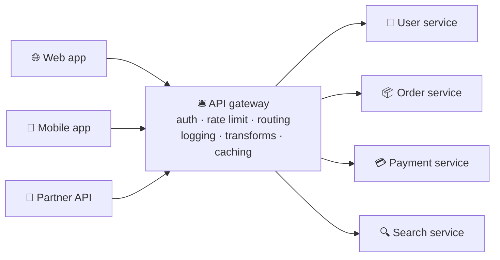

# 022 · API Gateway

> ⏱ 8 min · 📈 22% · 🅰️ Part A (core) · Phase 03: Scaling Basics
>
> `████░░░░░░░░░░░░░░░░` 22% of the whole guide

---

## 📖 Story

Pantry now ran eight services, and each one checked logins, logged requests, and blocked abusers in its own slightly different, slightly buggy way. Then a partner found one service that forgot to check logins *at all*. I winced when Maya told me, because I've seen that happen in real companies. She needed one front desk to handle it for everyone.

## 🎯 One-sentence idea

**An API gateway is the single front door for all your backend services. It handles the boring-but-critical cross-cutting work (auth, rate limits, routing, logging, request shaping) so each service doesn't have to.**

## 🧸 Analogy

A **hotel front desk**:

- Every guest comes through **one desk**, not straight to housekeeping or the kitchen.
- The desk **checks your ID** (authentication), **checks your booking** (authorization), limits how many **towels you can request per hour** (rate limiting), and **forwards your request** to the right department (routing).
- The kitchen and housekeeping never re-check your ID. They trust the front desk.

## 🖼️ Visual



## 🔬 How it works

- **Routing:** `/users/*` → user service, `/orders/*` → order service. Clients see **one API**.
- **Authentication:** validate the JWT/API key/OAuth token **once**, then pass trusted identity headers (e.g., `X-User-Id`) inward.
- **Rate limiting & quotas:** per user, per API key, per plan tier (lesson 024).
- **Request/response transformation:** protocol translation (REST ↔ gRPC), field filtering, response aggregation.
- **Observability:** access logs, metrics, request IDs, and tracing headers for every call.
- **Other jobs:** caching, CORS, IP allow/deny lists, request size limits, and API versioning.
- **Backend-for-Frontend (BFF):** a gateway variant **per client type** (web BFF, mobile BFF) that aggregates exactly what each UI needs.
- **Gateway vs load balancer:** an LB spreads traffic across copies of *one* service. A gateway fronts *many different* services and adds API-level policies. In practice gateways sit behind or include an LB.
- ⚠️ **Keep business logic out** of the gateway, or it becomes a bottleneck "god service" that every team must change.

## 🧩 Worked example

**A gateway config sketch** (Kong/Envoy-style, simplified):

```yaml
routes:
  - path: /v1/orders
    service: order-service:8080
    plugins:
      - jwt-auth: { issuer: "https://auth.shop.com" }
      - rate-limit: { per_user: "100/minute", burst: 20 }
      - request-id: {}
  - path: /v1/search
    service: search-service:9000
    plugins:
      - rate-limit: { per_ip: "30/second" }
      - cache: { ttl_seconds: 30 }
```

**Request flow:**

1. `GET /v1/orders` with `Authorization: Bearer eyJ...`
2. The gateway verifies the JWT signature and expiry → extracts `user_id=42`.
3. It checks the rate-limit counter for user 42 → OK.
4. It forwards to `order-service` with `X-User-Id: 42` and `X-Request-Id: 9f3c…`.
5. It logs the latency and status, and returns the response.

## ⚖️ Trade-offs

| You gain | You pay | Use it when |
|---|---|---|
| One place for auth, limits, logging | An extra hop (~1–5 ms), and a critical component that must be HA | Many services or many client types |
| Simpler services (no duplicate auth code) | Risk of a "god gateway" with business logic | Keep it thin |
| BFF per client | More gateways to maintain | Web and mobile need very different payloads |
| Managed gateway (AWS API GW, Apigee) | Cost, vendor limits | Fast setup, public APIs |

## 🌍 Real world

- **Netflix Zuul**, **Amazon API Gateway**, **Kong**, **Apigee**, **Envoy-based gateways** (e.g., Emissary), **Tyk**.
- **Netflix** popularized the **BFF pattern**, with different edge APIs for TVs, phones, and browsers.

## 📌 Cheat card

> - Gateway = **one front door: auth → rate limit → route → log**.
> - **LB = many copies of one service. Gateway = many different services.**
> - **Validate tokens once at the edge**, and pass identity inward.
> - **BFF** = a gateway tailored per client (web, mobile).
> - **Keep it thin.** No business logic.

## 🧪 Feynman check

Explain the hotel front desk analogy, and why it's better for the desk to check your ID once than for every department to check it again.

⚠️ **Common confusion:** "With a gateway, internal services don't need any security." Defense in depth still matters. Use network policies/mTLS between services, and have services check **authorization** for their own resources (e.g., "can user 42 see order 99?").

## ⚡ Quick recall

1. Name four jobs of an API gateway.
<details><summary>Answer</summary>

Routing, authentication, rate limiting, logging/metrics (also transformation, caching, CORS, request IDs).
</details>

2. What's a BFF?
<details><summary>Answer</summary>

Backend-for-Frontend: an API layer tailored to one client type, which aggregates and shapes data for that UI.
</details>

3. How is a gateway different from a load balancer?
<details><summary>Answer</summary>

An LB distributes traffic among instances of one service. A gateway is an API-aware front door for many services, adding policies like auth and rate limits.
</details>

## 🎤 Interview practice

**Q1. "Where do you enforce authentication in a microservices architecture?"**
<details><summary>Model answer</summary>

- **At the gateway:** validate the token (JWT signature/expiry, or introspect an opaque token), reject early, and pass the verified identity (user ID, scopes) downstream.
- **Service-to-service:** mTLS or signed internal tokens, so services trust only the gateway and each other.
- **Authorization** (resource-level) inside each service, because only the order service knows who owns order 99.
- **Likely follow-up:** "How do you revoke a JWT early?" → short expiry + refresh tokens, or a denylist checked at the gateway (lesson 069).
</details>

**Q2. "The API gateway is now a bottleneck and a single point of failure. What do you do?"**
<details><summary>Model answer</summary>

- Scale it **horizontally** (it should be stateless: rate-limit counters in Redis, config pulled from a store), across multiple AZs behind an L4 LB.
- **Remove business logic** that crept in, and split it into per-domain or per-client gateways (BFFs) to reduce blast radius.
- Cache token validation (JWKS keys), keep plugins lightweight, and monitor its p99 closely.
- **Likely follow-up:** "What if Redis (for rate limits) is down?" → fail open with local approximate limits, rather than blocking all traffic.
</details>

> 📖 *Next, customers overseas say the food photos load painfully slowly.*

---

⬅️ [021 · L4 vs L7 & Proxies](021-l4-l7-and-proxies.md) · 🗺️ [Phase map](README.md) · ➡️ [023 · CDN](023-cdn.md)

✅ **Safe stopping point.** Tick lesson 022 in [PROGRESS.md](../../PROGRESS.md).
