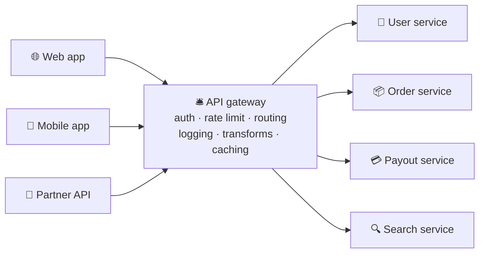

# 022 · API Gateway

> ⏱ 8 min · 📈 22% · 🅰️ Part A (core) · Phase 03: Scaling Basics
>
> `████░░░░░░░░░░░░░░░░` 22% of the whole guide

---

## 📖 Story

Pantry now runs **eight services**. Maya opens each codebase and finds eight hand-rolled versions of the same thing: login checks, request logging, abuse blocking. They're all slightly different, and all slightly wrong.

Then a security researcher emails her a single curl command:

```
curl https://pantry.app/internal/payouts/cook/17
```

It returns cook #17's **bank account details**. The payout service, written in a rush, **never checked for a login at all**.

Maya's blood goes cold. Eight front doors, and one of them was left wide open.

I winced when she told me, because I've watched this exact thing happen at real companies. She needs **one front desk** that every request must pass through, and that checks everyone the same way.

## 🎯 One-sentence idea

**An API gateway is the single front door for all your backend services, handling the critical cross-cutting work (auth, rate limits, routing, logging, request shaping) once, so no service has to reinvent it.**

## 🧸 Analogy

A **hotel front desk**:

- Every guest goes through **one desk**, never straight to the kitchen.
- The desk **checks your ID**, **checks your booking**, limits **towel requests per hour**, and **forwards** your request to the right department.
- The kitchen doesn't re-check your ID. It trusts the desk.

## 🖼️ Visual

*Diagram brief:* web, mobile, and partner clients converge on one gateway box, which is stamped with its policy checklist. Behind it, arrows fan out to separate services.



## 🔬 How it works

- **Route + authenticate once:** `/v1/orders/*` → the order service. Validate the JWT/API key/OAuth token **at the edge**, reject early, and forward **trusted identity headers** (`X-User-Id`, scopes) inward.
- **Policy in one place:** per-user and per-key **rate limits and quotas** (lesson 024), IP allow/deny lists, body size caps, CORS, and API versioning.
- **Shape the traffic:** REST ↔ gRPC translation, response aggregation, field filtering, and short-TTL caching. A **BFF** (Backend-for-Frontend) is a gateway tailored per client type.
- **Observability for free:** access logs, RED metrics (rate, errors, duration), and a `X-Request-Id` and trace headers stamped on every call.
- **Gateway ≠ load balancer:** an LB spreads traffic over copies of *one* service, while a gateway fronts *many* services with API-level policy. **Keep it thin**, with no business logic, or it becomes a "god service" that every team queues behind.

## 🧩 Worked example

```yaml
routes:
  - path: /v1/orders
    service: order-service:8080
    plugins:
      - jwt-auth:   { issuer: "https://auth.pantry.app" }
      - rate-limit: { per_user: "100/minute", burst: 20 }
      - request-id: {}
  - path: /v1/payouts
    service: payout-service:8080
    plugins:
      - jwt-auth:   { issuer: "https://auth.pantry.app", required_scope: "payouts:read" }
      - rate-limit: { per_user: "10/minute" }
  - path: /internal/*
    deny: true                       # never exposed publicly
```

**Flow:** `GET /v1/orders` + `Bearer eyJ…` → verify the signature and expiry with cached **JWKS** keys (~0.1 ms) → `user_id=42` → the rate-limit check in Redis (~0.5 ms) → forward with `X-User-Id: 42`, `X-Request-Id: 9f3c…` → log status and latency. Total gateway overhead: **~1–5 ms**.

## ⚖️ Trade-offs

| Maya's choice | What she gains | What she pays |
|---|---|---|
| One gateway for all services | One place for auth, limits, logging | An extra hop (~1–5 ms), and a critical tier to keep highly available |
| Thin services | No duplicated security code | Risk of a "god gateway" if logic creeps in |
| A BFF per client | Tailored payloads for web and mobile | More gateways to maintain |
| Managed gateway (AWS API GW, Apigee) | Fast setup | Cost and vendor limits |

## 🌍 Real world

- **Netflix Zuul**, **Amazon API Gateway**, **Kong**, **Apigee**, **Envoy-based gateways**, **Tyk**.
- **Netflix** popularized the **BFF pattern**, with different edge APIs for TVs, phones, and browsers.

## 📌 Cheat card

> - Gateway = **auth → rate limit → route → log**, once, at the edge.
> - **LB = many copies of one service. Gateway = many different services.**
> - **Authenticate at the edge, authorize in the service.**
> - **BFF** = a gateway per client type.
> - **Keep it thin. No business logic.**

## 🧪 Feynman check

Explain the hotel front desk, and why checking ID once at the desk beats every department checking it again.

⚠️ **Common confusion:** "Now that we have a gateway, internal services don't need security." Wrong, and it's exactly how the payout leak would happen again. Keep **defense in depth**: mTLS or network policy between services, and **resource-level authorization in each service** ("does user 42 own order 99?"). Only the service knows who owns what.

## ⚡ Quick recall

1. Name four jobs of an API gateway.
<details><summary>Reveal Answer</summary>

Routing, authentication, rate limiting, and logging/metrics (also transformation, caching, CORS, and request IDs).
</details>

2. What's a BFF?
<details><summary>Reveal Answer</summary>

A Backend-for-Frontend: an API layer tailored to one client type that aggregates and shapes data for that UI.
</details>

3. How is a gateway different from a load balancer?
<details><summary>Reveal Answer</summary>

An LB distributes traffic across instances of one service. A gateway is an API-aware front door for many services that adds policies like auth and rate limits.
</details>

## 🎤 Interview practice

**Q. "Where do you enforce authentication and authorization in a microservices architecture? And when the gateway itself becomes a bottleneck and a single point of failure, what do you do?"**
<details><summary>Model answer</summary>

- **Authentication at the gateway:**
  - Verify the JWT signature and expiry against cached JWKS keys, or introspect opaque tokens with a short cache.
  - Reject invalid tokens early.
  - Pass verified identity and scopes downstream in headers that the gateway **strips from inbound requests**, so clients can't forge them.
- **Service-to-service trust:** use **mTLS** (mesh) or signed internal tokens, so a service accepts calls only from the gateway or authenticated peers.
- **Authorization inside each service:** resource ownership checks ("is order 99 user 42's?") belong where the data lives.
- **Early revocation:** short-lived access tokens (5–15 min) + refresh tokens, plus a small denylist checked at the gateway (lesson 069).
- **Gateway as a bottleneck or SPOF:**
  - Make it **stateless**: rate-limit counters in Redis, config pulled from a store.
  - Scale it **horizontally across AZs** behind an L4 LB.
  - **Evict business logic** that crept in.
  - **Split by domain or client** (BFFs) to shrink the blast radius.
  - Keep plugins light, and watch its **p99** like a hawk.
- **If the rate-limit store fails:** **fail open** to local approximate limits for most routes, but **fail closed** on sensitive ones (login, payouts).
- **Likely follow-up:** "Why not validate tokens in every service instead?" → you can, as a second layer, but centralizing it guarantees no service forgets, which is the bug that leaked the payouts.
</details>

## 📖 Teaser

> 📖 *Pantry opens in a second country, and every food photo has to cross an ocean before anyone sees it.*

---

⬅️ [021 · L4 vs L7 & Proxies](021-l4-l7-and-proxies.md) · 🗺️ [Phase map](README.md) · ➡️ [023 · CDN](023-cdn.md)

✅ **Safe stopping point.** Tick lesson 022 in [PROGRESS.md](../../PROGRESS.md).
