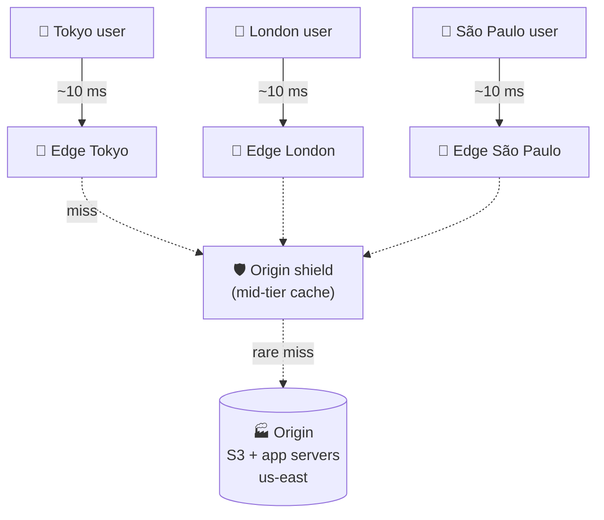

# 023 · CDN (Content Delivery Network)

> ⏱ 9 min · 📈 23% · 🅰️ Part A (core) · Phase 03: Scaling Basics
>
> `████░░░░░░░░░░░░░░░░` 23% of the whole guide

---

## 📖 Story

Pantry launches in a second country, eleven time zones away.

Maya opens the site from a hotel in Tokyo and watches. The page text appears. Then the food photos load, **slowly**, top to bottom, line by line, like a fax machine from 1993. **Three seconds per image.** Each photo is crossing the Pacific Ocean through undersea cables, from one server in Virginia, every single time, for every single customer.

Then she opens the cloud bill. **Data transfer: up 220%.** She's paying to ship the same lasagna photo across the ocean ten thousand times a day.

The photos should live **close to the people looking at them**, not in one faraway server room.

This is one of my favourite ideas in the whole guide. It's so simple, and so powerful.

## 🎯 One-sentence idea

**A CDN keeps copies of your content on edge servers near users all over the world, so users fetch from nearby instead of your faraway origin, which is faster for them and far cheaper and lighter for you.**

## 🧸 Analogy

A **bestselling book**:

- Without a CDN: everyone orders from **one warehouse in Ohio**. Tokyo waits weeks, and the warehouse drowns.
- With a CDN: copies sit in **local bookstores in every city**. Tokyo walks to the corner shop, and Ohio only restocks the shops.

## 🖼️ Visual

*Diagram brief:* a world map with one origin in the US and small edge stores on every continent. Users draw short arrows to their local edge. Edges draw thin, rare dotted arrows back to the origin, only on a miss.



## 🔬 How it works

- **Edges (PoPs) in hundreds of cities**, reached through **Anycast** or **DNS steering**. On a **hit**, the edge serves immediately. On a **miss**, it fetches from the origin once (often through an **origin shield** tier), stores the object, and serves it.
- **Freshness is set by headers:** `Cache-Control: public, max-age`, `s-maxage` (shared caches), `private`/`no-store`, and `stale-while-revalidate`/`stale-if-error` to keep serving during refresh or outages.
- **Invalidation:** purge by URL or **surrogate tag** (it takes seconds to minutes to spread globally), or better, use **content-hashed filenames** (`app.3f9a1c.js`): new content gets a new URL, so you cache it for a year and never purge.
- **Pull vs push:** a pull CDN fetches lazily on first request (the default). A push CDN pre-loads big, predictable files (a new episode at launch).
- **Beyond static files:** short-TTL API caching, TLS near users, **DDoS absorption + WAF**, image resizing (WebP/AVIF), and **edge compute** for auth checks, A/B tests, and redirects.

## 🧩 Worked example

```http
GET /static/app.3f9a1c.js
Cache-Control: public, max-age=31536000, immutable          # hashed name → cache 1 year

GET /dishes/42
Cache-Control: public, s-maxage=60, stale-while-revalidate=300   # edge 60 s, serve stale while refreshing

GET /account
Cache-Control: private, no-store                             # never in a shared cache
```

**Maya's bill, before and after.** 200 TB/month of images:

```
No CDN:   200 TB × ~$0.08/GB cloud egress ≈ $16,000/month, Tokyo p95 ≈ 3 s
CDN, 98% hit ratio: origin egress = 4 TB (≈ $320), CDN delivery is cheaper per GB at volume
         Tokyo p95 ≈ 40 ms; origin requests drop 50×
```

**The hit ratio is the metric:** 90% → 99% hits = **10× less origin traffic**.

## ⚖️ Trade-offs

| Maya's choice | What she gains | What she pays |
|---|---|---|
| A CDN in front of everything public | Global low latency, origin offload | CDN fees and config complexity |
| Long TTLs | Near-100% hit ratio | Stale content, unless she uses versioned URLs |
| CDN-cached API responses | Huge read offload | Risk of serving stale prices or leaking private data |
| Edge compute | Logic in ~10 ms of every user | A new runtime model with its own limits |

## 🌍 Real world

- **Cloudflare, Akamai, Fastly, AWS CloudFront, Google Cloud CDN.**
- **Netflix Open Connect** places Netflix-owned cache appliances **inside ISPs** and serves the large majority of its traffic from them.
- **Video platforms** (lesson 079) are, at heart, a CDN with extra steps.

## 📌 Cheat card

> - CDN = **copies near users. Hit → fast. Miss → fetch from origin once.**
> - **Hashed filenames + 1-year TTL** beats purging.
> - Watch the **hit ratio**. Each extra 9 cuts origin load **10×**.
> - Headers: **public/private · max-age · s-maxage · no-store · stale-while-revalidate**.
> - Media-heavy design → **object storage + CDN** by default.

## 🧪 Feynman check

Explain the bookstores, and why renaming a file (`app.v2.js`) beats asking every bookstore to throw away its old copies.

⚠️ **Common confusion:** caching personalized responses in a shared cache. If `/account` is cached at the edge without `private` or a correct cache key, **user B gets user A's page**. That has caused real data-leak incidents. The cache key must include everything that changes the response (`Vary`, cookies, auth), or the response must not be shared-cached at all.

## ⚡ Quick recall

1. What happens on a CDN cache miss?
<details><summary>Reveal Answer</summary>

The edge fetches the object from the origin (or shield), caches it per its headers, and serves it. Later requests at that edge are hits.
</details>

2. Why use content-hashed filenames?
<details><summary>Reveal Answer</summary>

Each version gets a unique URL, so assets can be cached forever and an update never needs a purge.
</details>

3. What's the difference between a pull CDN and a push CDN?
<details><summary>Reveal Answer</summary>

A pull CDN fetches from the origin on demand. A push CDN has content uploaded to it in advance.
</details>

## 🎤 Interview practice

**Q. "Our image-heavy marketplace is slow in Asia and the cloud bill is dominated by egress. We also want to cache some API responses at the edge. Design it, and tell me the risks."**
<details><summary>Model answer</summary>

- **Media path:**
  - Store originals in **object storage**.
  - Generate **right-sized WebP/AVIF variants** at upload (or with on-the-fly CDN image optimization).
  - Serve through a **CDN** with **hashed URLs + `max-age=31536000, immutable`**.
  - Add an **origin shield** so a miss in 300 PoPs becomes one origin fetch.
- **Private images:** **signed URLs** with short expiry (or signed cookies), so the CDN serves them without exposing the bucket.
- **API at the edge, only for public, non-personalized data** (catalog, "popular near you" per city):
  - `s-maxage=30–60` + `stale-while-revalidate`.
  - Cache keys include **city and locale**.
  - **Tag-based purge** (surrogate keys) when a dish changes.
- **Risks and mitigations:**
  - **Private data leaks** → `private`/`no-store` for anything user-specific, plus strict cache-key design.
  - **Stale prices or stock** → short TTL + purge on change, and authoritative checks at checkout.
  - **Cache poisoning** via unkeyed headers → normalize and limit the headers that are honoured.
- **Measure:** hit ratio, origin egress, and **p95 latency per region**.
- **Likely follow-up:** "A user deletes a photo. How fast does it disappear?" → purge by URL/tag (seconds to a minute globally). For sensitive content, short TTLs plus signed URLs whose keys you can rotate.
</details>

## 📖 Teaser

> 📖 *Photos fly now, but at 3 a.m. a single bot starts hammering Pantry's search 5,000 times a second, and real customers can't get in the door.*

---

⬅️ [022 · API Gateway](022-api-gateway.md) · 🗺️ [Phase map](README.md) · ➡️ [024 · Rate Limiting](024-rate-limiting.md)

✅ **Safe stopping point.** Tick lesson 023 in [PROGRESS.md](../../PROGRESS.md).
