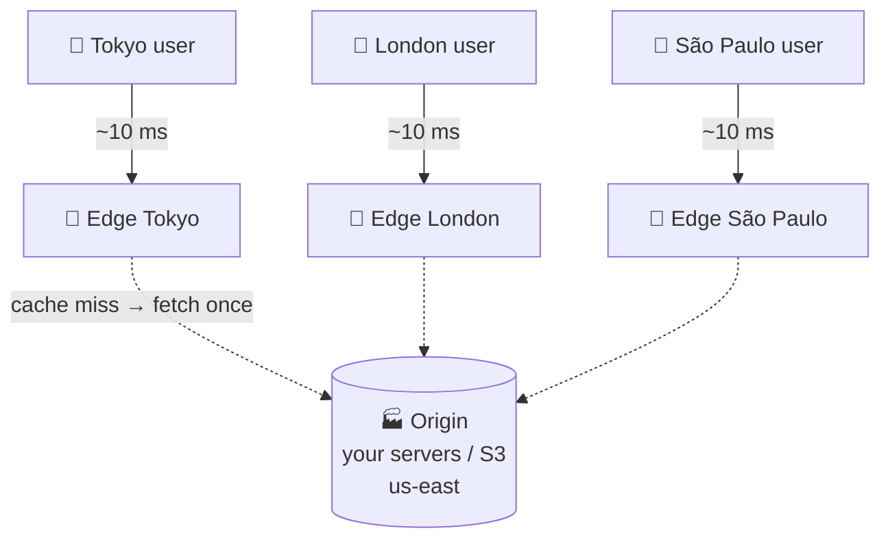

# 023 · CDN (Content Delivery Network)

> ⏱ 9 min · 📈 23% · 🅰️ Part A (core) · Phase 03: Scaling Basics
>
> `████░░░░░░░░░░░░░░░░` 23% of the whole guide

---

## 📖 Story

Pantry opens in a second country, and customers there wait three seconds for every food photo to cross the ocean. Leo's bandwidth bill doubles too. Maya realizes the photos should live *close to the people looking at them*, not in one faraway server room.

## 🎯 One-sentence idea

**A CDN keeps copies of your content on servers ("edges") close to users all over the world. Users get it from nearby instead of from your faraway origin, so it's faster for them and much cheaper and lighter for you.**

## 🧸 Analogy

A **bestselling book**:

- Without a CDN: everyone in the world orders it **from one warehouse in Ohio**. Slow shipping for Tokyo, and the warehouse is swamped.
- With a CDN: copies sit in **local bookstores in every city**. Tokyo readers walk to their local store. Ohio only restocks the stores now and then.

## 🖼️ Visual



## 🔬 How it works

- **Edge servers (PoPs)** in hundreds of cities. Users reach the nearest one via **DNS** or **Anycast** routing.
- **Cache hit:** the edge has a fresh copy → serves it instantly. **Cache miss:** the edge fetches from the **origin**, stores it, and serves it.
- **Freshness** is controlled by `Cache-Control` headers: `max-age=86400`, `s-maxage` (for shared caches), `no-store`, `stale-while-revalidate`.
- **Invalidation:**
  - **Purge** an URL or tag when content changes (it takes seconds to minutes to spread globally).
  - Better: **versioned filenames** (`app.3f9a1c.js`). New content gets a new URL, so you never need to purge, and you can cache it "forever".
- **Pull vs push CDN:**
  - **Pull:** the edge fetches on first request (the most common, easy).
  - **Push:** you upload content to the CDN ahead of time (good for big, predictable files like video releases).
- **What to put on a CDN:** images, video, JS/CSS, downloads, and increasingly **API responses** (short TTL) and **edge compute** (auth checks, A/B tests, personalization at the edge).
- **Bonus powers:** DDoS absorption, a WAF, TLS termination near users, image resizing, and compression.

## 🧩 Worked example

**Cache-friendly headers:**

```http
# Static asset with a hashed name → cache for a year, never changes
GET /static/app.3f9a1c.js
Cache-Control: public, max-age=31536000, immutable

# Product page HTML → edge caches for 60 s, serves stale while refreshing
GET /products/42
Cache-Control: public, s-maxage=60, stale-while-revalidate=300

# User's account page → never cache in shared caches
GET /account
Cache-Control: private, no-store
```

**The money math:** a site serves **2 PB/month** of images.

```
Without CDN: all 2 PB leaves your cloud → egress at ~$0.05–0.09/GB ≈ $100k–180k/month
With CDN at a 95% hit ratio: origin egress = 100 TB; CDN delivery pricing is usually cheaper at volume
→ origin load drops 20×, and users in every continent get ~10–30 ms instead of ~150 ms
```

**Cache hit ratio is the metric to watch.** 90% vs 99% hits = **10× less origin traffic**.

## ⚖️ Trade-offs

| You gain | You pay | Use it when |
|---|---|---|
| Low latency worldwide | CDN cost, config complexity | Any global audience |
| Origin offload (and fewer servers) | Stale content risk | Static and semi-static content |
| DDoS protection | Vendor dependency | Public-facing sites |
| Edge compute | New programming model, limits | Personalization/auth at the edge |
| Long TTLs | Harder updates (use versioned URLs!) | Immutable assets |

## 🌍 Real world

- **Cloudflare, Akamai, Fastly, AWS CloudFront, Google Cloud CDN.**
- **Netflix Open Connect:** Netflix puts its own cache boxes *inside ISPs*, and serves the large majority of its video from them.
- **Video platforms** (lesson 079) are basically "a CDN with extra steps."

## 📌 Cheat card

> - CDN = **copies near users**. **Hit → fast. Miss → fetch from origin once.**
> - **Versioned filenames + long TTL** beats purging.
> - Watch the **cache hit ratio**. Each extra "9" cuts origin load 10×.
> - `Cache-Control`: **public/private, max-age, s-maxage, no-store, stale-while-revalidate**.
> - Media-heavy design? **Object storage + CDN** is the default answer.

## 🧪 Feynman check

Explain the bookstore analogy, and why renaming a file (`app.v2.js`) is smarter than asking every bookstore to throw away old copies.

⚠️ **Common confusion:** "CDNs are only for static files." Modern CDNs cache short-lived API responses, terminate TLS, block attacks, and run code at the edge. But **never cache personalized or private responses in a shared cache**, or users may see each other's data.

## ⚡ Quick recall

1. What happens on a CDN cache miss?
<details><summary>Answer</summary>

The edge fetches the content from the origin, caches it (per its headers), and serves it. Later requests at that edge are hits.
</details>

2. Why use content-hashed filenames?
<details><summary>Answer</summary>

Each version gets a unique URL, so assets can be cached forever and updates never need a purge.
</details>

3. Pull vs push CDN?
<details><summary>Answer</summary>

Pull: the edge fetches from the origin on demand. Push: you upload content to the CDN in advance.
</details>

## 🎤 Interview practice

**Q1. "Our image-heavy site is slow for users in Asia, and our cloud bill is dominated by bandwidth. Fix it."**
<details><summary>Model answer</summary>

- Store images in **object storage (S3)** and put a **CDN** in front, with **long TTLs + versioned URLs**.
- Serve **right-sized, modern formats** (WebP/AVIF), resized at upload or by the CDN's image optimization.
- Consider **origin shield** (a mid-tier cache) to cut origin fetches further.
- Monitor the **hit ratio** and **p95 latency by region**.
- **Likely follow-up:** "How do you handle a user deleting a photo?" → purge by URL/tag, plus authorization on private images (signed URLs with short expiry).
</details>

**Q2. "Can you cache API responses in a CDN? What are the risks?"**
<details><summary>Model answer</summary>

- Yes, for **public, non-personalized** responses (product catalogs, trending lists) with a short `s-maxage` and `stale-while-revalidate`.
- Risks: **leaking personalized data** (cache keys must include anything that changes the response, via `Vary` or custom keys), stale prices or inventory, and cache poisoning.
- Personalized data → `Cache-Control: private` or no caching. Or cache the public shell at the edge and fetch the personal bits separately.
- **Likely follow-up:** "How do you invalidate when a price changes?" → tag-based purge (surrogate keys), or a short TTL if brief staleness is acceptable.
</details>

> 📖 *Next time: At 3 am, a bot starts scraping every menu fifty times a second.*

---

⬅️ [022 · API Gateway](022-api-gateway.md) · 🗺️ [Phase map](README.md) · ➡️ [024 · Rate Limiting](024-rate-limiting.md)

✅ **Safe stopping point.** Tick lesson 023 in [PROGRESS.md](../../PROGRESS.md).
