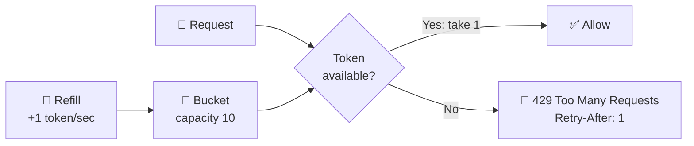

# 024 · Rate Limiting

> ⏱ 10 min · 📈 24% · 🅰️ Part A (core) · Phase 03: Scaling Basics
>
> `████░░░░░░░░░░░░░░░░` 24% of the whole guide

---

## 📖 Story

3:07 a.m. Maya's phone vibrates off the nightstand and clatters onto the floor.

The alert reads: **search p99 = 14 s**. She stumbles to her laptop, eyes half-closed, and pulls up the traffic graph. It's a solid wall.

**One API key** is hitting `/search` **5,000 times per second**, scraping every dish and every price, round the clock. The search cluster is pinned at 100% CPU. A night-shift nurse trying to order a late dinner can't even load the menu.

Maya blocks the key. The graph drops. She crawls back to bed.

But I told her what I'll tell you: **there'll be another one next week**, with a new key, a new IP, a new trick. Whack-a-mole is not a strategy.

What she needs is a fair rule for **everyone**: *you may have this much, this fast, and no more.* Let me show you the jar of coins that makes it work.

## 🎯 One-sentence idea

**Rate limiting caps how many requests a client can make in a window of time, protecting the system from abuse and overload and keeping things fair, using simple algorithms like the token bucket.**

## 🧸 Analogy

A **jar of coins** (the token bucket):

- Each client's jar holds at most **10 coins**.
- One coin drips in **every second**, but the jar never overflows.
- **Each request costs one coin.** No coins → "please wait" (HTTP 429).
- A quiet user has a full jar and can **burst** 10 requests. A constant spammer gets exactly **1 per second**.

## 🖼️ Visual

*Diagram brief:* a jar with a dripping tap labelled "+1/s" on top and a capacity line at 10. Requests reach in and take one coin. When the jar is empty, they bounce off a red 429 sign.



## 🔬 How it works

- **Five algorithms:**
  - **Token bucket** allows bursts up to capacity b at long-run rate r, and is the most popular.
  - **Leaky bucket** smooths output to a constant rate by queueing.
  - **Fixed window** is one counter per clock window, the simplest, but it allows **2× bursts at window edges**.
  - **Sliding log** stores a timestamp per request: exact, but memory-heavy.
  - **Sliding window counter** weights the previous window's count: accurate enough and cheap.
- **Key it wisely:** per user, API key, IP, endpoint, or a combination, e.g. "100/min per user, but 5/min per IP on `/login`."
- **Enforce at the edge first** (gateway/WAF), where rejection is cheapest. Add service-level limits for expensive operations.
- **Distributed counters:** fleet-wide limits need shared state, so use **Redis with atomic ops** (`INCR` + `EXPIRE`, or a Lua token-bucket script, ~0.5 ms). At extreme scale, use local counters that sync every ~100 ms (approximate).
- **Respond well:** `429` + `Retry-After` + `X-RateLimit-Limit/Remaining/Reset`, and clients back off with **jitter**. Decide up front whether you **fail open** (availability) or **fail closed** (safety) when the limiter itself is down.

## 🧩 Worked example

**Fixed window's edge burst (limit 100/min):**

```
12:00:59 → 100 requests ✅ (window 12:00)
12:01:00 → 100 requests ✅ (counter reset)
= 200 requests in ~1 second 😬
```

**Token bucket, atomic in Redis (Lua, sketched in Python):**

```python
def allow(key, rate=1.0, capacity=10):
    tokens, ts = redis.hmget(f"tb:{key}", "tokens", "ts") or (capacity, now())
    tokens = min(capacity, tokens + (now() - ts) * rate)   # refill since last seen
    if tokens < 1:
        return False                                        # → 429
    redis.hset(f"tb:{key}", mapping={"tokens": tokens - 1, "ts": now()})
    redis.expire(f"tb:{key}", 60)
    return True
```

**Maya's new policy:** search = **10 req/s per key, burst 20**. The scraper's 5,000 req/s becomes **10 req/s**, a **99.8% cut**, and real users never notice the limit.

## ⚖️ Trade-offs

| Maya's choice | What she gains | What she pays |
|---|---|---|
| Token bucket | Bursts allowed, smooth long-run rate | Two knobs to tune |
| Fixed window | Dead simple | Edge bursts |
| Central Redis counters | Accurate across the fleet | An extra hop, and Redis becomes critical |
| Local in-memory limits | Zero latency | Inaccurate across many instances |
| Fail open | Availability during a limiter outage | Temporary abuse window |
| Fail closed | Safety | A limiter outage becomes a site outage |

## 🌍 Real world

- **Stripe** runs token-bucket request limiters, concurrency limiters, and fleet-wide load shedders.
- **GitHub's API:** 5,000 requests/hour per authenticated user, with `X-RateLimit-*` headers.
- **Cloudflare and AWS WAF** rate-limit by IP at the edge to blunt floods and credential stuffing.

## 📌 Cheat card

> - **Token bucket = coins in a jar:** rate r, capacity b (burst).
> - **Fixed window → 2× edge bursts.** The sliding window counter fixes it cheaply.
> - Key by **user / API key / IP / endpoint**. **Enforce at the edge.**
> - Shared state = **Redis atomic INCR or Lua**.
> - Always return **429 + Retry-After**.
> - Full walkthrough: [075 · Design a Rate Limiter](../09-core-case-studies/075-design-rate-limiter.md)

## 🧪 Feynman check

Explain the coin jar, and why a quiet user can suddenly fire 10 requests while a constant spammer only ever gets 1 per second.

⚠️ **Common confusion:** "Rate limiting = DDoS protection." Per-client limits stop *one* greedy client. A botnet of **a million IPs each sending 2 requests** sails under every per-IP limit. Large DDoS needs network-level scrubbing (Anycast CDN), plus per-account and behavioural limits.

## ⚡ Quick recall

1. In a token bucket, what does capacity control?
<details><summary>Reveal Answer</summary>

The maximum burst: how many requests can pass at once after a quiet period.
</details>

2. What's the flaw in a fixed-window counter?
<details><summary>Reveal Answer</summary>

Clients can send up to 2× the limit in a short span around a window boundary.
</details>

3. What response should a rate-limited request get?
<details><summary>Reveal Answer</summary>

`429 Too Many Requests`, ideally with `Retry-After` and rate-limit headers.
</details>

## 🎤 Interview practice

**Q. "Design rate limiting for a public API with millions of clients across 50 gateway servers, and make sure it also blunts credential stuffing on `/login`."**
<details><summary>Model answer</summary>

- **Algorithm:** a **token bucket** (or sliding window counter) per API key, with **tiered limits** by plan (free 100/min, pro 10k/min).
- **State:** a **Redis Cluster** sharded by key. One atomic **Lua** script does refill + check + decrement in a single round trip (~0.5–1 ms).
- **Placement:** in the **gateway**, before auth-heavy or DB work. Stricter per-endpoint limits for expensive routes.
- **Scale and resilience:**
  - To cut Redis load, each gateway **leases batches of tokens** (e.g. 50 at a time) and spends them locally. The limit becomes slightly approximate in exchange for fewer round trips.
  - If Redis is slow or down: **fail open** to a local approximate limiter for normal routes, **fail closed** for login, SMS, and payments.
- **Client contract:** `429` + `Retry-After` + remaining-quota headers. Documented backoff with jitter.
- **Credential stuffing (one attempt each from millions of IPs):**
  - Per-IP limits alone fail here, so add **per-account failed-attempt limits**, progressive delays, and CAPTCHA after N failures.
  - Device fingerprinting and IP reputation at the WAF.
  - **Breached-password checks**, and push users to **MFA**.
  - A **global anomaly alarm** on the login failure rate.
- **Likely follow-up:** "How do you rate limit GraphQL?" → by **query cost points**, not by request count.
</details>

## 📖 Teaser

> 📖 *The bots are tamed, but Pantry's traffic swings from a lunchtime tsunami to a 4 a.m. trickle, and Maya is paying for a full army of servers that spends most of the night asleep.*

---

⬅️ [023 · CDN](023-cdn.md) · 🗺️ [Phase map](README.md) · ➡️ [025 · Autoscaling & Containers](025-autoscaling-and-containers.md)

✅ **Safe stopping point.** Tick lesson 024 in [PROGRESS.md](../../PROGRESS.md).
