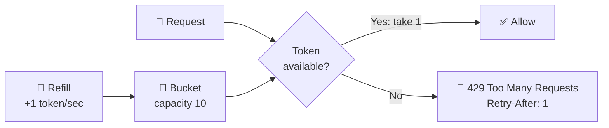

# 024 · Rate Limiting

> ⏱ 10 min · 📈 24% · 🅰️ Part A (core) · Phase 03: Scaling Basics
>
> `████░░░░░░░░░░░░░░░░` 24% of the whole guide

---

## 📖 Story

At 3 am, one bot hit Pantry's search 5,000 times a second, and real customers couldn't even load a menu. Maya could block that bot, but I told her there'd be another next week. What she needed was a fair rule for everyone: *you may have this much, this fast, and no more.* Let me show you the jar of coins that makes it work.

## 🎯 One-sentence idea

**Rate limiting caps how many requests a client can make in a time window. It protects your system from abuse and overload and keeps things fair, and it uses simple algorithms like the token bucket.**

## 🧸 Analogy

A **jar of coins** (the token bucket):

- Each client has a jar that holds at most **10 coins**.
- A coin is added **every second** (the refill rate), but the jar can't overflow.
- **Each request costs 1 coin.** No coins → "Please wait" (HTTP 429).
- If you've been quiet, your jar is full, so you can **burst** 10 requests at once. After that, you're limited to 1 per second.

## 🖼️ Visual



## 🔬 How it works

**The five classic algorithms:**

| Algorithm | How it works | 👍 | 👎 |
|---|---|---|---|
| **Token bucket** | Tokens refill at rate r up to capacity b. Each request uses one. | Allows bursts, memory-cheap, the most popular | Two parameters to tune |
| **Leaky bucket** | Requests enter a queue that drains at a fixed rate | Smooth, constant output | Bursts get queued or dropped, adds latency |
| **Fixed window counter** | Count requests per clock window (e.g., per minute) | Simplest (one counter) | **Boundary burst**: 2× the limit around the window edge |
| **Sliding window log** | Store the timestamp of each request, and count those in the last N sec | Exact | Memory-heavy (a log per client) |
| **Sliding window counter** | Blend the current and previous window counts, weighted | Accurate enough, cheap | Approximate |

- **What to key on:** user ID, API key, IP address, endpoint, or a combination ("100/min per user, 10/min on `/login` per IP").
- **Where to enforce:** at the **API gateway / edge** (cheapest place to reject), in a **service** (business limits), or at the client (be polite).
- **Distributed limiting:** many gateway instances must share counters → **Redis** with atomic ops (`INCR` + `EXPIRE`, or a Lua script for token bucket). For extreme scale, use local counters that sync periodically (approximate).
- **Respond well:** `429 Too Many Requests` + `Retry-After` + `X-RateLimit-Limit/Remaining/Reset` headers.
- **Beyond abuse:** **load shedding** (protect yourself when overloaded, lesson 061), **cost control** (expensive endpoints), **tiered plans** (free: 100/day, pro: 10k/day).

## 🧩 Worked example

**Fixed window's boundary problem (limit: 100/min):**

```
12:00:59 → 100 requests ✅ (window 12:00)
12:01:00 → 100 requests ✅ (window 12:01, counter reset)
= 200 requests in 2 seconds 😬
```

**Token bucket in Redis (pseudo-code, run atomically as a Lua script):**

```python
def allow(user_id, rate=1.0, capacity=10):
    key = f"tb:{user_id}"
    tokens, last = redis.hmget(key, "tokens", "ts") or (capacity, now())
    tokens = min(capacity, tokens + (now() - last) * rate)   # refill since last time
    if tokens < 1:
        return False                                          # → 429
    redis.hmset(key, {"tokens": tokens - 1, "ts": now()})
    redis.expire(key, 60)
    return True
```

**Simple fixed-window in Redis (2 commands):**

```
INCR  rl:user42:202610011200      → 57
EXPIRE rl:user42:202610011200 60  (set on first increment)
if value > 100 → reject
```

## ⚖️ Trade-offs

| Choice | Gain | Cost |
|---|---|---|
| Token bucket | Bursts allowed, smooth long-term rate | Tuning rate and capacity |
| Fixed window | Dead simple | Boundary bursts |
| Centralized Redis counter | Accurate across the fleet | Extra hop, Redis becomes critical |
| Local in-memory limits | Zero latency | Inaccurate with many instances |
| Fail-open when the limiter breaks | Availability | Temporary abuse risk |
| Fail-closed | Safety | An outage if the limiter breaks |

## 🌍 Real world

- **Stripe** uses token buckets plus several limiter types (request rate, concurrency, fleet-wide load shedders).
- **GitHub API:** 5,000 requests/hour per authenticated user, with `X-RateLimit-*` headers.
- **Cloudflare/AWS WAF** rate-limit by IP at the edge to stop floods and credential stuffing.

## 📌 Cheat card

> - **Token bucket = coins in a jar:** refill rate r, capacity b (burst).
> - **Fixed window** is simple but allows **2× bursts at window edges**. The **sliding window counter** fixes it cheaply.
> - Key by **user / API key / IP / endpoint**. Enforce at the **edge first**.
> - Shared counters in **Redis (atomic INCR or Lua)**.
> - Always return **429 + Retry-After**. Clients back off with **jitter**.
> - Full design walkthrough: [075 · Design a Rate Limiter](../09-core-case-studies/075-design-rate-limiter.md)

## 🧪 Feynman check

Explain the coin jar to a friend, including why a quiet user can suddenly send 10 requests, but a constant spammer only gets 1 per second.

⚠️ **Common confusion:** "Rate limiting = DDoS protection." It helps, but a large DDoS needs network-level scrubbing (CDN/Anycast). Per-user limits don't stop millions of IPs each sending a little.

## ⚡ Quick recall

1. What does bucket capacity control in the token bucket?
<details><summary>Answer</summary>

The maximum burst size (how many requests can go through at once after being idle).
</details>

2. What's the flaw in a fixed-window counter?
<details><summary>Answer</summary>

Clients can send up to 2× the limit in a short span around the window boundary.
</details>

3. What HTTP response should a rate-limited request get?
<details><summary>Answer</summary>

`429 Too Many Requests`, ideally with `Retry-After` and rate-limit headers.
</details>

## 🎤 Interview practice

**Q1. "Design rate limiting for a public API used by millions of clients across 50 gateway servers."**
<details><summary>Model answer</summary>

- **Algorithm:** token bucket (or sliding window counter) per API key, with tiered limits per plan.
- **State:** Redis Cluster, sharded by key. An atomic Lua script checks-and-decrements in one round trip (~1 ms).
- **Placement:** in the gateway, before any expensive work. Separate stricter limits for sensitive endpoints (login, SMS).
- **Resilience:** if Redis is slow or down, **fail open** with a local approximate limiter. Monitor rejections.
- **Client experience:** 429 + `Retry-After` + remaining-quota headers.
- **Likely follow-up:** "How do you reduce Redis load?" → local token pre-allocation (each gateway grabs batches of tokens), or approximate sync every 100 ms.
</details>

**Q2. "How would you stop credential stuffing on a login endpoint?"**
<details><summary>Model answer</summary>

- Layered limits: **per IP**, **per account** (failed attempts), and **global** anomaly detection.
- Progressive friction: CAPTCHA after N failures, exponential delays, temporary account lock with notification.
- Edge/WAF bot detection, blocking known-bad IP reputations, and breached-password checks.
- Encourage MFA.
- **Likely follow-up:** "Attackers use millions of IPs, one attempt each. Now what?" → per-account limits, device fingerprinting, and behavioural and risk scoring. Per-IP limits alone fail here.
</details>

> 📖 *Next, traffic swings wildly between lunch and midnight, and Leo hates paying for idle servers.*

---

⬅️ [023 · CDN](023-cdn.md) · 🗺️ [Phase map](README.md) · ➡️ [025 · Autoscaling & Containers](025-autoscaling-and-containers.md)

✅ **Safe stopping point.** Tick lesson 024 in [PROGRESS.md](../../PROGRESS.md).
