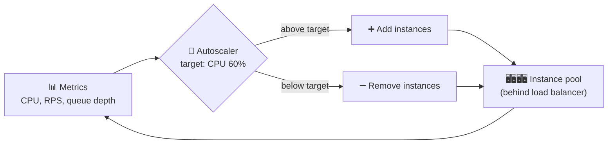

# 025 · Autoscaling & Containers

> ⏱ 9 min · 📈 25% · 🅰️ Part A (core) · Phase 03: Scaling Basics
>
> `█████░░░░░░░░░░░░░░░` 25% of the whole guide

---

## 📖 Story

Pantry's traffic chart looked like a mountain range: quiet at 4 am, ten times busier at 7 pm. Leo was paying for peak capacity all day long. Then a surprise promotion caught everyone off guard. Maya wanted servers that appear when they're needed and vanish when they're not. I'll show you how, and the traps I've fallen into doing it.

## 🎯 One-sentence idea

**Autoscaling adds servers when load rises and removes them when it falls, so you pay for what you use. Containers (packaged apps) and orchestrators like Kubernetes make starting and stopping copies fast and reliable.**

## 🧸 Analogy

A **supermarket** with checkout staff on call:

- When lines get long (**CPU > 70%** or **queue > 100**), the manager calls in more cashiers (**scale out**).
- When it's quiet, cashiers go home (**scale in**), so you don't pay idle staff.
- Every cashier gets an **identical, pre-packed kit** (a **container**): same till, same scanner, same rules. A new cashier is ready in seconds instead of days of training.
- The **store manager** (Kubernetes) decides who works which lane, replaces anyone who faints, and keeps the right headcount.

## 🖼️ Visual



```
┌───────── Kubernetes cluster ─────────┐
│ Node 1          Node 2        Node 3  │
│ [pod][pod]      [pod][pod]    [pod]   │  ← pods = running containers
│   ▲ scheduler places pods on nodes    │
│   ▲ HPA changes pod count             │
│   ▲ cluster autoscaler adds nodes     │
└───────────────────────────────────────┘
```

## 🔬 How it works

- **Containers (Docker):** your app + its libraries + config, packaged into an **image**. It runs the same everywhere, starts in **seconds**, and is lighter than a VM (it shares the host OS kernel).
- **Orchestrator (Kubernetes/ECS/Nomad):** runs N copies (**pods**), restarts crashed ones, rolls out new versions, provides service discovery, and **scales**.
- **Autoscaling types:**
  - **Reactive (target tracking):** "keep average CPU at 60%." Add pods when above, remove when below.
  - **Scheduled:** "scale to 50 instances at 8:55 am every weekday."
  - **Predictive:** ML forecasts traffic from history and scales *before* the spike.
  - **Event-driven (KEDA):** scale workers on **queue length**, down to zero when idle.
  - **Serverless (Lambda, Cloud Run):** the platform scales per request automatically, including to zero.
- **Choose the right metric:** CPU for compute-bound work, **requests per second** or **latency** for web services, **queue depth / consumer lag** for workers.
- **Gotchas:**
  - **Cold start time:** if a new instance needs 3 minutes to boot and warm up, you'll be late for sudden spikes. Keep **headroom** and a **minimum** instance count.
  - **Flapping:** scaling up and down repeatedly. Use **cooldowns** and scale in more slowly than you scale out.
  - **Downstream limits:** 100 new app pods can overwhelm the database with connections (use a pooler, lesson 040).
  - **Stateful things** (DBs, caches) don't autoscale easily like stateless apps.

## 🧩 Worked example

**Kubernetes Horizontal Pod Autoscaler:**

```yaml
apiVersion: autoscaling/v2
kind: HorizontalPodAutoscaler
metadata: { name: api }
spec:
  scaleTargetRef: { apiVersion: apps/v1, kind: Deployment, name: api }
  minReplicas: 4            # never fewer (headroom + redundancy)
  maxReplicas: 60           # cost cap + protects the DB
  metrics:
    - type: Resource
      resource: { name: cpu, target: { type: Utilization, averageUtilization: 60 } }
  behavior:
    scaleDown: { stabilizationWindowSeconds: 300 }   # wait 5 min before shrinking
```

**The math the autoscaler does:**

```
desired = ceil(current × currentMetric / target)
       = ceil(10 pods × 90% CPU / 60%) = 15 pods
```

**Flash sale plan:** a scheduled scale-up to 40 pods 15 minutes before the sale, reactive scaling on top, a queue in front of order processing to absorb the peak (lesson 057), and rate limits as a last line of defense (lesson 024).

## ⚖️ Trade-offs

| Option | Gain | Cost | Use when |
|---|---|---|---|
| Fixed capacity | Predictable, simple | Pay for peak 24/7 | Steady load |
| Reactive autoscaling | Pay for use | Lags sudden spikes | Gradual daily curves |
| Scheduled / predictive | Ready before spikes | Needs known patterns | Business hours, events |
| Serverless | Zero ops, scales to zero | Cold starts, limits, cost at high steady load | Spiky/low traffic, event handlers |
| Containers + K8s | Portable, efficient, powerful | Operational complexity | Many services, a platform team |

## 🌍 Real world

- **Kubernetes** (from Google's Borg) is the de-facto standard orchestrator.
- **Netflix** built predictive autoscaling (Scryer) to scale ahead of evening peaks.
- **AWS Auto Scaling Groups**, **GCP Managed Instance Groups**, **KEDA** for event-driven scaling.

## 📌 Cheat card

> - **Container = packaged app. Orchestrator = the manager. Autoscaler = the headcount rule.**
> - Scale on the **right metric**: CPU, RPS/latency, or **queue depth**.
> - **Scale out fast, scale in slow** (cooldowns). Keep a **minimum** for headroom.
> - **Boot time matters.** Pre-scale for known events.
> - Autoscaling apps can **overwhelm the database**, so cap max replicas and pool connections.

## 🧪 Feynman check

Explain the on-call cashier analogy, and why a store would call staff in *before* a big sale instead of waiting for the lines to get long.

⚠️ **Common confusion:** "Autoscaling makes us infinitely scalable." It scales the **stateless** tier. Databases, third-party APIs, and licences have fixed limits, and autoscaling can just move the bottleneck there.

## ⚡ Quick recall

1. Why scale in more slowly than you scale out?
<details><summary>Answer</summary>

To avoid flapping, and to keep capacity in case the load comes back quickly. Being under-provisioned hurts users, while being briefly over-provisioned only costs a little money.
</details>

2. What metric should queue workers scale on?
<details><summary>Answer</summary>

Queue depth or consumer lag (the backlog), not CPU.
</details>

3. What's a key difference between a container and a VM?
<details><summary>Answer</summary>

Containers share the host OS kernel and start in seconds with little overhead. VMs include a full guest OS and are heavier and slower to start.
</details>

## 🎤 Interview practice

**Q1. "Traffic goes 10× in 2 minutes when a push notification is sent. Autoscaling can't keep up. What do you do?"**
<details><summary>Model answer</summary>

- **Pre-scale:** the push is planned, so trigger scale-up *before* sending (a scheduled or event hook).
- **Stagger the push** (send in batches over several minutes) to flatten the spike.
- **Serve from caches/CDN**: what the notification links to is often the same content for everyone.
- **Faster boot:** smaller images, warm pools of pre-initialized instances.
- **Protect the backend:** queue non-urgent work, and use rate limiting and load shedding as a safety net.
- **Likely follow-up:** "How do you size the warm pool?" → from historical peak ratios plus the boot time.
</details>

**Q2. "When would you choose serverless over containers?"**
<details><summary>Model answer</summary>

- **Serverless:** spiky or low-volume workloads, event handlers (S3 upload → thumbnail), small teams, and scale-to-zero cost savings.
- **Containers:** steady high traffic (cheaper per request), long-running connections, custom runtimes, tight latency (no cold starts), and heavy resource needs.
- Mixed architectures are common.
- **Likely follow-up:** "How do you fight cold starts?" → provisioned concurrency, smaller packages, lighter runtimes, keeping functions warm.
</details>

> 📖 *Next, Pantry's codebase is enormous, and three teams keep breaking each other's work.*

---

⬅️ [024 · Rate Limiting](024-rate-limiting.md) · 🗺️ [Phase map](README.md) · ➡️ [✅ Checkpoint 25%](checkpoint-25.md)

✅ **Safe stopping point.** Tick lesson 025 in [PROGRESS.md](../../PROGRESS.md), then do the checkpoint!
