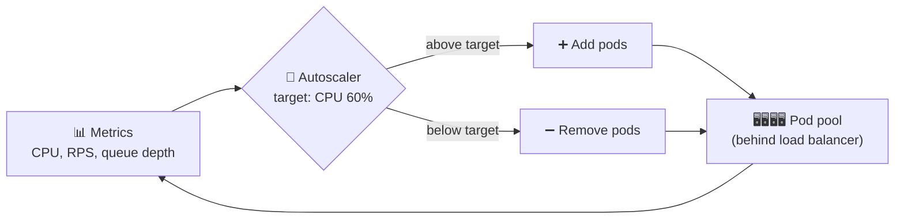

# 025 · Autoscaling & Containers

> ⏱ 9 min · 📈 25% · 🅰️ Part A (core) · Phase 03: Scaling Basics
>
> `█████░░░░░░░░░░░░░░░` 25% of the whole guide

---

## 📖 Story

Pantry's traffic chart looks like a mountain range. **4 a.m.:** a flat valley, 30 requests per second. **7 p.m.:** a jagged peak, **3,000**. Maya runs 40 servers around the clock, sized for the peak. At 4 a.m., 39 of them are asleep with their meters running.

Then, on a Thursday, a food blogger with a million followers posts a surprise discount code. No warning. Traffic doesn't climb, it **detonates**: 300 to 6,000 requests per second in **ninety seconds**.

Maya clicks "add servers" by hand. Each new VM takes **four minutes** to boot, install packages, and warm up. By the time they're ready, the rush has already crushed the existing fleet and hungry customers have left.

She wants servers that **appear the moment they're needed and vanish when they're not**. I'll show you how, and the traps I've fallen into doing it.

## 🎯 One-sentence idea

**Autoscaling adds instances when load rises and removes them when it falls, so you pay for what you use, and containers plus orchestrators like Kubernetes make starting and stopping identical copies fast and reliable.**

## 🧸 Analogy

A **supermarket** with on-call cashiers:

- Long lines (**CPU > 60%** or **queue > 100**) → the manager calls in cashiers (**scale out**).
- Quiet aisles → cashiers go home (**scale in**).
- Every cashier gets an **identical, pre-packed kit** (a **container**), so a new one is ready in seconds.
- The **store manager** (Kubernetes) assigns lanes, replaces anyone who faints, and keeps the headcount right.

## 🖼️ Visual

*Diagram brief:* a feedback loop. Metrics flow into an autoscaler dial set to "CPU 60%", which adds or removes pods in a pool, whose new load flows back into the metrics. Below it, a cluster cross-section showing nodes, pods, and the two autoscalers.



```
┌───────── Kubernetes cluster ─────────┐
│ Node 1          Node 2        Node 3  │
│ [pod][pod]      [pod][pod]    [pod]   │  ← pods = running containers
│   ▲ scheduler places pods on nodes    │
│   ▲ HPA changes the pod count         │
│   ▲ cluster autoscaler adds nodes     │
└───────────────────────────────────────┘
```

## 🔬 How it works

- **Containers** package the app + libraries + config into an immutable **image** that runs identically everywhere and starts in **seconds** (it shares the host kernel, unlike a VM's full guest OS).
- **Orchestrators** (Kubernetes, ECS, Nomad) keep N **pods** running: they restart crashes, roll out versions, provide service discovery, and scale. The **HPA** scales pods, and the **cluster autoscaler** adds nodes when pods can't fit.
- **Scaling modes:** **reactive** target tracking ("keep CPU at 60%"), **scheduled** ("50 pods at 6:45 p.m."), **predictive** (forecast from history), **event-driven** (KEDA on queue depth, down to zero), and **serverless** (per-request scaling, including to zero).
- **Pick the right signal:** CPU for compute-bound work, **RPS or latency** for web tiers, **queue depth or consumer lag** for workers.
- **The traps:** **boot time** (a 4-minute warm-up means you're always late, so keep a **minimum** and a **warm pool**), **flapping** (scale out fast, **scale in slowly** with stabilization windows), and **downstream overload** (60 new pods × 20 DB connections = 1,200 connections, so cap the max and use a pooler, lesson 040).

## 🧩 Worked example

```yaml
apiVersion: autoscaling/v2
kind: HorizontalPodAutoscaler
metadata: { name: api }
spec:
  scaleTargetRef: { apiVersion: apps/v1, kind: Deployment, name: api }
  minReplicas: 4             # headroom + redundancy
  maxReplicas: 60            # cost cap + protects the DB
  metrics:
    - type: Resource
      resource: { name: cpu, target: { type: Utilization, averageUtilization: 60 } }
  behavior:
    scaleDown: { stabilizationWindowSeconds: 300 }   # wait 5 min before shrinking
```

**The HPA's math:** `desired = ceil(current × currentMetric / target) = ceil(10 × 90% / 60%) = 15 pods`.

**Maya's bill:** a fixed 40 servers, 24 h → **960 server-hours/day**. Autoscaled (4 at night, up to 40 at peak, ~12 on average) → **~290 server-hours/day**, a **~70% saving**. And with a container image that's ready in **~15 s** instead of a 4-minute VM, the blogger spike gets absorbed.

## ⚖️ Trade-offs

| Maya's choice | What she gains | What she pays |
|---|---|---|
| Fixed capacity | Predictable and simple | Paying for peak 24/7 |
| Reactive autoscaling | Pay for what she uses | Lags sudden spikes |
| Scheduled/predictive | Ready *before* the spike | Needs known patterns |
| Serverless | Zero ops, scales to zero | Cold starts, limits, cost at high steady load |
| Containers + K8s | Portable, dense, powerful | Real operational complexity |

## 🌍 Real world

- **Kubernetes** (descended from Google's Borg) is the de-facto standard orchestrator.
- **Netflix's Scryer** predicts evening peaks and scales ahead of them.
- **AWS Auto Scaling Groups**, **GCP Managed Instance Groups**, and **KEDA** for event-driven scaling.

## 📌 Cheat card

> - **Container = packaged app. Orchestrator = the manager. Autoscaler = the headcount rule.**
> - Scale on the **right metric**: CPU, RPS/latency, or **queue depth**.
> - **Scale out fast, scale in slow.** Keep a **minimum** and pre-scale for known events.
> - **Cap max replicas.** Autoscaling can DDoS your own database.

## 🧪 Feynman check

Explain the on-call cashiers, and why a smart store calls staff in *before* a big sale instead of waiting for the lines to grow.

⚠️ **Common confusion:** "Autoscaling makes us infinitely scalable." It scales the **stateless** tier. The database, third-party APIs, and licences have fixed ceilings, and autoscaling usually just **moves the bottleneck** there, faster.

## ⚡ Quick recall

1. Why scale in more slowly than you scale out?
<details><summary>Reveal Answer</summary>

To avoid flapping and keep capacity in case load returns. Under-provisioning hurts users, while brief over-provisioning only costs a little money.
</details>

2. What metric should queue workers scale on?
<details><summary>Reveal Answer</summary>

Queue depth or consumer lag (the backlog), not CPU.
</details>

3. What's a key difference between a container and a VM?
<details><summary>Reveal Answer</summary>

Containers share the host kernel and start in seconds with little overhead. VMs carry a full guest OS and are heavier and slower to start.
</details>

## 🎤 Interview practice

**Q. "Traffic jumps 10× within 2 minutes every time marketing sends a push notification, and autoscaling can't keep up. Fix it, and tell me when you'd pick serverless instead of containers."**
<details><summary>Model answer</summary>

- **The spike is self-inflicted and predictable, so pre-scale:**
  - Hook the campaign tool to **scale up before sending** (a scheduled or event trigger).
  - Keep a **warm pool** of pre-initialized instances.
- **Flatten the spike:** **stagger** the push in batches over 5–10 minutes.
- **Serve the hot path cheaply:** the landing content is identical for everyone, so cache it at the **CDN** with `stale-while-revalidate`.
- **Boot faster:** slim images, lazy-load heavy dependencies, and readiness that passes as soon as the app can serve.
- **Protect the core:**
  - Put a **queue** in front of order processing (lesson 057).
  - Use **rate limits and load shedding** as the last line of defence.
  - Cap `maxReplicas` and pool DB connections so the scale-up doesn't crush Postgres.
- **Serverless vs containers:**
  - **Serverless** for spiky or low-volume, event-driven work (an S3 upload → thumbnail), small teams, and scale-to-zero savings.
  - **Containers** for steady high traffic (cheaper per request), long-lived connections, tight latency (no cold starts), and custom runtimes.
  - Mixed fleets are normal.
- **Likely follow-up:** "How do you size the warm pool?" → from historical peak-to-baseline ratios × boot time. It needs enough capacity to bridge the gap until reactive scaling catches up.
</details>

## 📖 Teaser

> 📖 *Pantry's servers now breathe with the traffic, but its codebase has become a giant knot where a typo on the recipes page can take down checkout.*

---

⬅️ [024 · Rate Limiting](024-rate-limiting.md) · 🗺️ [Phase map](README.md) · ➡️ [✅ Checkpoint 25%](checkpoint-25.md)

✅ **Safe stopping point.** Tick lesson 025 in [PROGRESS.md](../../PROGRESS.md), then do the checkpoint!
