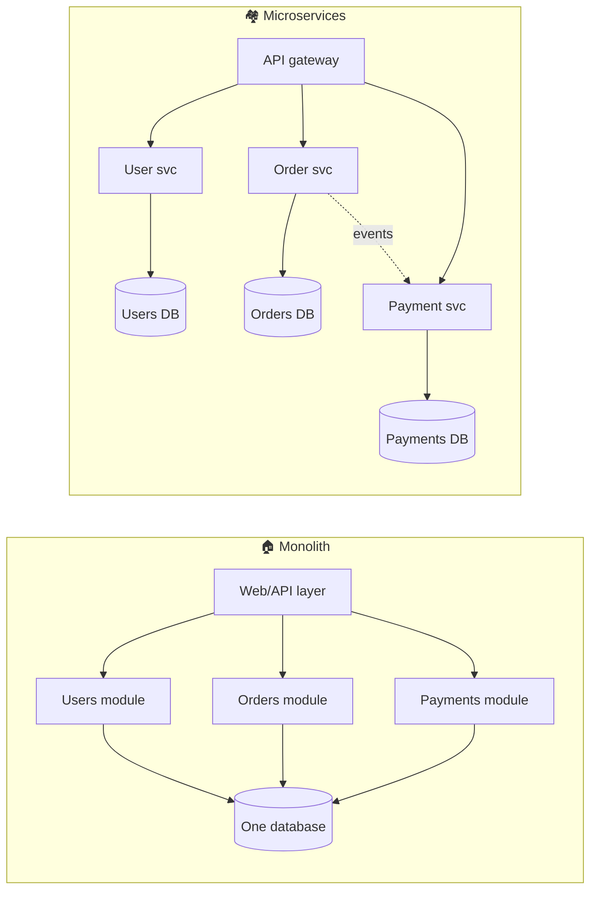

# 026 · Monolith vs Microservices

> ⏱ 10 min · 📈 26% · 🅰️ Part A (core) · Phase 03: Scaling Basics
>
> `█████░░░░░░░░░░░░░░░` 26% of the whole guide

---

## 📖 Story

Pantry's codebase is now **400,000 lines** in a single repository, and forty engineers push to it every day.

A deploy takes **six hours**: build, test, stage, pray. Last Tuesday, someone fixed a typo on the *recipes* page. It shipped. **Checkout broke.** For 25 minutes nobody could pay, because the recipes module and the payment module shared a helper function, a database table, and a fate.

Maya stares at the dependency graph her tooling generated. It looks like a bowl of spaghetti somebody sat on.

At the next planning meeting, the word lands on the table like a grenade: **"microservices."** *Like Netflix. Like Uber.*

Maya looks at me. I've watched that decision save teams, and I've watched it sink them, slowly, over eighteen months of distributed debugging. Let me give you what you need to make the call yourself.

## 🎯 One-sentence idea

**A monolith is one deployable app that's simple to build, test, and run, while microservices split it into independently deployed services that scale teams and hot spots separately at the cost of a heavy distributed-systems tax, so you split when team size and scaling needs demand it, not before.**

## 🧸 Analogy

- 🏠 **Monolith = one big house.** Kitchen to bedroom is instant (a function call). Renovating the kitchen disrupts the whole family.
- 🏘️ **Microservices = a village of small houses.** Each family renovates whenever it likes. But every visit means **walking outside in the rain** (network calls), and you need **roads, addresses, and mail** (discovery, APIs, messaging). A flood can hit some houses and not others (partial failure).

## 🖼️ Visual

*Diagram brief:* on the left, one house with internal rooms sharing one database. On the right, a village of separate houses, each with its own small database, joined by roads (sync calls) and dotted mail routes (events).



## 🔬 How it works

- **Monolith:** one build, one deploy, usually one database. In-process calls take **nanoseconds**, and **ACID transactions span everything**. Simple to develop, debug, and test, but it's harder to change as the team grows, one bug can take down everything, and you scale it all together.
- **Microservices:** services split by **business capability**, each **owning its data**, deployed independently, and talking over REST, gRPC, or events. You get team autonomy, per-service scaling, and fault isolation, and you pay with network latency, partial failures, **no cross-service transactions** (sagas, lesson 088), and mandatory tracing and CI/CD.
- **Modular monolith, the sweet spot:** one deployable with **enforced internal module boundaries** (no reaching into another module's tables). Simple to run, cheap to split later.
- **Conway's Law:** architecture mirrors the org chart. Microservices pay off only when **teams** can work independently too.
- **How to split:** along **DDD bounded contexts**, with a **database per service**, peeling features out with the **strangler fig** pattern (route one endpoint at a time to the new service).

## 🧩 Worked example

**The "distributed monolith" trap:**

```
Checkout → Order svc → (sync) User → (sync) Inventory → (sync) Pricing → (sync) Promo → (sync) Payment
```

- **Six hops in series:** availability 0.999⁶ ≈ **99.4%** (~52 h/yr of downtime), and the latencies add up.
- They share a schema, so **all must deploy together**: no independence at all.

**The better shape:** the order service keeps **local read copies** of prices and user data (updated by events), payment runs **async** via a queue (`PENDING → PAID`), and only truly required sync calls stay on the critical path.

| Signal at Pantry | Split? |
|---|---|
| 5 engineers, one product | ❌ Modular monolith |
| 40 engineers blocking each other's deploys | ✅ Start extracting by domain |
| Video transcoding needs 20× the CPU of everything else | ✅ Extract that one |
| Payments need PCI isolation | ✅ Isolate it |
| "Because Netflix does it" | ❌ |

## ⚖️ Trade-offs

| | Monolith | Modular monolith | Microservices |
|---|---|---|---|
| Simplicity | 🟢 | 🟢 | 🔴 |
| Team independence | 🔴 | 🟡 | 🟢 |
| Independent scaling | 🔴 | 🔴 | 🟢 |
| Transactions | 🟢 ACID | 🟢 ACID | 🔴 Sagas / eventual |
| Calls between parts | 🟢 In-process | 🟢 | 🔴 Network |
| Ops overhead | 🟢 Low | 🟢 Low | 🔴 High |

## 🌍 Real world

- **Amazon** moved to services in the early 2000s ("two-pizza teams"). **Netflix** and **Uber** run hundreds to thousands of services.
- **Shopify** runs one of the world's largest **modular monoliths** (Rails) at massive scale.
- **Segment** and an **Amazon Prime Video** monitoring team publicly moved parts *back* to a monolith to cut cost and complexity.

## 📌 Cheat card

> - **Start with a modular monolith. Split when teams or scaling demand it.**
> - Microservices = **independent deploys + own data + network calls**.
> - The tax: **latency, partial failure, no ACID across services, tracing, ops.**
> - Split by **domain**, with a **DB per service**, using the **strangler fig**.
> - **Conway's Law:** architecture mirrors the org.

## 🧪 Feynman check

Explain the house versus the village, and why "walking outside in the rain" is the hidden cost of microservices.

⚠️ **Common confusion:** "Microservices are more scalable." Monoliths scale horizontally fine (lesson 017). Microservices mainly scale **organizations** (teams shipping independently) and let you scale **different parts differently**.

## ⚡ Quick recall

1. What's a modular monolith?
<details><summary>Reveal Answer</summary>

A single deployable app with strict internal module boundaries. It's simple to run and easy to split later.
</details>

2. Why should each microservice own its own database?
<details><summary>Reveal Answer</summary>

So it can change its schema and deploy independently, without being coupled to other services through shared tables.
</details>

3. What's the strangler fig pattern?
<details><summary>Reveal Answer</summary>

Gradually replacing a legacy system by routing one feature at a time to new services until the old system can be retired.
</details>

## 🎤 Interview practice

**Q. "Our microservices are slow, every deploy needs five teams to coordinate, and a checkout touches six services synchronously. What went wrong, and how do you fix it without a rewrite?"**
<details><summary>Model answer</summary>

- **Diagnosis: a distributed monolith.** Services are coupled through **shared databases**, **long synchronous call chains**, and boundaries drawn by technical layer ("pricing", "validation") instead of business domain. You pay the network tax and get none of the independence.
- **Fix it incrementally:**
  1. **One owner per data set.** Break shared tables apart behind APIs or events. A service's schema is private.
  2. **Redraw boundaries around domains** (DDD bounded contexts). **Merge** services that always change and deploy together.
  3. **Replace sync chains with events and local read models.** The order service subscribes to `PriceChanged` and `UserUpdated` and keeps its own copy, so checkout no longer calls Pricing live.
  4. **Make payment async:** `PENDING → PAID` via a queue, with a **saga** (compensating actions) and a **transactional outbox** for reliable event publishing (lessons 062, 088).
  5. **Versioned, backward-compatible APIs and contract tests**, so teams deploy independently.
  6. Add **distributed tracing** to find the remaining critical-path hops.
- **Measure success:** fewer sync hops on checkout, deploys per team per day, and a lower change-failure rate.
- **Likely follow-up:** "We're a 10-person startup. Microservices?" → no. Build a **modular monolith** with enforced boundaries, and extract only for a concrete reason (wildly different scaling, compliance, team contention).
</details>

## 📖 Teaser

> 📖 *Chapter 4 is next. Pantry's menu page is loaded a million times a day, every load hits the database, and the database is starting to melt.*

---

⬅️ [✅ Checkpoint 25%](checkpoint-25.md) · 🗺️ [Phase map](README.md) · ➡️ [027 · Caching Basics](../04-caching/027-caching-basics.md)

✅ **Safe stopping point.** Tick lesson 026 in [PROGRESS.md](../../PROGRESS.md). 🎉 **Phase 03 complete!** Review the [cheatsheet](CHEATSHEET.md) and [interview bank](INTERVIEW-QUESTIONS.md).
