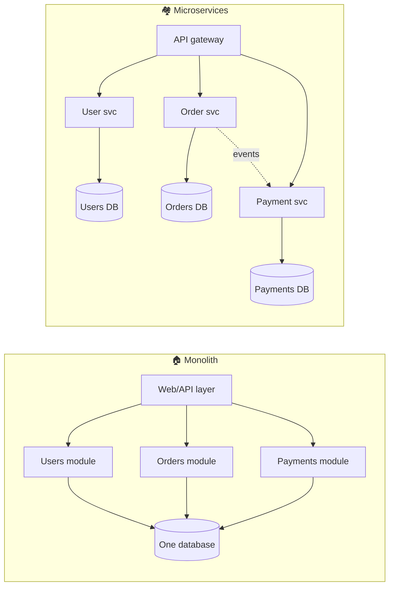

# 026 · Monolith vs Microservices

> ⏱ 10 min · 📈 26% · 🅰️ Part A (core) · Phase 03: Scaling Basics
>
> `█████░░░░░░░░░░░░░░░` 26% of the whole guide

---

## 📖 Story

Pantry now had 40 engineers in one giant codebase. Deploys took a whole day, and a typo on the recipes page broke checkout. In a meeting someone said, "Let's do microservices, like Netflix!" Maya looked at me. I've seen that decision save teams, and I've seen it sink them. Let me give you what you need to make the call yourself.

## 🎯 One-sentence idea

**A monolith is one deployable app (simple to build, test, and run). Microservices split the app into small independent services (teams and parts can scale and ship independently, but you pay a big distributed-systems tax). Split when team size and scaling needs demand it, not before.**

## 🧸 Analogy

- 🏠 **Monolith = one big house.** Everything's under one roof. Walking from the kitchen to the bedroom is instant (a function call). Renovating the kitchen means the whole family deals with the mess.
- 🏘️ **Microservices = a village of small houses.** Each family renovates its own house whenever it wants. But going from one house to another means **walking outside in the rain** (network calls). You need **roads, addresses, and mail** (service discovery, APIs, messaging), and a flood can hit some houses and not others (partial failure).

## 🖼️ Visual



## 🔬 How it works

- **Monolith:** one codebase, one build, one deploy, usually one database. Modules call each other **in-process** (nanoseconds, with shared transactions).
  - ✅ Simple dev, debugging, testing, and deploys. ACID transactions across everything. Fast in-process calls.
  - ❌ It gets harder to change as the team grows, one bug can crash everything, and you must scale the whole app together.
- **Microservices:** small services organized around **business capabilities** ("orders", "payments"), each owning its **own data**, deployed independently, and talking over the network (REST/gRPC/events).
  - ✅ Independent deploys, **team autonomy**, scaling each hot part separately, fault isolation, and technology freedom.
  - ❌ Network latency and failures, **no cross-service transactions** (you need sagas, lesson 088), data consistency problems, distributed debugging (tracing required), and heavy ops overhead (CI/CD, observability, service discovery).
- **Modular monolith:** one deployable, but with **strict internal module boundaries**. It's the best of both for most teams, and it's easy to split later.
- **Conway's Law:** systems mirror the communication structure of the org. Microservices work when **teams** are independent too.
- **How to split (when it's time):** by **business domain** (Domain-Driven Design "bounded contexts"), with **a database per service**. Use the **strangler fig** pattern to peel features out of the monolith one at a time.

## 🧩 Worked example

**The "distributed monolith" trap** (the worst of both worlds):

```
Checkout request → Order svc → (sync) User svc → (sync) Inventory svc
                             → (sync) Pricing svc → (sync) Promo svc → (sync) Payment svc
```

- 6 network hops in series → latency adds up, and **availability multiplies down** (0.999⁶ ≈ 99.4%).
- All services must deploy together because they share a DB schema. So you have no independence at all.

**Better:**

- Order service owns its data, and keeps a **local copy** of the prices and user info it needs (updated via events).
- Payment runs **asynchronously** via a queue, with order status `PENDING → PAID`.
- Only **truly required** sync calls stay on the critical path.

**When a startup should split — a checklist:**

| Signal | Split? |
|---|---|
| 5 engineers, one product | ❌ Modular monolith |
| 50+ engineers stepping on each other's deploys | ✅ Start extracting |
| One component needs 20× the resources of the rest (e.g., video encoding) | ✅ Extract that one |
| Different reliability or compliance needs (payments/PCI) | ✅ Isolate it |
| "Because Netflix does it" | ❌ |

## ⚖️ Trade-offs

| | Monolith | Modular monolith | Microservices |
|---|---|---|---|
| Simplicity | 🟢 | 🟢 | 🔴 |
| Team independence | 🔴 | 🟡 | 🟢 |
| Independent scaling | 🔴 | 🔴 | 🟢 |
| Transactions | 🟢 ACID | 🟢 ACID | 🔴 Sagas / eventual |
| Latency between parts | 🟢 In-process | 🟢 | 🔴 Network |
| Ops overhead | 🟢 Low | 🟢 Low | 🔴 High |
| Best for | Startups, small teams | Most growing companies | Large orgs, very different scaling needs |

## 🌍 Real world

- **Amazon** moved to services in the early 2000s ("two-pizza teams"). **Netflix** and **Uber** run hundreds to thousands of services.
- **Shopify** famously runs a **modular monolith** (a huge Rails app) at a massive scale.
- **Segment** and **Amazon Prime Video's monitoring team** publicly moved parts *back* from microservices to a monolith to cut cost and complexity.

## 📌 Cheat card

> - **Start with a (modular) monolith. Split when teams or scaling demand it.**
> - Microservices = **independent deploys + own data + network calls**.
> - The **distributed-systems tax**: latency, partial failure, no ACID across services, tracing, ops.
> - Split by **business domain**, with a **database per service**, using the **strangler fig**.
> - **Conway's Law:** architecture mirrors the org chart.

## 🧪 Feynman check

Explain the house-vs-village analogy, and why "walking outside in the rain" is the hidden cost of microservices.

⚠️ **Common confusion:** "Microservices are more scalable." Monoliths scale horizontally fine (lesson 017). Microservices mainly scale **organizations** (teams shipping independently) and let you scale **different parts differently**.

## ⚡ Quick recall

1. What's a modular monolith?
<details><summary>Answer</summary>

A single deployable app with strict, well-defined internal module boundaries. Simple to run, and easy to split later.
</details>

2. Why should each microservice own its own database?
<details><summary>Answer</summary>

So services can change their schema and deploy independently, without tight coupling through shared tables.
</details>

3. What's the strangler fig pattern?
<details><summary>Answer</summary>

Gradually replacing a legacy system by routing one feature at a time to new services, until the old system can be retired.
</details>

## 🎤 Interview practice

**Q1. "We're a 10-person startup. Should we build microservices?"**
<details><summary>Model answer</summary>

- Almost certainly **no**. Build a **modular monolith** with clear domain boundaries, one deploy pipeline, and one database (with separate schemas per module if you like).
- You'll move faster, debug more easily, and avoid the ops burden.
- Extract a service only for a concrete reason: a wildly different scaling profile (video transcoding), compliance isolation (payments), or team growth causing deploy conflicts.
- **Likely follow-up:** "How do you keep the monolith splittable?" → enforce module boundaries (no reaching into other modules' tables), communicate via interfaces or internal events.
</details>

**Q2. "Our microservices are slow and every deploy needs 5 teams to coordinate. What went wrong?"**
<details><summary>Model answer</summary>

- It's a **distributed monolith**: services are tightly coupled through **shared databases** and **long synchronous call chains**, with boundaries drawn by technical layer instead of business domain.
- Fixes: redraw boundaries around domains, **one owner per data set**, replace sync chains with **events and local read models**, **version APIs** (backward-compatible changes), and consider **merging** services that always change together.
- **Likely follow-up:** "How do you handle a transaction spanning orders and payments?" → saga with compensations and an outbox (lessons 062, 088).
</details>

> 📖 *Chapter 4 is next. The menu page, loaded a million times a day, is melting the database.*

---

⬅️ [✅ Checkpoint 25%](checkpoint-25.md) · 🗺️ [Phase map](README.md) · ➡️ [027 · Caching Basics](../04-caching/027-caching-basics.md)

✅ **Safe stopping point.** Tick lesson 026 in [PROGRESS.md](../../PROGRESS.md). 🎉 **Phase 03 complete!** Review the [cheatsheet](CHEATSHEET.md) and [interview bank](INTERVIEW-QUESTIONS.md).
