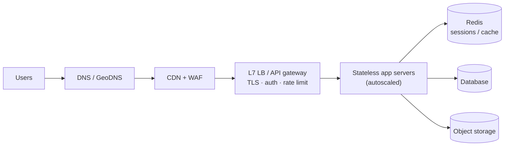

# 📌 Phase 03 Cheatsheet: Scaling Basics

## 🧠 Core ideas

| # | Idea in one line |
|---|---|
| 017 | **Up = bigger box** (simple, ceiling, SPOF). **Out = more boxes** (scalable, redundant, complex). |
| 018 | **Stateless servers**: sessions → Redis/JWT, files → S3, cron → one leader. |
| 019 | **LB = one front door + health checks + draining.** Make the LB itself redundant. |
| 020 | **Round robin** (uniform) · **least connections** (uneven) · **consistent hash** (affinity) · **power of two choices** (big fleets). |
| 021 | **L4 = envelope address** (fast, any protocol). **L7 = reads HTTP** (smart routing). Reverse proxy protects servers, forward proxy represents clients. |
| 022 | **Gateway = auth + rate limit + routing + logging** for many services. Keep it thin. BFF per client type. |
| 023 | **CDN = copies near users.** Versioned URLs + long TTL. Watch the hit ratio. |
| 024 | **Token bucket = coins in a jar.** 429 + Retry-After. Shared counters in Redis. |
| 025 | **Autoscale on the right metric.** Scale out fast, in slow. Beware DB limits. |
| 026 | **Modular monolith first.** Microservices scale *teams*, at a distributed-systems cost. |

## 🔢 Numbers

```
Nginx/HAProxy: 10k–100k+ req/s per node · L4 LB: millions of connections
Gateway hop adds ~1–5 ms · Redis rate-limit check ~0.5–1 ms
CDN edge latency ~10–30 ms vs origin across the world ~150+ ms
Hit ratio 90% → 99% = 10× less origin traffic
HPA: desired = ceil(current × metric / target)
```

## 🪄 Tricks

- Scaling order: **Cache → Clone → Split → Shard.**
- **Liveness ≠ readiness.**
- **Modulo hashing reshuffles about everything** when N changes → consistent hashing.
- **Fixed window allows 2× bursts** at edges → use sliding window or token bucket.
- Rate limiter broken? Usually **fail open** (with local limits).
- **Microservices smell:** a shared DB + long sync call chains = a distributed monolith.

## 🏗️ The standard "front half" of any design



## ⚠️ Top mistakes

- Sticky sessions instead of real statelessness.
- A single LB or gateway with no redundancy.
- Caching personalized responses in a shared CDN cache.
- Autoscaling without protecting the database.
- Microservices on day one.

---

🗺️ [Phase map](README.md) · 🎤 [Interview questions](INTERVIEW-QUESTIONS.md)
