# 📈 Phase 03: Scaling Basics

> **Lessons 017–026 · 17% → 26% · 🅰️ Part A (core)**
> By the end of this phase you'll grow a system **from 1 server to many**: load balancers, stateless services, CDNs, gateways, rate limits, autoscaling, and when to split into microservices.

## 📖 Chapter 3: The Night the Article Went Live

A festival article sends a wave of visitors to Pantry, far more than one server can survive. In this chapter, Maya grows Pantry from one machine into a fleet: a doorman at the front, forgetful (stateless) servers behind it, copies of photos near every customer, fair limits for greedy bots, servers that appear and vanish on demand, and one big question: should Pantry split into many services?

## 🗺️ Phase map

```mermaid
flowchart LR
    L17["017<br/>Vertical vs<br/>horizontal"] --> L18["018<br/>Stateless<br/>services"]
    L18 --> L19["019<br/>Load<br/>balancers"]
    L19 --> L20["020<br/>LB<br/>algorithms"]
    L20 --> C20{{"✅ Checkpoint 20%"}}
    C20 --> L21["021<br/>L4 vs L7<br/>& proxies"]
    L21 --> L22["022<br/>API<br/>gateway"]
    L22 --> L23["023<br/>CDN"]
    L23 --> L24["024<br/>Rate<br/>limiting"]
    L24 --> L25["025<br/>Autoscaling<br/>& containers"]
    L25 --> C25{{"✅ Checkpoint 25%"}}
    C25 --> L26["026<br/>Monolith vs<br/>microservices"]
```

| # | Lesson | ⏱ | One-line idea |
|---|---|---|---|
| 017 | [Vertical vs horizontal scaling](017-vertical-vs-horizontal-scaling.md) | 8 min | Bigger machine vs more machines |
| 018 | [Stateless services & sessions](018-stateless-services.md) | 8 min | Keep servers forgetful so any of them can handle any request |
| 019 | [Load balancers](019-load-balancers.md) | 9 min | A traffic cop that spreads requests and skips sick servers |
| 020 | [Load balancing algorithms](020-load-balancing-algorithms.md) | 8 min | Round robin, least connections, hashing: how the cop chooses |
| ✅ | [Checkpoint 20%](checkpoint-20.md) | 15 min | 🎉 Level-up! |
| 021 | [L4 vs L7 & proxies](021-l4-l7-and-proxies.md) | 9 min | Route by address (fast) or by content (smart). Forward vs reverse proxies |
| 022 | [API gateway](022-api-gateway.md) | 8 min | One front door for auth, limits, and routing |
| 023 | [CDN](023-cdn.md) | 9 min | Copies of your content near every user |
| 024 | [Rate limiting](024-rate-limiting.md) | 10 min | Token bucket and friends: fairness and protection |
| 025 | [Autoscaling & containers](025-autoscaling-and-containers.md) | 9 min | Add and remove servers automatically. Containers make that easy |
| ✅ | [Checkpoint 25%](checkpoint-25.md) | 15 min | A quarter of the way! |
| 026 | [Monolith vs microservices](026-monolith-vs-microservices.md) | 10 min | Split by team and scaling needs, not by fashion |

📌 [Phase cheatsheet](CHEATSHEET.md) · 🎤 [Phase interview questions](INTERVIEW-QUESTIONS.md)

⬅️ Previous phase: [02 Networking](../02-networking/README.md) · ➡️ Next phase: [04 Caching](../04-caching/README.md)
