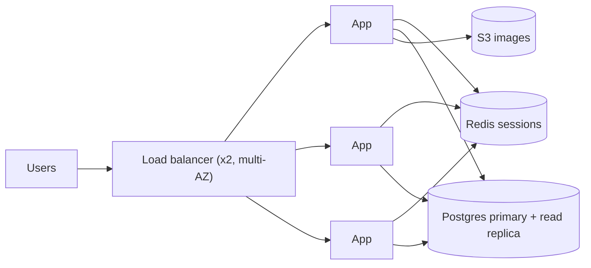

# ✅ Checkpoint 20%: 🎉 Level-Up! From One Box to Many

> ⏱ 15 min · Covers lessons **016–020** · 📈 You're at **20%**
>
> `████░░░░░░░░░░░░░░░░` 🎉 **One fifth of the entire guide!** You can now explain how a web app grows past one server.

**Rules:** answer out loud or on paper **before** opening answers.

---

## ⚡ Part 1: Recall (5 questions)

1. SSE or WebSocket for a notification bell that only receives updates?

Answer

SSE: it's one-way server → client, and simpler.

2. Name two downsides of vertical scaling.

Answer

A hardware ceiling and a single point of failure (plus cost at the high end and upgrade downtime).

3. Where do sessions go in a stateless design?

Answer

A shared store like Redis, or client-held signed tokens (JWT).

4. What's the difference between liveness and readiness checks?

Answer

Liveness: is the process alive (restart it if not)? Readiness: can it serve traffic right now (don't route to it if not)?

5. Which LB algorithm keeps the same user on the same cache server, even as servers are added?

Answer

Consistent hashing on the user or cache key.

**Score: ___ / 5**

---

## 🧪 Part 2: Explain it aloud (Feynman)

3-minute timer. Explain to a 12-year-old:

> "How can a website keep working when one of its computers breaks, and how does it handle ten times more visitors on Black Friday?"

Must include: **load balancer, health checks, stateless servers, horizontal scaling**.

---

## 🛠️ Part 3: Mini-design

**A blog platform** currently runs on 1 server (app + DB + uploaded images on local disk). Traffic will grow 20×.

Draw the new architecture and list what must change in the code or setup.

One good answer

Changes: sessions → Redis; images → S3 (+ CDN later); DB on its own server; health and readiness endpoints; graceful shutdown; cron jobs run once (a lock or dedicated runner).

---

## 🎤 Part 4: Interview questions

**Q1. "Round robin vs least connections: when does it matter?"**

Model answer

When request durations vary widely (uploads, reports, WebSockets). Round robin piles long requests unevenly, while least connections sends new work to the least busy server. For uniform short requests, the difference is tiny.

**Q2. "What state hides in a typical 'stateless' web app?"**

Model answer

In-memory sessions, local file uploads, in-process caches, in-memory rate-limit counters, scheduled jobs, WebSocket connections, and local temp files for multi-step flows. Each must move to a shared store or be made safe to lose.

**Q3. "How do you avoid a load balancer becoming a single point of failure?"**

Model answer

Redundant LB instances across availability zones (active-active via DNS/Anycast, or active-passive with a floating IP and health-checked failover), or a managed cloud LB that's redundant by design.

---

## 📊 Score yourself

| Recall score | What to do |
|---|---|
| 5/5 | 🚀 On to [021 · L4 vs L7 & Proxies](021-l4-l7-and-proxies.md) |
| 4/5 | ✅ Move on. Reread the cheat card you missed. |
| ≤ 3/5 | 🔁 Revisit [018](018-stateless-services.md), [019](019-load-balancers.md), [020](020-load-balancing-algorithms.md) |

🏆 **Level-up reward:** 20%. You can already explain what most "scaling" blog posts are about.

---

⬅️ [020 · Load Balancing Algorithms](020-load-balancing-algorithms.md) · 🗺️ [Phase map](README.md) · ➡️ [021 · L4 vs L7 & Proxies](021-l4-l7-and-proxies.md)

✅ Tick **Checkpoint 20%** in [PROGRESS.md](../../PROGRESS.md). 🎉
