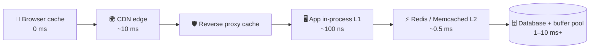

# 027 · Caching Basics & Where Caches Live

> ⏱ 8 min · 📈 27% · 🅰️ Part A (core) · Phase 04: Caching
>
> `█████░░░░░░░░░░░░░░░` 27% of the whole guide

---

## 📖 Story

Every visitor to Pantry lands on the same page: **"Top dishes near you."**

And every single time, the database rebuilds it from scratch. It joins four tables, sorts 80,000 ratings, and filters by distance, **twenty thousand times a minute**, to produce an answer that changes maybe twice an hour.

Maya watches the database CPU graph. **95%.** It's a hamster sprinting on a wheel, gasping, producing the same result over and over and over. Disk reads spike. Query times climb from 20 ms to 400 ms. The menu page starts to **melt**.

When she showed me, I asked her one question, and now I'll ask you:

*Why walk to the library every time for a book you could keep on your desk?*

## 🎯 One-sentence idea

**A cache is a small, fast copy of data you'd otherwise fetch from somewhere slow, and caches live at every layer from the browser to the database, so the craft is caching the right things for the right length of time.**

## 🧸 Analogy

Your **desk vs the library**:

- The **library** (database) has everything, but the walk takes 20 minutes.
- Your **desk** (cache) holds this week's 10 books. Grabbing one takes 2 seconds.
- The desk is **small**, so you keep only what you use most (eviction).
- When the library gets a **new edition**, your desk copy is **stale** (invalidation).

## 🖼️ Visual

*Diagram brief:* a ladder from the user down to the database. Each rung is a cache layer labelled with its latency. The rungs get faster and smaller as they get closer to the user, and harder to invalidate.



## 🔬 How it works

- **Hit vs miss:** a hit serves from the copy (fast). A miss goes to the source (slow), then usually stores the result. **Hit ratio = hits ÷ lookups** is the scorecard: at 95%, the DB sees only 5% of reads.
- **Why it works: skew.** Real access follows a power law, so a small slice of keys (~20%) gets most of the traffic (~80%+). Cache that slice.
- **Where caches live:** **browser** (HTTP headers, free), **CDN** (public content near users), **reverse proxy** (whole responses), **in-process L1** (~100 ns, but one copy per server), **distributed L2** (Redis/Memcached, shared, ~0.5 ms), and the **DB buffer pool** (hot pages in RAM).
- **What to cache:** data that's **read often, changes rarely, and is expensive to compute**: rendered fragments, profiles, catalogue pages, precomputed feeds, and heavy query results.
- **What not to cache (or only briefly):** values where staleness causes harm (balances, stock *at checkout*), and huge key spaces that are rarely reused (the hit ratio would be near zero).

## 🧩 Worked example

**Maya's "Top dishes" page:**

```
Load:       20,000 reads/min ≈ 333 reads/s, each a 400 ms aggregation query
DB budget:  can sustain ~50 of these/s → overloaded ~7× 💥
Cache:      key = top:{city}:{hour}, TTL 10 min, ~200 cities
Misses:     ≈ 200 cities ÷ 600 s ≈ 0.33 rebuilds/s → DB load drops ~1,000×
Latency:    0.5 ms Redis GET vs 400 ms query
```

**Sizing for a product catalogue:**

```
1M dishes × 5 KB = 5 GB total; hot 20% ≈ 1 GB → fits easily in one Redis node
Avg latency at 95% hits = 0.95 × 0.5 + 0.05 × (0.5 + 5) ≈ 0.75 ms (vs 5 ms)
```

## ⚖️ Trade-offs

| Maya's choice | What she gains | What she pays |
|---|---|---|
| Any cache | 10–1,000× lower latency, huge DB offload | **Staleness**, memory, and another system to run |
| In-process L1 | Fastest possible (~100 ns) | 50 servers = 50 copies to invalidate, and they can disagree |
| Distributed L2 (Redis) | One shared copy | A network hop, and a cluster to operate |
| Caching per-user data | Personal pages are fast too | Low reuse means a low hit ratio and wasted memory |

## 🌍 Real world

- **Meta** runs one of the world's largest Memcached fleets, serving billions of lookups per second.
- **X/Twitter** keeps precomputed home timelines in Redis.
- **Every database** caches internally: Postgres `shared_buffers`, the InnoDB buffer pool.

## 📌 Cheat card

> - Cache = **a fast copy of slow data**. **Hit ratio** is the scorecard.
> - Layers: **browser → CDN → proxy → L1 → Redis L2 → DB buffer**.
> - Cache what's **read-heavy, slow-changing, and expensive**.
> - **Size = the hot set** (~20% of data). Redis GET ≈ **0.5 ms**, a DB query ≈ **1–10 ms+**.
> - Every cache asks one question: **how stale is OK?**

## 🧪 Feynman check

Explain the desk and the library, including what happens when the library gets a new edition of a book that's sitting on your desk.

⚠️ **Common confusion:** "Adding a cache always helps." With a low hit ratio (unique keys, fast-changing data), every miss pays **cache lookup + DB query**, so it's slower than no cache, plus extra complexity. **Measure the hit ratio before celebrating.**

## ⚡ Quick recall

1. What is the cache hit ratio?
<details><summary>Reveal Answer</summary>

Hits ÷ total lookups: the fraction of requests served from the cache.
</details>

2. Why does caching work so well for most apps?
<details><summary>Reveal Answer</summary>

Access is skewed. A small portion of the data receives most of the requests.
</details>

3. What's the downside of an in-process L1 cache on 50 servers?
<details><summary>Reveal Answer</summary>

Each server holds its own copy, so memory is duplicated, invalidation must reach all 50, and they can disagree for a while.
</details>

## 🎤 Interview practice

**Q. "The database is at 90% CPU from reads. The team added Redis, but DB load barely moved. Diagnose it, then tell me where caching belongs in an e-commerce stack."**
<details><summary>Model answer</summary>

- **Why Redis didn't help:**
  - **Low hit ratio:** keys too unique (a timestamp or unnormalized query params in the key), TTLs too short, or a cache too small (eviction churn).
  - **The wrong things cached:** the cached endpoints aren't the ones generating the expensive queries.
  - **Bypassed paths:** some code reads the DB directly. Or misses never write back.
  - **How to prove it:** compare hit/miss rates per key pattern with the DB's **top queries by total time** (`pg_stat_statements`). Cache *those*, with **normalized keys**.
- **Where caching belongs in e-commerce:**
  - **Browser + CDN:** versioned static assets (1-year TTL), public product HTML (short TTL + `stale-while-revalidate`).
  - **Redis:** product details, category listings, sessions, carts, and precomputed recommendations.
  - **In-process L1:** feature flags, config, and the category tree (tiny, hot, rarely changing).
  - **Never trust the cache for:** stock and price **at checkout**. Read the source of truth.
- **Freshness:** invalidate on write via events, with a TTL as the safety net (lesson 031).
- **Likely follow-up:** "What if the hot queries are all unique, like search?" → cache the building blocks, move search to an inverted index (lesson 043), or precompute.
</details>

## 📖 Teaser

> 📖 *The cache makes pages a hundred times faster, and now Maya has to decide exactly who puts data in it, and what happens when it isn't there.*

---

⬅️ [026 · Monolith vs Microservices](../03-scaling-basics/026-monolith-vs-microservices.md) · 🗺️ [Phase map](README.md) · ➡️ [028 · Cache-Aside & Read-Through](028-cache-aside-and-read-through.md)

✅ **Safe stopping point.** Tick lesson 027 in [PROGRESS.md](../../PROGRESS.md).
